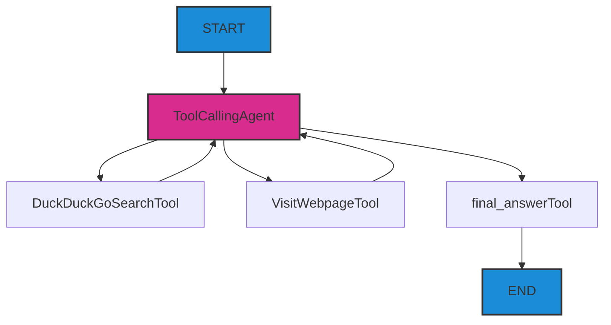

# Creating Your First Agent

I want you to create your first AI Agent even before understanding the basic concepts. Therefore, we will immediately proceed to practice creating a simple agent that conducts multi-step research on the internet.

## Questions

- How to create an AI Agent that can search for information on the internet?
- How to write a system prompt for an agent?
- What are the basic components (4) needed to create a search agent?

## Steps

### 1. Obtaining API Keys

#### Option 1: (recommended)

:::tip llm-keygen.merkulov.ai

I'm giving away API keys for 98% of the world's models at [llm-keygen.merkulov.ai](https://llm-keygen.merkulov.ai) **(it only takes 1 click to get a key)**. Supported providers:

- openai, anthropic
- google, deepseek, Xai

- a lot of other model providers via openrouter, openrouter, replicate, etc.

In addition to the key, you will have a web console where you can manage keys, track consumption, and view logs.

Free users receive a quota of 10M tokens per month for small models (but you can use any, although you can quickly burn through the quota). *merkulov.courses students are not limited by this quota.*

:::

You only need to authenticate via GitHub and copy the key. **Save it in a safe place** - you will reuse it in the future.

Using models more expensive than gemini-2.0-flash or gpt-4o-mini is not recommended, as you may not have enough quota to complete the entire course.

<details>
<summary>Other options</summary>

#### Huggingface $0.1

You can use many open-source models using Hugging Face inference endpoints.

Sequence of actions:

1. Register on [huggingface.com](https://huggingface.com)
2. Create an API key at [huggingface.com/settings/tokens](https://huggingface.com/settings/tokens)
    - select a Fine-grained key
    - specify a name and grant access as in the screenshot
        
3. **Save it in a safe place** - you will reuse it in the future.

#### Option 3. langdock

You can get $110 for 7 days on [langdock.com](https://langdock.com) for APIs from major proprietary providers.

Recommended for developing future huge projects with high consumption. You can register as many accounts as you want.

#### Paid options

Choose, register, and top up your API balance with any of the providers:

- [openai.com](https://openai.com)
- [anthropic.com](https://anthropic.com)
- [groq.com](https://groq.com)
- [cohere.com](https://cohere.com)
- [gemini.google.com](https://gemini.google.com)

Or top up the balance of the [openrouter.ai](https://openrouter.ai) proxy to have access to all APIs at once.

</details>

### 2. Creating your own analogue of perplexity (internet search agent)

#### 1. Register on [replit.com](https://replit.com)

#### 2. Create a project

1. Choose a template
2. Select Python.
3. Create app

#### 3. Configure the environment

:::danger do not use replit agent - the practice will not work with it
Using an **assistant** (not an agent), edit your project on replit - **read,** copy and paste my prompts, remembering to change them where necessary.
:::

**You need to edit the prompt below.**
```
You are a teaching assistant - do not write unnecessary things and do not run ahead.
Create an empty training project in Python:
- in .env add OPENAI_API_KEY=________ and OPENAI_BASE_URL=https://proxy.merkulov.ai
- install the smolagents==1.12.0, smolagents[openai]==1.12.0 libraries
- create an empty main.py file and import DuckDuckGoSearchTool, HfApiModel, ToolCallingAgent, VisitWebpageTool, OpenAIServerModel, PromptTemplates from smolagents

Do nothing more.
```

Click apply changes, check the main.py file to make sure everything is ok.

:::warning

1. Ignore warnings about the absence of the smolagents library.
2. If you are looking for and cannot find the .env file in the directory -> click the three dots -> show hidden files -> .env
3. **You didn't forget to specify OPENAI_API_KEY in the prompt, did you?**

If unexpected errors occur, first check whether you are using an assistant and not an agent.
:::

#### 4. Configure the model

An agent is a combination of 4 components:
- LLM
- prompt
- tools

During operation, it accumulates a message history - it can be called "context".

```
Now we need to create an LLM entity and configure it. Create an OpenAIServerModel class with the parameters model_id="openai/gpt-4o-mini".

Also create a tools variable:
tools = [
    DuckDuckGoSearchTool(max_results=5), # internet search through a free search engine
    VisitWebpageTool() # reading text from a web page
]
```

Click apply changes.

#### 5. Configure the agent

**The cognitive architecture of the agent looks like this:**

Imagine that you receive a query from a user on the START node, and then endlessly run in the direction of the arrows until you reach END.


**You need to edit the prompt below.**

Imagine that you are explaining to a very stupid subordinate what he should do (and he can only write text and use tools):
- explain his role (for example, "you are - ...")
- explain what he should do (for example, "you should search ...")
- explain what each of the tools does
- At the end, add "When you find the answer, call the final_answer tool, and write it in the answer."
```
Now create a PromptTemplates class with the parameter system_prompt="""
You play the role of ...
You must ...
You have a DuckDuckGoSearchTool tool that ...
You have a VisitWebpageTool tool that ...
When you find the answer, ...
"""
```

Click apply changes.

#### 6. Final touch

```
Now write the remaining code:
agent = ToolCallingAgent(
    tools=tools,
    model=model,
    prompt_templates=prompt_template,
    max_steps=6 # limit against looping
)

# ------

query = "In what year did Cassius Clay change his name?"
output = agent.run(query)

print("Executor result:", output)
```

Click apply changes.

Open the "console" on the right and run main.py with the large button at the top. **View the results!** Don't rush to study the smolagents framework now, we'll come back to it.

You can try other questions:
- `How much do 1000 tokens of YandexGPT Pro in Yandex Cloud cost for two modes?`
- `Find the name of the team that took 3rd place in TI10. In which tournament did this team debut?`
    This is an example of a multi-step study. To answer this question, you must first find out the bronze medalist, and then find out the team's composition in that year.
- **Any other question you come up with yourself**

<details>
<summary>Answers</summary>

1. Cassius Clay changed his name in 1964.
2. 0.60 rubles and 1.20 rubles
3. Star Ladder Star Series Season 10.

Most likely you got the wrong answer to the last question. Think about how you need to supplement the agent's system prompt so that it rechecks the information found or makes a "re-request"?

<details>
<summary>Hint to improve the system prompt</summary>

So that the agent can double-check information and make additional requests, you can add the following instructions to the system prompt:

```
system_prompt="""
You are a professional internet researcher.
    Your task is to find the information that the user needs. If you find part of some information, then do not immediately output it in the answer - but make a request to check.
    Use the DuckDuckGoSearchTool tools to search for information on the Internet and VisitWebpageTool to visit web pages.
    When you find the answer, call the final_answer tool, and write it in the answer.
"""
```


</details>
</details>

Congratulations! You have created your first agent that can conduct research on the internet. Examples of similar, but more complex, production agents are [perplexity](https://www.perplexity.ai), [you.com](https://you.com). They also roam the network until they stumble upon an answer.


## Extra Steps

1. Registration on [e2b.dev](https://e2b.dev)
2. Create an API key
3. Add to .env E2B_API_KEY=...

You can try replacing all the `main.py` code with this to touch an agent with planning, searching, and the ability to write programs + get their output.
```
from smolagents import CodeAgent, DuckDuckGoSearchTool, OpenAIServerModel

model = OpenAIServerModel(model_id="openai/gpt-4o-mini")

agent = CodeAgent(tools=[DuckDuckGoSearchTool()], model=model, executor_type="e2b")
#output = agent.run("How many seconds would it take for a leopard at full speed to run through Pont des Arts?")
print("E2B executor result:", output)
```

**We can use a similar agent to solve problems that require accurate calculations.**

---

Here is an example of an agent that, using e2b, python, and the matplotlib library, generates a graph image and sends it to a chat with the user: [ai-analyst](https://ai-analyst.e2b.dev/)
    
Try the prompt in [ai-analyst](https://ai-analyst.e2b.dev/): `Build a beautiful Price-Costs-Value histogram with three columns for the iPhone as an illustration. It costs $200 to produce an iPhone, its price is $1000, and users estimate its value at $1200.`


## Now we know...

We have studied:
- How to create a basic cognitive architecture for an AI Agent
- How to configure search and web browsing tools
- How to create an effective system prompt for an agent
- How to use the smolagents framework for rapid prototyping of agents
- How to limit an agent to prevent looping

## Exercises

1. What are the basic components of an agent?
2. Think about where you can use such an agent in your life and business?
3. What problems might the current agent have when working?
4. Try modifying the agent's system prompt to improve the quality of its responses or add new functionality.

