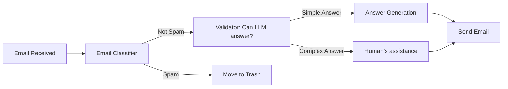
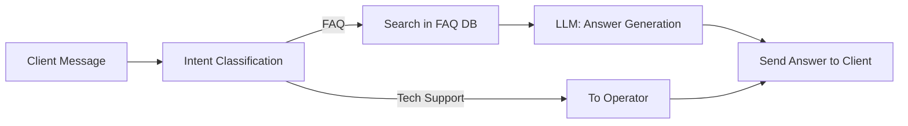
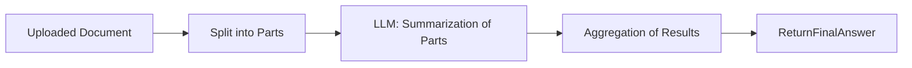
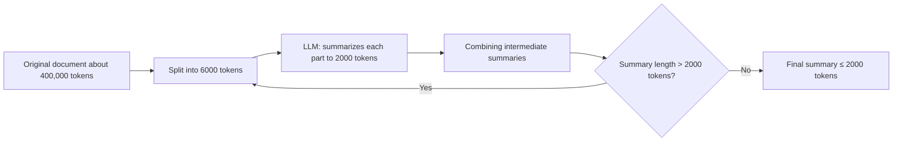
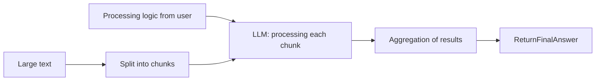
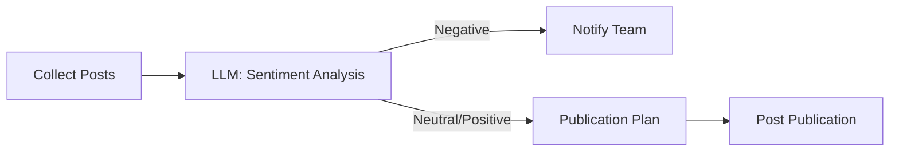
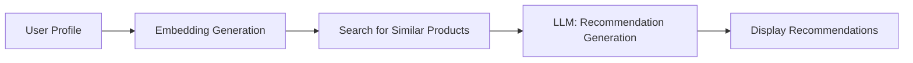
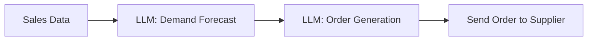
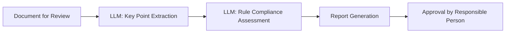

<details>
<summary>Communication and Support</summary>

<details>
<summary>Email Classifier</summary>



<details>
<summary>Example Input Requests</summary>

```text
Email 1:
From: client@example.com
Subject: Payment Issue
Message: "Hello, I paid for the order a few days ago, but the status has not changed. Please help."

Email 2:
From: user2@example.com
Subject: Question about the product
Message: "Good afternoon, please tell me about the features of your application."
```
</details>

<details>
<summary>System Prompt: Email Classifier</summary>

```text
You are a model that classifies incoming emails as 'spam' or 'not_spam'.
You receive the header and body of the email as input.
Output is a single word: 'spam' or 'not_spam'.
```
</details>

<details>
<summary>System Prompt: Validator (Can LLM answer?)</summary>

```text
You are a model that checks whether an LLM can autonomously answer a request.
You receive the body of the email.
If the answer is simple, output 'simple_answer', otherwise 'complex_answer'.
```
</details>

<details>
<summary>System Prompt: Answer Generation</summary>

```text
You are a support assistant. Compose a polite and concise answer to the client based on the text of the email:
\"\"\"{email_body}\"\"\"
```
</details>

</details>

<details>
<summary>Support Request Triage</summary>



<details>
<summary>Example Input Requests</summary>

```text
Request 1: "How do I reset my account password?"
Request 2: "I have an error when paying for a subscription, order number #12345."
```
</details>

<details>
<summary>System Prompt: Intent Classification</summary>

```text
You are a model that determines the intent based on the client's message: 'FAQ' or 'technical_support'.
Output is 'FAQ' or 'technical_support'.
```
</details>

<details>
<summary>System Prompt: LLM FAQ Answer Generation</summary>

```text
You are an assistant generating an answer based on the found FAQ.
Input: client request and FAQ content:
\"\"\"Question: {faq_question}
Answer: {faq_answer}\"\"\"
Output is a complete answer to the client.
```
</details>

</details>

</details>
<details>
<summary>Document Summarization</summary>

<details>
<summary>Document Summarization Pipeline</summary>



<details>
<summary>Example Input Documents</summary>

```text
Document 1: Article about JavaScript (≈ 5,000 tokens)
Document 2: Quarterly Sales Report (≈ 8,000 tokens)
```

</details>

<details>
<summary>System Prompt: LLM — Summarization of Parts</summary>

```text
You are a model for summarizing text fragments.
Your task is to form a short and informative summary (≤ 500 tokens) based on the input fragment (≤ 6000 tokens).
Input: text fragment of the document.
Output: summary of the fragment.
```

</details>

</details>

<details>
<summary>Summarization of Infinite Text</summary>

Suppose you can only use an LLM that can maximally accommodate 8000 tokens in its Attention layers. The maximum LLM can generate up to 2000 tokens. (Total: 6000 tokens input, 2000 output)



For example, for a text of 18 megatokens, the algorithm will run in 2 summarization cycles:
    1. 1 cycle: 18,000 tokens -> 6,000 tokens
        1.1. 18,000 tokens -> 3 chunks of 6,000 tokens
        1.2. 3 chunks of 6,000 tokens -> 3 summaries of 2,000 tokens
        1.3. 3 summaries of 2,000 tokens -> concatenation into 1 summary of 6,000 tokens
    2. 2 cycle: 6,000 tokens -> 2,000 tokens
        2.1. 6,000 tokens -> 1 chunk of 6,000 tokens
        2.2. 1 chunk of 6,000 tokens -> 1 summary of 2,000 tokens
        2.3. 1 summary of 2,000 tokens -> final summary

<details>
<summary>Example Input Document</summary>

```text
Document: Technical product specification (≈ 400,000 tokens)
```

</details>

<details>
<summary>System Prompt: LLM — Summarizes each part to 2000 tokens</summary>

```text
Summarize the text in 2000 tokens.
```

</details>

</details>

<details>
<summary>Analysis and Processing of Large Text with Manager Logic</summary>



<details>
<summary>Example Input Data</summary>

```text
Processing logic: "Find all mentions of the words 'error' and 'exception', count their frequency."
Text: Application logs (≈ 100,000 tokens)
```

</details>

<details>
<summary>System Prompt: LLM — Processing a text chunk</summary>

```text
You are an analytical model. Your task is to form a partial report based on the user's specified logic and the input text chunk.
Input:
- Processing logic: {logic}
- Chunk text: {text}
Output:
- Partial report.
```

</details>

</details>

</details>

<details>
<summary>Social Monitoring and Recommendations</summary>

<details>
<summary>Social Media Monitoring</summary>



<details>
<summary>Example Input Requests</summary>

```text
Request 1: "Collect the last 100 tweets with the hashtag #ourProduct"
Request 2: "Get posts from Instagram for the last 24 hours mentioning the brand"
```
</details>

<details>
<summary>Example System Prompt for the "Sentiment Analysis" Step</summary>

```text
You are a social media sentiment analysis model. Your task is to classify each post as "Negative", "Neutral" or "Positive".
Input data:
- Post text: {text}
Output data:
- Sentiment: {Negative|Neutral|Positive}
- Brief justification of the classification.
```
</details>

</details>

<details>
<summary>Recommendation System</summary>



<details>
<summary>Example Input Data</summary>

```text
User profile:
- ID: 12345
- View history: ["Phone", "Headphones", "Cases"]
- Age: 29
- Interests: technology, music
```

</details>

<details>
<summary>Example System Prompt for the "Recommendation Generation" Step</summary>

```text
You are an LLM-based recommendation system. Your task is to generate five relevant recommendations based on user embeddings and a list of similar products.
Input data:
- User embeddings: {vector}
- List of similar products: [{id, name, embedding}, ...]
Output data:
- JSON array with recommendations:
[
  {id: ..., name: ..., reason: ...},
  ...
]
```

</details>

</details>

</details>


<details>
<summary>Code Review and Publication</summary>

  <details>
  <summary>Automated Code Review</summary>

  ```mermaid
  flowchart LR
      PR[Pull Request] --> Lint[Automated Tests]
      Lint -->|Errors| Report[Report Generation]
      Lint -->|OK| Comments[LLM: Comment Generation]
      Comments --> Post[Add Comments to PR]
  ```

  <details>
  <summary>Example Input Requests</summary>

  ```text
  Request 1: Pull Request with changes to the app.js file:
  ```diff
  - function add(a, b) { return a + b; }
  + function add(a, b) { return Number(a) + Number(b); }
  ```
  Request 2: Pull Request deleting unused variables in utils.js:
  ```diff
  - const unused = 42;
  + // deleted
  ```
  ```
  </details>

  <details>
  <summary>System Prompt: LLM — Comment Generation</summary>

  ```text
  You are an assistant for automated code review.
  Your task is to:
  - detect syntax or logic errors,
  - note style guide violations,
  - suggest code improvement recommendations,
  based on the Pull Request diff.
  Input data:
  - diff Pull Request: {diff}
  Output format (structured output):
  [
    {file: "app.js", line: 1, comment: "It is recommended to explicitly cast parameters to Number for safe string addition."},
    {file: "utils.js", line: 3, comment: "The 'unused' variable is not used - it should be deleted."}
  ]
  ```
  </details>

  </details>

  <details>
  <summary>Blog Publication</summary>

  ```mermaid
  flowchart LR
      Draft[Article Draft] --> SpellCheck[LLM: Spell Check]
      SpellCheck --> StyleEdit[LLM: Style Improvement]
      StyleEdit --> Publish[Publication on Social Networks]
  ```

  <details>
  <summary>Example Input Requests</summary>

  ```text
  Article draft:
  "OpenAI introduced a new GPT-4 model. It offers improved text generation, code support, and data analytics capabilities. Some sections of the text can be made smoother and more expressive..."
  ```
  </details>

  <details>
  <summary>System Prompt: LLM — Spell Check</summary>

  ```text
  You are a model for spell checking texts.
  Your task is to find and correct typos and typographical errors.
  Input:
  - draft text: {draft_text}
  Output:
  - corrected text without errors.
  ```
  </details>

  <details>
  <summary>System Prompt: LLM — Style Improvement</summary>

  ```text
  You are a model for stylistic editing of texts.
  Your task is to make the text smoother, clearer and more attractive while preserving the original meaning.
  Input:
  - text after spell checking: {corrected_text}
  Output - edited text.
  ```
  </details>

  </details>

</details>

<details>
<summary>Marketing and Sales</summary>

  <details>
  <summary>Marketing Campaign Personalization</summary>

  ```mermaid
  flowchart LR
      CRM[Customer Data] --> Segment[LLM: Audience Segmentation]
      Segment --> Message[LLM: Message Generation]
      Message --> Launch[Launch E-mail Campaign]
  ```

  <details>
  <summary>Example Input Requests</summary>

  ```text
  CRM data 1: {id: 101, name: "Anna", age: 28, last_purchases: ["sneakers","t-shirt"], interests: ["sports","travel"]}
  CRM data 2: {id: 102, name: "Boris", age: 35, last_purchases: ["smart watch"], interests: ["technology","fitness"]}
  ```
  </details>

  <details>
  <summary>System Prompts</summary>

    <details>
    <summary>LLM: Audience Segmentation</summary>

    ```text
    You are a model that segments customers into categories (age, interests, purchase history) based on a list of CRM data.
    Input: list of clients [{id, name, age, last_purchases, interests}, ...]
    Output - JSON array of segments:
    [
      {segment_id: 1, criteria: "athletes 25-35", clients: [101, ...]},
      ...
    ]
    ```
    </details>

    <details>
    <summary>LLM: Message Generation</summary>

    ```text
    You are a copywriter assistant creating personalized e-mails for each segment.
    Input: segment {segment_id, criteria, clients} and message template.
    Output - JSON array of messages:
    [
      {segment_id: 1, subject: "Special offer for athletes", body: "..."},
      ...
    ]
    ```
    </details>

  </details>

  </details>

  <details>
  <summary>Lead Qualification and Upsale (Sales)</summary>

  ```mermaid
  flowchart LR
      Lead[New Lead] --> Qualify[LLM: Qualification]
      Qualify -->|Ready to Sell| Propose[LLM: Commercial Offer]
      Propose --> Send[Send Offer]
      Send --> Follow[LLM: Response Analysis]
      Follow -->|Positive| Upsell[LLM: Upsale Generation]
      Upsell --> SendUpsell[Send Additional Offer]
  ```

  <details>
  <summary>Example Input Requests</summary>

  ```text
  Lead 1: {id: "LID123", company: "Acme Corp", budget: 50000, need: "CRM system"}
  Lead 2: {id: "LID124", company: "Beta LLC", budget: 150000, need: "sales analytics"}
  ```
  </details>

  <details>
  <summary>System Prompts</summary>

    <details>
    <summary>LLM: Qualification</summary>

    ```text
    You are a model that assesses leads for readiness to buy.
    Input: lead {id, company, budget, need}
    Output - {lead_id, status: "ready"/"not ready", score: number}
    ```
    </details>

    <details>
    <summary>LLM: Commercial Offer</summary>

    ```text
    You are a sales assistant generating commercial offers.
    Input: lead {lead_id, company, need, budget} and CP template.
    Output - {lead_id, proposal: "text of commercial offer"}
    ```
    </details>

    <details>
    <summary>LLM: Response Analysis</summary>

    ```text
    You are a model for analyzing customer feedback.
    Input: correspondence {lead_id, messages: [...]}
    Output - {lead_id, sentiment: "positive"/"negative"/"neutral"}
    ```
    </details>

    <details>
    <summary>LLM: Upsale Generation</summary>

    ```text
    You are an upsell assistant forming an additional offer.
    Input: lead {lead_id} and interaction history.
    Output - {lead_id, upsell_offer: "text of additional offer"}
    ```
    </details>

  </details>

  </details>

</details>

<details>
<summary>Operational Processes</summary>

<details>
<summary>Automatic Replenishment of Goods</summary>



<details>
<summary>Example Input Data</summary>

```json
{
  "sales_data": [
    {"product_id": "A1", "date": "2024-06-01", "quantity": 120},
    {"product_id": "B2", "date": "2024-06-01", "quantity": 75}
  ],
  "safety_stock": 50
}
```

</details>

<details>
<summary>System Prompts</summary>

<details>
<summary>LLM: Demand Forecast</summary>

```text
You are a demand forecasting model.
Input: array of sales records with fields {product_id, date, quantity}.
Task: based on historical data, predict demand for each product for the next period.
Output: array of objects [{product_id, forecast_quantity}, ...].
```

</details>

<details>
<summary>LLM: Order Generation</summary>

```text
You are an assistant for generating orders to a supplier.
Input: demand forecast [{product_id, forecast_quantity}, ...] and safety stock parameter.
Task: calculate the order quantity to cover the forecast demand plus the reserve.
Output: array of objects [{product_id, order_quantity}, ...].
```

</details>

</details>

</details>

<details>
<summary>Document Compliance Check</summary>



<details>
<summary>Example Input Data</summary>

```text
Document type: lease agreement
Document text:
"This agreement is concluded between the Landlord and the Tenant...
Article 1. Subject of the agreement...
Article 2. Term of validity..."
```

</details>

<details>
<summary>System Prompts</summary>

<details>
<summary>LLM: Key Point Extraction</summary>

```text
You are a model for extracting key points from legal text.
Input: full text of the document.
Task: highlight article numbers and their brief content.
Output: array of objects [{article: number, summary: text}, ...].
```

</details>

<details>
<summary>LLM: Rule Compliance Assessment</summary>

```text
You are a model for checking document compliance with specified regulations.
Input: array of key points and list of rules.
Task: for each item, determine whether it complies with the rules.
Output: [{article, compliance: "complies"/"does not comply", comments}, ...].
```

</details>

<details>
<summary>LLM: Report Generation</summary>

```text
You are a report preparation assistant.
Input: compliance assessment results.
Task: generate a structured report in markdown with sections "Compliant Items" and "Violations".
Output: markdown text of the report.
```

</details>

</details>

</details>

</details>
