<details>
<summary>HR Processes</summary>

<details>
<summary>Resume Screening (Recruitment)</summary>

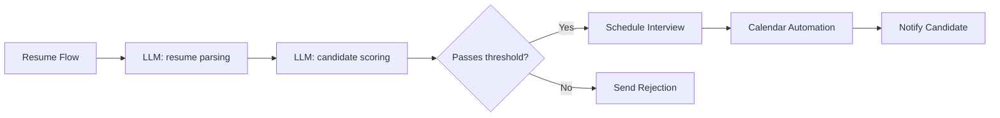

<details>
<summary>Input Data Examples</summary>

```json
[
  {
    "name": "Ivan Ivanov",
    "skills": ["Python", "SQL", "Docker"],
    "experience_years": 3,
    "education": "Master of Computer Science"
  },
  {
    "name": "Anna Petrova",
    "skills": ["Java", "Spring", "Microservices"],
    "experience_years": 5,
    "education": "Bachelor of IT"
  }
]
```

</details>

<details>
<summary>System Prompts</summary>

<details>
<summary>LLM: resume parsing</summary>

```text
You are a model for structuring resumes.
Input: resume text.
Task: extract {name, skills, experience_years, education}.
Output: JSON object with candidate fields.
```

</details>

<details>
<summary>LLM: candidate scoring</summary>

```text
You are a model for evaluating resumes based on given criteria.
Input: object {name, skills, experience_years}.
Criteria: relevance of skills and work experience.
Output: {name, score: number from 0 to 100}.
```

</details>

<details>
<summary>LLM: schedule interview</summary>

```text
You are an interview scheduling assistant.
Input: list of candidates who passed the threshold and available interview slots.
Task: assign candidates to slots.
Output: [{name, interview_time}, ...].
```

</details>

</details>

</details>

<details>
<summary>Onboarding Automation (HR)</summary>

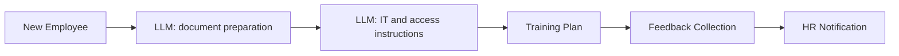

<details>
<summary>Input Data Examples</summary>

```json
{
  "name": "Sergey Kuznetsov",
  "position": "Frontend Developer",
  "start_date": "2024-07-01"
}
```

</details>

<details>
<summary>System Prompts</summary>

<details>
<summary>LLM: document preparation</summary>

```text
You are an HR assistant for preparing corporate documents.
Input: {name, position, start_date}.
Task: generate a list and templates of documents (employment contract, NDA, etc.).
Output: [{document_type, template_text}, ...].
```

</details>

<details>
<summary>LLM: IT and access instructions</summary>

```text
You are a model for generating instructions for setting up the IT environment.
Input: employee position.
Task: create a checklist for creating accounts and setting up software.
Output: a list of checklist items.
```

</details>

<details>
<summary>LLM: training plan</summary>

```text
You are an assistant for training new employees.
Input: position.
Task: develop a step-by-step training plan with modules and deadlines.
Output: [{module, duration_days}, ...].
```

</details>

<details>
<summary>LLM: feedback collection</summary>

```text
You are a model for generating a feedback questionnaire.
Input: list of onboarding stages.
Task: formulate questions for each stage.
Output: [{stage, questions: [...]}, ...].
```

</details>

<details>
<summary>LLM: HR notification</summary>

```text
You are an assistant for notifying HR of the results.
Input: feedback results.
Task: compose a brief message with key findings.
Output: notification text.
```

</details>

</details>

</details>

</details>

<details>
<summary>DevOps</summary>

<details>
<summary>CICD pipeline monitoring</summary>

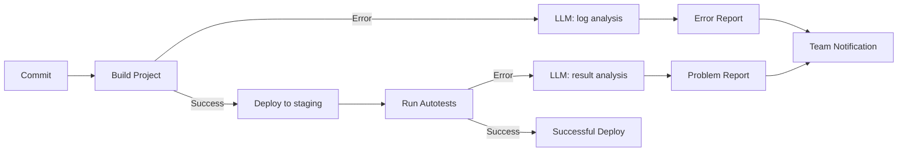

<details>
<summary>Input Data Examples</summary>

```text
Commit: {id: "abc123", author: "ivan", timestamp: "2024-06-15T10:23:00Z"}
Build logs: "ERROR: Module not found: 'utils.js'"
```
</details>

<details>
<summary>System Prompt Examples</summary>

<details>
<summary>LLM: log analysis</summary>

```text
You are a model for analyzing CI logs. Input: build log text. Task: find the cause of the error and suggest a solution. Output: {error_type, message, recommendation}.
```
</details>

<details>
<summary>LLM: result analysis</summary>

```text
You are a model for analyzing autotest results. Input: test runner output. Task: identify failed tests and describe the problem. Output: [{test_name, status: "fail"/"pass", log}].
```
</details>

</details>
</details>

<details>
<summary>Autotests: generation and analysis</summary>

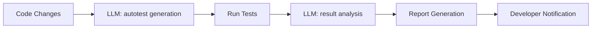

<details>
<summary>Input Data Examples</summary>

```text
Code changes: diff function sum(a, b)
Test results: 3 passed, 1 failed (test_sum.js)
```
</details>

<details>
<summary>System Prompt Examples</summary>

<details>
<summary>LLM: autotest generation</summary>

```text
You are an autotest generation assistant. Input: code diff. Task: generate unit tests in Jest for new or modified functions. Output: test code.
```
</details>

<details>
<summary>LLM: result analysis</summary>

```text
You are a model for analyzing test results. Input: test runner output. Task: highlight failed tests and suggest fix options. Output: [{test_name, status, suggestion}].
```
</details>

</details>
</details>

</details>

<details>
<summary>Other Cases</summary>

<details>
<summary>Quiz Generation for Training</summary>

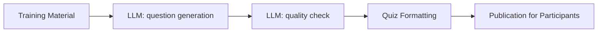

<details>
<summary>Input Data Examples</summary>

```text
Training material: "HTTP Basics: GET/POST methods, status codes"
```
</details>

<details>
<summary>System Prompt Examples</summary>

<details>
<summary>LLM: question generation</summary>

```text
You are a model for generating training questions. Input: material text. Task: formulate 5 questions of different types (open-ended, multiple choice). Output: [{question, type}].
```
</details>

<details>
<summary>LLM: quality check</summary>

```text
You are a model for evaluating the quality of questions. Input: list of questions. Task: check the correctness of formulations and difficulty. Output: [{question, ok: true/false, comment}].
```
</details>

</details>
</details>

<details>
<summary>Expense Report Automation</summary>

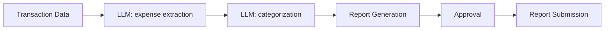

<details>
<summary>Input Data Examples</summary>

```json
{
  "transactions": [
    {"id": "T1", "amount": 250},
    {"id": "T2", "amount": 75}
  ]
}
```
</details>

<details>
<summary>System Prompt Examples</summary>

<details>
<summary>LLM: expense extraction</summary>

```text
You are a model for extracting expense data. Input: array of transactions. Task: return a list of {id, amount}.
```
</details>

<details>
<summary>LLM: categorization</summary>

```text
You are a model for classifying expenses. Input: list of {id, amount}. Task: assign a category from the list. Output: [{id, category}].
```
</details>

</details>
</details>

<details>
<summary>Personal Travel Planner</summary>

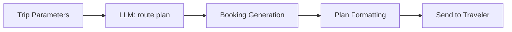

<details>
<summary>Input Data Examples</summary>

```json
{
  "destination": "Barcelona",
  "dates": ["2024-07-01", "2024-07-07"],
  "preferences": ["museums", "beach"]
}
```
</details>

<details>
<summary>System Prompt Examples</summary>

<details>
<summary>LLM: route plan</summary>

```text
You are a travel planning assistant. Input: trip parameters. Task: suggest a route by day. Output: [{day, activities}].
```
</details>

<details>
<summary>LLM: booking generation</summary>

```text
You are a model for generating bookings. Input: route. Task: generate data for booking a hotel and transport. Output: [{service, details}].
```
</details>

<details>
<summary>LLM: plan formatting</summary>

```text
You are an assistant for formatting the plan. Input: booking data and route. Task: assemble a single document with a schedule. Output: markdown.
```
</details>

</details>
</details>

</details>

<details>
<summary>Request Routing to Four Departments</summary>

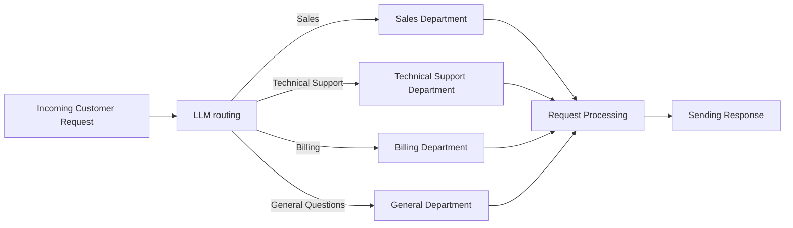

<details>
<summary>Input Request Examples</summary>

```text
Request 1: "Hello! I want to know about the new rates."
Request 2: "I can't pay the bill, the payment is declined."
Request 3: "How to enable international roaming?"
Request 4: "Where can I find the offer agreement?"
```

</details>

<details>
<summary>System Prompt: LLM routing</summary>

```text
You are a model for routing incoming customer requests.
Input data:
- Customer request text: {request}
Task: determine the direction of request processing: one of the values "Sales", "Technical Support", "Billing", "General Questions".
Output: a string with one of the specified values.
```

</details>

<details>
<summary>System Prompt: LLM request processing</summary>

```text
You are a model for processing customer requests in the {direction} direction.
Input data:
- Customer request text: {request}
Task: generate a detailed and polite response to the request in accordance with the specifics of the direction.
Output: a text response to the customer.
```

</details>

</details>

<details>
<summary>Web3 workflow examples</summary>

<details>
<summary>Minting and listing NFT</summary>

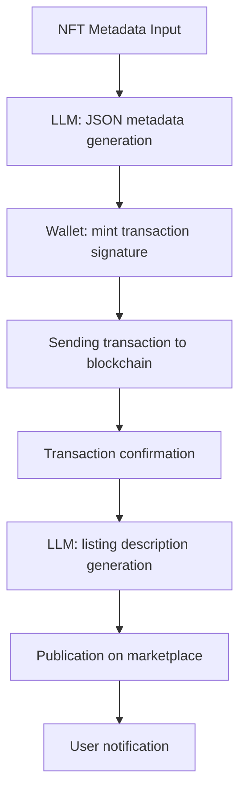

<details>
<summary>Input Data Examples</summary>

```json
{
  "name": "CryptoKitty #2024",
  "description": "Exclusive NFT with animated kitty",
  "image": "https://example.com/cat.gif",
  "attributes": [
    { "trait_type": "rarity", "value": "epic" },
    { "trait_type": "background", "value": "galaxy" }
  ]
}
```

</details>

<details>
<summary>System Prompts</summary>

<details>
<summary>LLM: JSON metadata generation</summary>

```text
You are a model for generating NFT JSON metadata in ERC-721 format.
Input: {name, description, image, attributes}.
Output: JSON object without unnecessary comments.
```

</details>

<details>
<summary>LLM: listing description generation</summary>

```text
You are a model for writing selling NFT descriptions.
Input: NFT JSON metadata.
Task: generate a short (2–3 sentences), catchy description.
Output: plain text.
```

</details>

</details>
</details>

<details>
<summary>Token swap on DEX</summary>

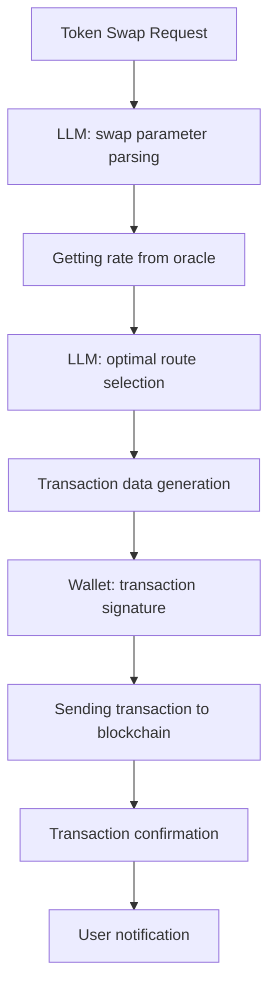

<details>
<summary>Input Request Examples</summary>

```text
Request 1: "Swap 1.5 ETH to DAI at the best rate."
Request 2: "Swap 1000 USDC to USDT with minimal fees."
```

</details>

<details>
<summary>System Prompts</summary>

<details>
<summary>LLM: swap parameter parsing</summary>

```text
You are a model for extracting swap parameters from a text request.
Input: request text.
Task: return JSON {from_token, to_token, amount}.
```

</details>

<details>
<summary>LLM: optimal route selection</summary>

```text
You are a model for selecting the optimal swap route on DEX.
Input: JSON {from_token, to_token, amount}.
Task: suggest an exchange path through pools, minimizing slippage.
Output: JSON {route, estimated_gas}.
```

</details>

</details>
</details>

<details>
<summary>Creating a proposal in DAO</summary>

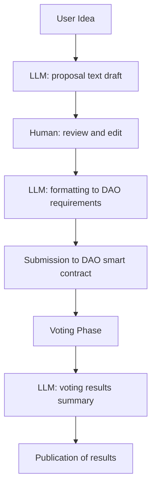

<details>
<summary>Input Request Examples</summary>

```text
Idea 1: "Suggest increasing the liquidity pool by 5% transaction fee."
Idea 2: "Implement a reward program for active DAO participants."
```

</details>

<details>
<summary>System Prompts</summary>

<details>
<summary>LLM: proposal text draft</summary>

```text
You are a model for transforming an idea into a formal DAO proposal.
Input: idea text.
Task: generate JSON {title, description}.
```

</details>

<details>
<summary>LLM: formatting to DAO requirements</summary>

```text
You are a model for formatting a draft according to the DAO template.
Input: JSON {title, description}.
Requirements: title up to 100 characters, description up to 1000 characters.
Output: JSON {title, description}.
```

</details>

<details>
<summary>LLM: voting results summary</summary>

```text
You are a model for creating a final voting summary.
Input: list of votes [{voter, vote}].
Task: calculate the results and formulate a conclusion.
Output: text summary.
```

</details>

</details>
</details>

<details>
<summary>Automated Smart Contract Audit</summary>

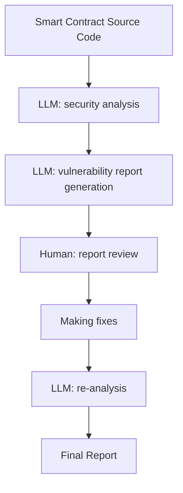

<details>
<summary>Input Data Examples</summary>

```solidity
// SPDX-License-Identifier: MIT
pragma solidity ^0.8.0;

contract SimpleToken {
    mapping(address => uint256) public balances;
    function mint(address to, uint256 amount) public {
        balances[to] += amount;
    }
}
```

</details>

<details>
<summary>System Prompts</summary>

<details>
<summary>LLM: security analysis</summary>

```text
You are a model for analyzing the security of smart contracts.
Input: contract source code.
Task: identify vulnerabilities (overflow, reentrancy, etc.) and provide recommendations.
Output: JSON [{issue, severity, recommendation}].
```

</details>

<details>
<summary>LLM: vulnerability report generation</summary>

```text
You are a model for compiling a report based on vulnerability analysis.
Input: security analysis results.
Task: write a detailed markdown report describing each problem and recommendations.
Output: markdown.
```

</details>

</details>
</details>

</details>
