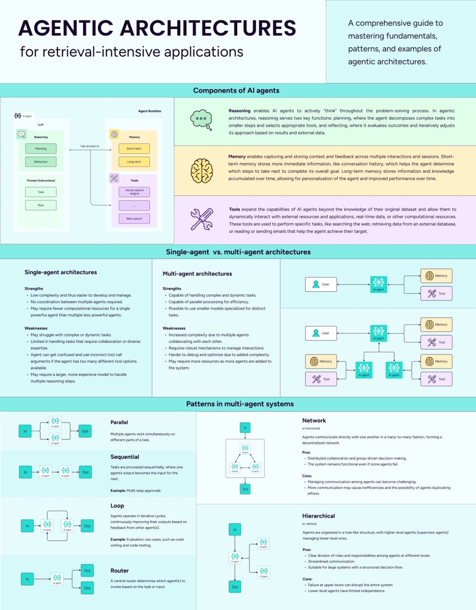

# Cognitive Architectures for AI Agents 101

Hooray! Starting with this module, we will be studying agents! Previously, you have already familiarized yourself with how to create AI Workflows without loops, and in the HF course, you learned about the basic elements (LLM, Tool, Context) that make up an agent. Now we will look at agent architectures - with loops.

[History of the term "Cognitive Architecture"](https://blog.langchain.dev/what-is-a-cognitive-architecture/)

## Questions

- What types of cognitive architectures are there?
- What is the name of the architecture where the LLM evaluates its own response without having Tools?
- Which cognitive architecture is currently the most advanced?

## Steps

### 1. Studying basic loop architectures

<iframe width="560" height="315" src="https://www.youtube.com/embed/ZJlfF1ESXVw?si=4cXLWZRlV8rW7Itl" title="YouTube video player" frameborder="0" allow="accelerometer; autoplay; clipboard-write; encrypted-media; gyroscope; picture-in-picture; web-share" referrerpolicy="strict-origin-when-cross-origin" allowfullscreen></iframe>
[miro pdf](https://drive.google.com/file/d/1ESnrIy4c5LPOhNHRnn87Cv7DU_i0-_J9/view)

:::tip
You can take a break here.
:::

### 2. [Introduction to Agents](https://www.getzep.com/ai-agents/introduction-to-ai-agents)

- Read only the first chapter
- Skip familiar topics

## Extra Steps

### E1. Check out py/js code of Plan-and-Execute Agents

https://blog.langchain.dev/planning-agents/

Cheat Sheet on Agentic Architectures

### E2. Cheat Sheet on Agentic Architectures

Cheat Sheet on Agentic Architectures

## Now we know...

In this module, we got acquainted with the basics of cognitive architectures for AI agents, and considered their main types:
- Reflection
- Reflexion Actor
- Plan-and-Execute
- ReWoo
- LLMCompiler

Next, we will delve into the **practical aspects** of agent development. You will get acquainted with more advanced architectures in the Senior & Frontier blocks.

## Exercises

-
