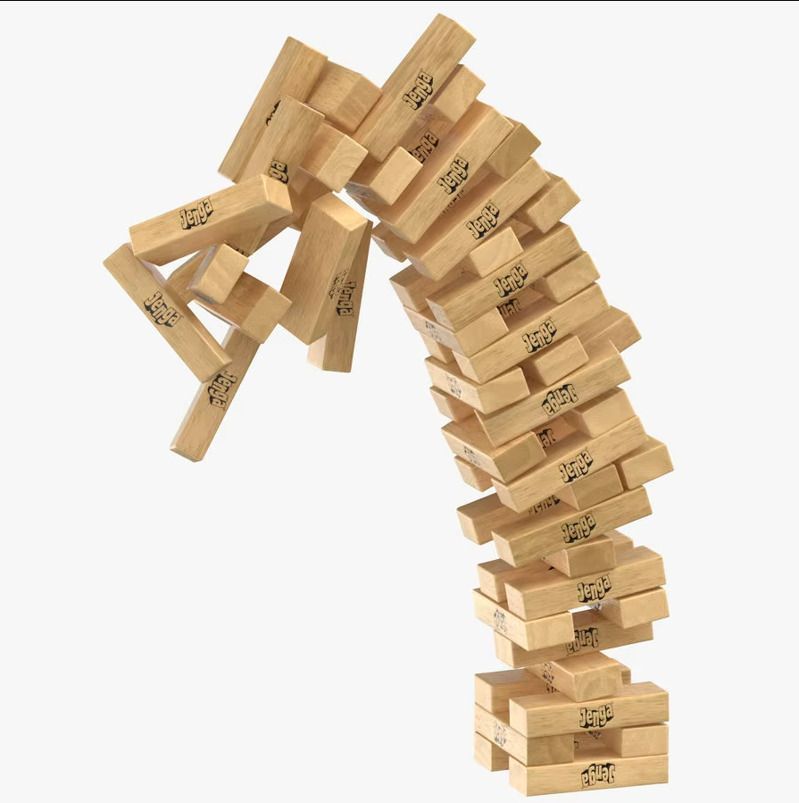

# When is RAG needed, and when is it not?

You are already familiar with the basics of RAG, but now it's time to see its true power in action. This approach allows you to transform huge amounts of unstructured data into compact and relevant answers, saving you time and resources. **However, before building RAG, you need to know when it doesn't work.**

## Questions

- When should you not use RAG?
- What are the alternatives?
- What is Ton-of-Voice and domain knowledge?

## Steps

### 1. Prompt Engineering, RAG, and Fine-tuning: Benefits and When to Use

<iframe width="560" height="315" src="https://www.youtube.com/embed/YVWxbHJakgg?si=ORwDR8sXd78cC8os" title="YouTube video player" frameborder="0" allow="accelerometer; autoplay; clipboard-write; encrypted-media; gyroscope; picture-in-picture; web-share" referrerpolicy="strict-origin-when-cross-origin" allowfullscreen></iframe>

### 2. Important principle

:::warning
Modern LLM models, at first glance, follow our instructions quite well. However, as the number of instructions increases, they start to make mistakes.

Noise (amount of text) also negatively affects the quality of answers.
:::

### 3. Case analysis

<details>
<summary>
What is Ton of Voice?
</summary>

*Note for customer service*: Ton of Voice is a set of instructions that an employee of the company must follow when communicating with a client.

Example Ton of Voice that a conditional bank needs:
```text
You are a helpful assistant "Alice" who helps bank customers.
Always answer according to the instructions:
- Answer in Russian
- Answer briefly and concisely
- Never mention other banks in your answers
- Always use a polite and friendly tone
- Observe confidentiality and do not disclose personal data of clients
- Clarify the details of the question to give the most accurate answers
- Follow the bank's script and use official terminology
- If necessary, offer additional banking products
- Immediately escalate complex requests to a specialist
- Confirm the information received before completing the dialogue
- Provide answers in a structured form with clear points
- Respond promptly and inform the client about the timing of the issue resolution
- Be proactive and offer help, even if the client did not ask
```

In production, this list grows over time with the fantasies of managers to huge sizes - every time they notice chat-bot behavior that they don't like, they try to "fix it" with more and more instructions.

And then this happens:



</details>

<details>
<summary>
What is domain knowledge?
</summary>

Domain knowledge is a set of information (terms, concepts, definitions, rules, restrictions, features, behavioral characteristics, interaction features, etc.) that an assistant must know in order to correctly perform their role.

Example of domain knowledge for conditional leasing of agricultural machinery:
```text
You are a helpful assistant "Boris" who helps clients of our leasing service.

- Leasing commission (Origination Fee) – a one-time fee for processing a transaction, usually 0.5–2% of the cost of agricultural machinery.
- LTV (Loan‑to‑Value) ratio – the ratio of the amount of financing to the market value of the equipment, determines the amount of the down payment.
- Residual Value – the projected price of equipment at the end of the lease term, on the basis of which the redemption payment is calculated.
- Declining Balance depreciation – a method of calculating depreciation, in which the amount of depreciation is maximum in the first periods of use.
- On‑site service – a schedule of preventive inspections and repairs directly on the farm territory, regulated by the contract.
- GPRS‑Monitor telemetric module – a device for remote monitoring of the engine condition, load and location of a tractor or combine.
- Agro-industrial complex subsidization program – a state support measure that reduces the interest rate on leasing specialized agricultural machinery.
- Warranty resource – minimum mileage or operating hours before the start of warranty service by the lessor.
- Penalty for delay – daily penalty rate (usually 0.1–0.3% of the overdue payment amount).
- Plan‑fact report on loading – comparison of planned and actual operating hours of equipment in the context of agricultural cycles.

...

(the full list contains 50,000 terms and concepts)
```
</details>

#### Quality of answers

Quality of answers = accuracy *or* ton-of-voice *or* domain knowledge *or* knowledgebase *or* all together...

- **I want to improve the quality of answers, I have 1 minute** - Use a system prompt

- **I want to improve the quality of answers, I have 10 minutes** - Prompt Engineering Technics (CoT, Few-shot, etc.)

    *In-Scale: use automatic prompt optimization (APE) - more on this in the following modules*

#### Own knowledgebase

- **I want to train AI on my knowledge base, avoid hallucinations, I have 5 minutes** - Upload all the information into the dialogue (In-Context Learning)

    *In-Scale: cache the prompt to reduce the cost of requests* | 
    [What is prompt caching?](https://www.anthropic.com/news/prompt-caching) |
    [Docs](https://docs.anthropic.com/en/docs/build-with-claude/prompt-caching)

- **I want to train AI on my knowledge base, avoid hallucinations** - Vanilla RAG

    *In-Scale: use advanced RAG approaches*

    *In-Scale 2: **in a loop**, try new approaches and hyperparameters (chunk_size, top_k, etc.), then evaluate the entire pipeline (for example, using RAGAS - more on this later)*

#### Own Ton of Voice

- **I want the model to follow the Ton-of-Voice of my business** - Fine-tuning (Partial-Finetuning, Parameter-efficient fine-tuning)
    
    *In-Scale: Data is the king*

#### Model for the domain area

- **I want the model to understand my domain area** - Fine-tuning (Parameter-efficient fine-tuning, Domain-specific fine-tuning, Full tuning)
    
    *In-Scale: Data is the king*

#### FAQ

- **I want the model to answer 1 to 1 as the answers in my FAQ database** - Use classification or LLM as a router
    
    *In-Scale: This is hell, avoid at all costs*

:::tip
All approaches are combined!

For example, you need both a knowledge base and a ton-of-voice (a common case for customer services) 
- you can use a system prompt with prompt techniques + RAG
- or fine-tuning + RAG
:::

:::info Advantages of RAG and prompt-caching over fine-tuning

The fine-tuning process takes time and resources. In some cases (documentation, large website), we need to update the entire LLM system every day or several times a day.

If we use RAG, we can only update the vector index, not the entire LLM system. (Or update the prompt cache with the provider)

Fine-tuning happens relatively slowly: from a few hours to a few days.
:::

## Extra Steps

Rewind:
<iframe width="560" height="315" src="https://www.youtube.com/embed/zYGDpG-pTho?si=gwtA2yDUDxM6y_H8" title="YouTube video player" frameborder="0" allow="accelerometer; autoplay; clipboard-write; encrypted-media; gyroscope; picture-in-picture; web-share" referrerpolicy="strict-origin-when-cross-origin" allowfullscreen></iframe>

### E1. What is LoRA?

<details>
<summary>
What is LoRA?
</summary>

<iframe width="560" height="315" src="https://www.youtube.com/embed/DhRoTONcyZE?si=RaopfibF8kfloQPA" title="YouTube video player" frameborder="0" allow="accelerometer; autoplay; clipboard-write; encrypted-media; gyroscope; picture-in-picture; web-share" referrerpolicy="strict-origin-when-cross-origin" allowfullscreen></iframe>

</details>

Senior level: [LoRA usecases](../../senior/model-dev/lora-usecases)

### E2. What is DPO?

<details>
<summary>
What is DPO?
</summary>

We can produce DPO with any open source models, using instructions and tools available on the Internet. DPO is also available within proprietary platforms, for example, in OpenAI.

<iframe width="560" height="315" src="https://www.youtube.com/embed/nSrj1J6ODoM?si=GivOE3gC3rz9q3L9" title="YouTube video player" frameborder="0" allow="accelerometer; autoplay; clipboard-write; encrypted-media; gyroscope; picture-in-picture; web-share" referrerpolicy="strict-origin-when-cross-origin" allowfullscreen></iframe>

</details>

## Now we know...

We figured out when the RAG approach brings the most benefit and when its use is not justified, and also learned about the important nuances of tonality and domain knowledge for accurate answers. Combining RAG methods with prompt techniques and fine-tuning allows you to create flexible solutions that adapt to a variety of business tasks. Remember that the success of a RAG system depends on the balance between the quality of answers, processing speed, and resource costs.

## Exercises

- Think about the task that you have to solve with GenAI for yourself or for your business.
    - What improvements will the RAG approach give to it?
    - What improvements will the Fine-tuning approach give to it?
    - What improvements will the Prompt Engineering approach give to it?
- Why does prompt-caching save money?
- Does prompt-caching exist when using local models?