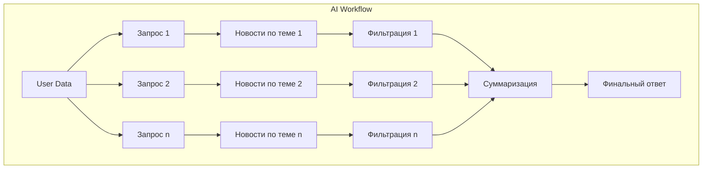
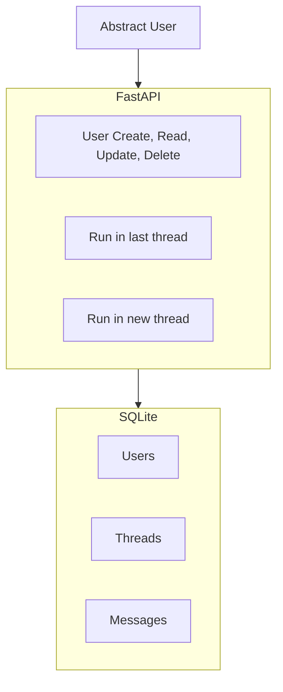
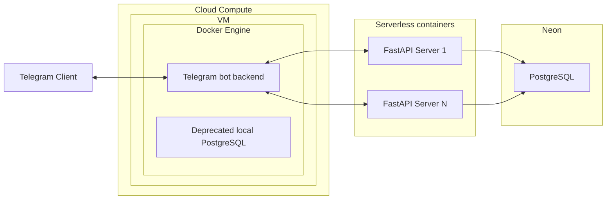

# About the "Lightweight Backend Development" Block

## Why is this needed?

In most AI Agents vacancies and projects, beyond everything related to AI, you will be required to:
- deploy your AI service
- integrate the AI service into an existing backend
- write API integrations for your AI service (tools for the agent)

By completing this block, you will not become a full-fledged backend developer, however:
- you will master rapid serverless development (necessary for startups, MVPs, PoCs)
- You will understand the basic SWE concepts (microservices, databases, APIs, etc.) necessary for passing interviews for junior and middle Applied AI positions
- You will learn how to work with databases and ORMs

## Content: Practice

As you can see on the roadmap, the block is divided into theoretical and practical modules. It is recommended to study the modules from top to bottom, skipping topics you are already familiar with.

By the end of the practical modules, you will implement a production-ready backend that:
- is deployed not on a local machine
- consists of several microservices
- uses serverless technologies
- has tests, logging, and monitoring, etc.
- partially runs on a VM in the cloud, containerized

Step 1: First, you will develop an AI workflow for aggregating and filtering news

Step 2: Then you will develop a backend for this workflow

Step 3: Then you will write a Telegram bot that will use your improved backend with an AI Agent

In the end, you will get a Telegram bot with the following functionality:

(image will be here)

## Content: Theory

:::info instruction
Before proceeding to the next practical modules, complete the preceding theoretical modules as needed.
:::

:::danger about the Lite backend development block
IMFO: An Applied AI engineer does not have to be a backend development specialist, but you yourself must delve into the level of immersion + skip familiar topics.
- **Want to get to Agent development faster?** - study these topics superficially - returning to immersion in SWE during the course of production development.
    - For Full-time learners: spend 0.5-1 days per module
    - For Part-time learners: spend 1-2 days per module
- **Want in-depth knowledge?** - will be useful for future architects
    - For Full-time learners: spend 1-2 days per module, superficially go through the Extra/Silver sections
    - For Part-time learners: spend 2-4 days per module, superficially go through the Extra/Silver sections
:::

### Block Map

- That very IT base
- Practice 1 - workflow
- FastAPI
- Databases
- Practice 2 - backend
- Clouds and VMs
- Docker
- Microservices
- Rapid development
- Practice 3 - app
- Extra ✦