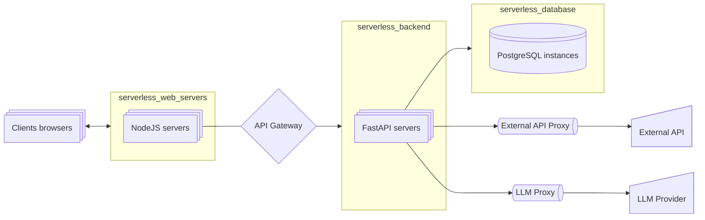

# Microservices and System Architecture for Applied AI

Imagine microservices as modular spacecraft, and Docker as your personal spaceport for assembling them. Here you will learn how to design "orbital stations" for AI Agents: breaking down monolithic systems into autonomous satellite services, configuring their interaction through interstellar protocols (REST/gRPC), and automating deployment with CI/CD launch vehicles. These skills will allow your neural networks to scale like a galactic empire, update without downtime, and survive failures of individual components without collapsing the entire system.

Ask AI Instructions

:::tip instruction
Since these topics do not change over time, it is best to study them with a personal tutor - ChatGPT.

The learning process should be as follows:
- you create a system prompt for ChatGPT ([templates](../metalearning#chatgpt-prompts)), where you describe your background, preferences, level of detail of explanations, etc.
- copy the topic from the list (triple click), and ask ChatGPT to explain this topic to you
- if you want to delve deeper, ask clarifying questions

At the moment, this is the most convenient way to learn the basics. **In addition to concepts, you can study additional materials in the Gold, Silver, Extra sections.**
1. Gold - should definitely be studied before communicating with ChatGPT
2. Ask AI - ask questions on each unfamiliar topic
3. Silver - secondary materials
4. Extra - in-depth topics
:::

## Golden

### 1. Videos

sys des: docker

<iframe width="560" height="315" src="https://www.youtube.com/embed/QEzbZKtLi-g?si=-AWdHrv8kphS7k4F" title="YouTube video player" frameborder="0" allow="accelerometer; autoplay; clipboard-write; encrypted-media; gyroscope; picture-in-picture; web-share" referrerpolicy="strict-origin-when-cross-origin" allowfullscreen></iframe>

### 2. Architectures for GenAI

#### Standard Architecture for an AI Agent

- we need a proxy to the LLM to comply with rate-limiting
- we need a proxy to the external API to comply with rate-limiting and caching results
- we need a gateway in front of the backend to classify requests, determine user roles (paid tier, free tier), set limits on context size, etc., set rate-limiting, etc.

## Ask AI

45. **Basic Concepts of Microservice Architecture (Starter Guide)**
46. Microservices vs Monolith: a complete comparison of architectures
47. Domain-Driven Design: basic principles for microservices
48. API Gateway: patterns for beginners (Overview)
49. Docker for AI services: minimally necessary practices
50. Kubernetes: orchestration basics for AI developers
51. Load balancing of GPU tasks: basic approaches
52. Versioning AI models: semantic versioning
53. A/B testing of models: production use-cases (Brief overview)
54. Security of AI services: OAuth2/JWT in practice
55. Rate limiting for AI operations: basics for beginners
56. CI/CD for AI: minimal working pipeline
57. GRPC vs REST: comparison for AI API (Concept)
58. Caching ML model results: basic strategies
59. Circuit Breaker: operating principle and implementation
60. Monitoring neural network services: key metrics
61. **Caching: TTL vs invalidation (Comparative analysis)**
    

    
Caching: strategies and cache invalidation

    <iframe width="560" height="315" src="https://www.youtube.com/embed/a4yX7RUgTxI?si=fZJZ2tg9YYM_Gmvz" title="YouTube video player" frameborder="0" allow="accelerometer; autoplay; clipboard-write; encrypted-media; gyroscope; picture-in-picture; web-share" referrerpolicy="strict-origin-when-cross-origin" allowfullscreen></iframe>

    

62. Message Queue: basic concepts and use-cases (Overview)

## Silver

System Design Tutorial, 53 min, fully with animations

<iframe width="560" height="315" src="https://www.youtube.com/embed/F2FmTdLtb_4?si=YBQFjHAGU4-tImWM" title="YouTube video player" frameborder="0" allow="accelerometer; autoplay; clipboard-write; encrypted-media; gyroscope; picture-in-picture; web-share" referrerpolicy="strict-origin-when-cross-origin" allowfullscreen></iframe>

## Extra
