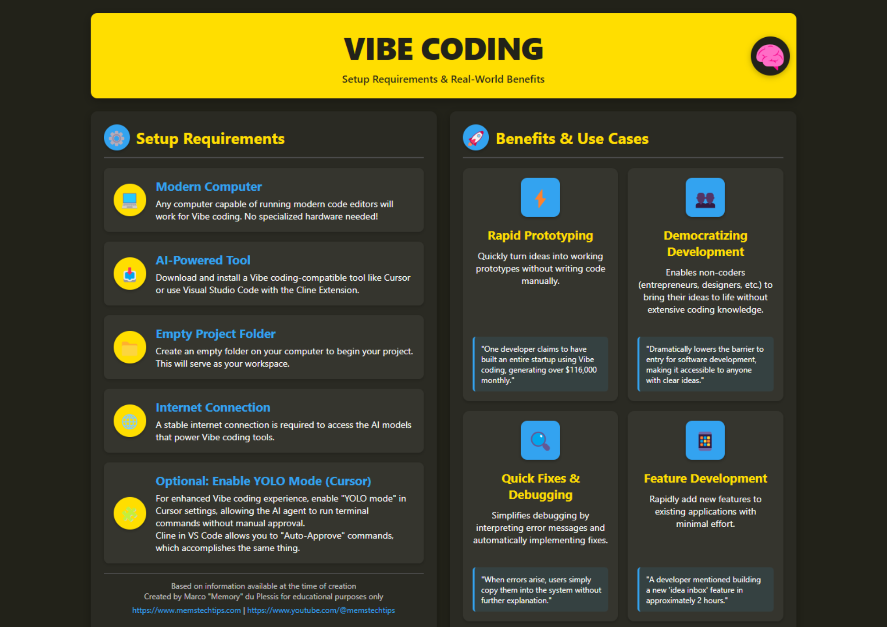
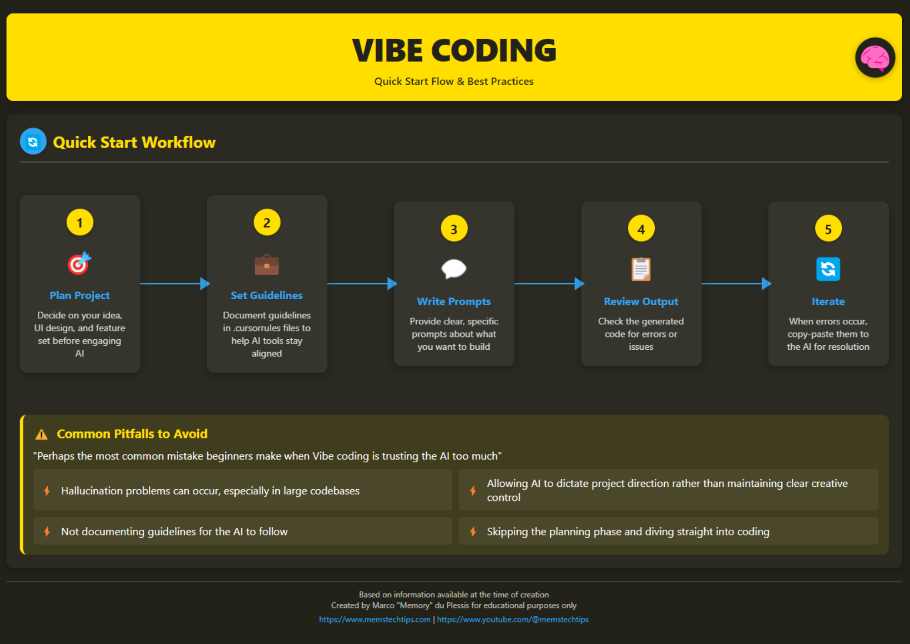

# Vibe-Coding and Cursor AI

In this stage, we will explore a revolutionary approach to programming — vibe-coding — and get acquainted with the Cursor AI tool, which uses artificial intelligence to generate code. You will learn how to apply these technologies to significantly speed up the development process and create applications without in-depth knowledge of programming languages.

<iframe width="560" height="315" src="https://www.youtube.com/embed/Tw18-4U7mts?si=2mFmUAZyvE_S622K" title="YouTube video player" frameborder="0" allow="accelerometer; autoplay; clipboard-write; encrypted-media; gyroscope; picture-in-picture; web-share" referrerpolicy="strict-origin-when-cross-origin" allowfullscreen></iframe>

## Questions

Questions we will discuss:

- What is vibe-coding and how does this approach change traditional development?
- How does Cursor AI implement the concept of vibe-coding in practice?
- How to get started with Cursor AI and generate code using AI?
- What are the advantages and limitations of programming with AI?
- How to integrate vibe-coding into the workflows of professional developers?

## Steps

### 1.1. Understanding the concept of vibe-coding

Vibe-coding is an innovative approach to software development proposed by researcher Andrei Karpathy. This method completely rethinks the programming process: developers formulate their intentions in natural language and allow artificial intelligence to generate most of the actual code[^1].

:::warning

**Vibe-coding is not a simple skill**, as most people think. It may be wise to allocate as much time to mastering it as to learning a new programming language. **However, the time invested in learning it will pay off tenfold.**

:::

Key characteristics of vibe-coding:

- Programmers "trust the vibe" and allow AI to perform most of the code writing process
- Developers describe tasks and requirements in human language
- Neural networks automatically create code, fix errors, and implement the necessary functions
- Developers often accept code without fully understanding all the details of its operation[^1]

AI researcher Simon Willison explains an important nuance: "If a neural network wrote every line of your code, but you checked, tested, and fully understood it — it's no longer vibe-coding, but just using a neural network as a typewriter"[^1].

### 1.2. Voice-to-Code: expanding the possibilities of vibe-coding

The spread of vibe-coding has accelerated the transition to programming using voice interfaces. Voice-to-Code technology allows developers to verbally formulate ideas, and AI converts speech into ready-made and working code[^1].

This approach is especially useful for:

- Developers with neurodiversity, as it takes into account different cognitive styles
- Reducing barriers to entry into the IT industry
- Accelerating prototyping and MVP creation processes

As practical examples show, with the help of voice programming and AI, you can create a full-fledged application in 15 minutes without writing a single line of code manually[^2].

### 1.3. Getting acquainted with Cursor AI as a vibe-coding tool

Cursor AI is a code editor with integrated artificial intelligence, which is one of the leading tools for implementing vibe-coding in practice. It offers a unique approach to programming, making the application creation process more accessible and efficient[^3].

Main features of [Cursor AI](https://www.cursor.com/):

- **Code generation**: instant creation of program code based on a description of the task in natural language
- **Automation of routine tasks**: writing templates, adding comments, and structuring projects
- **Error correction**: identifying and eliminating syntax and logic errors
- **Explanation of complex parts of the code**: helping to understand the functionality of various parts of the program[^3]

### 1.4. Practical application of Cursor AI

To get started with [Cursor AI](https://www.cursor.com/):

1. Download and install the program from the [official website](https://www.cursor.com/)
2. After installation, you will see an interface similar to Visual Studio Code, but with additional AI features
3. To interact with AI, call the chat section with the key combination CMD+L
4. Select a language model (GPT-4 or Claude 3.7 Sonnet are recommended for best results)
5. Formulate a request for code generation[^3]

Example request: "Create a project structure for a web application on Flask that allows you to add, delete, and view tasks"[^3].

### 2. Learn the basics of vibe-coding

<iframe width="560" height="315" src="https://www.youtube.com/embed/v7UcVPO4y3c?si=DEaVMhRwFbvj1wiF" title="YouTube video player" frameborder="0" allow="accelerometer; autoplay; clipboard-write; encrypted-media; gyroscope; picture-in-picture; web-share" referrerpolicy="strict-origin-when-cross-origin" allowfullscreen></iframe>

Infographics on vibe-coding

### 3. [Good atomic tips](https://www.reddit.com/r/ChatGPTCoding/comments/1j5l4xw/vibe_coding_manual/)

### 4. How I reduced 90% errors for my Cursor by AI Jason (love him)

1. https://youtu.be/1L509JK8p1I?si=li1kcbXQtp5zOotC
2. https://youtu.be/dF4uCZAY1tk?si=oPu6Iknwxz4Foop3

## Extra Steps

### E1. Professional Vibe-Coding

[Vibecoding Guides](https://github.com/cpjet64/vibecoding) - these guides are written by a person with extensive experience. According to [@llm_notes](https://t.me/llm_notes), using the tips from these guides, you can create architecturally complex services zero-shot.

### E2. How to vibe-code taking into account YESTERDAY'S changes in your framework?

The problem with llm-based assistants is that their pre-training was done on a slice of the Internet made at a certain time - usually this slice is 10+ months behind the current day.
During these months, new frameworks appear, old ones are updated - and assistants write code without knowing about these changes.

So how do you convey this knowledge to the assistant? For this, we need llm.txt and MCP:

<iframe width="560" height="315" src="https://www.youtube.com/embed/fk2WEVZfheI?si=3kpd-35HROIbbCRB" title="YouTube video player" frameborder="0" allow="accelerometer; autoplay; clipboard-write; encrypted-media; gyroscope; picture-in-picture; web-share" referrerpolicy="strict-origin-when-cross-origin" allowfullscreen></iframe>

- https://mirror-feeling-d80.notion.site/MCP-Server-for-llms-txt-1ba808527b1780b38388ee8126933592
- https://github.com/langchain-ai/mcpdoc

### E3. Additional links

- https://github.com/roboco-io/awesome-vibecoding?tab=readme-ov-file - a list of everything on vibe-coding
- https://simonwillison.net/2025/Mar/11/using-llms-for-code/ - guide for experienced devs

## Now we know...

We have explored the concept of vibe-coding as a revolutionary approach to programming using artificial intelligence. We got acquainted with Cursor AI — a code editor with integrated AI that allows you to generate code based on descriptions in natural language. Now we understand how to install and configure Cursor AI, how to interact with it and formulate requests for code generation.

## Exercises

1. **Analysis and reflection**: Think about how the role of a programmer will change in a world where most of the code is written by AI? Which skills will become more valuable, and which will be less in demand?

Answer

https://youtu.be/psLjf6xeaj0?si=VTnLEcGEcff98jHb
approximately from 6:30 to 26:00 - deep thoughts

P.S. Valera and Igor are good friends

3. Install Cursor AI and try to create a simple project (for example, a landing page, calculator, or to-do list) using only descriptions in natural language.
4. Try writing a PRD for your idea - then improve it with expensive ChatGPT - then read its PRD and edit it
5. Useful for life - ask the Agent to "make some kind of graph for you using python and the seaborn library"

⁂

[^1]: https://vc.ru/ai/1868358-vaib-koding-kak-novyi-sposob-razrabotki-programmnogo-obespecheniya

[^2]: https://www.youtube.com/watch?v=FXYPc-L-pnk

[^3]: https://dzen.ru/a/Z9VP64QnBwBkY7cE

[^4]: https://coursehunter.net/course/cursor-programmirovanie-s-ai

[^5]: https://www.youtube.com/watch?v=OZaxtm3RyCw

[^6]: https://www.itrn.ru/expertise/detail.php?id=204078

[^7]: https://habr.com/ru/news/895504/

[^8]: https://itinai.ru/cursor-инновационный-редактор-кода-ide-испол?query-24-page=3

[^9]: https://www.youtube.com/watch?v=XpPrOgVyI98

[^10]: https://techcrunch.com/2025/03/14/ai-coding-assistant-cursor-reportedly-tells-a-vibe-coder-to-write-his-own-damn-code/

[^11]: https://habr.com/ru/news/895918/

[^12]: https://www.youtube.com/watch?v=dan3QfN3CDU

[^13]: https://dzen.ru/a/Z39of6JA-1YoFUi-

[^14]: https://coursehunter.net/course/cursor-ai-polnoe-rukovodstvo-dlya-razrabotchikov

[^15]: https://www.youtube.com/watch?v=oFAPQv5UikM

[^16]: https://ru.wikipedia.org/wiki/Вайб-кодинг

[^17]: https://www.youtube.com/watch?v=CW1aPily6-Q

[^18]: https://productuniversity.ru/cursor

[^19]: https://www.youtube.com/watch?v=pHNOhptPKQI

[^20]: https://dev.to/charlene_/vibe-coding-with-ai-agents-lol-4bkd