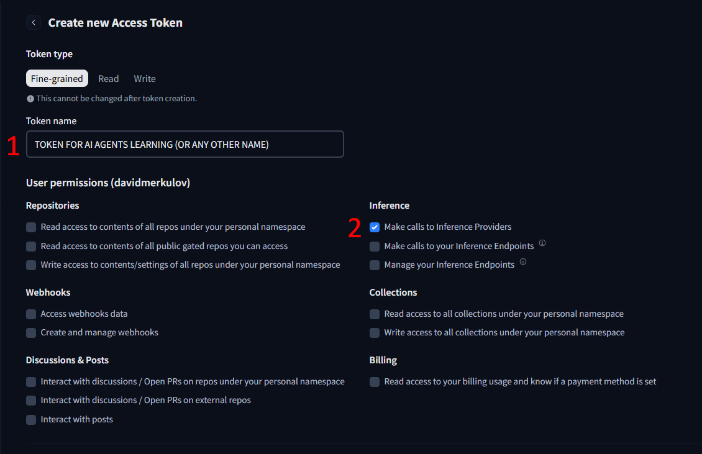
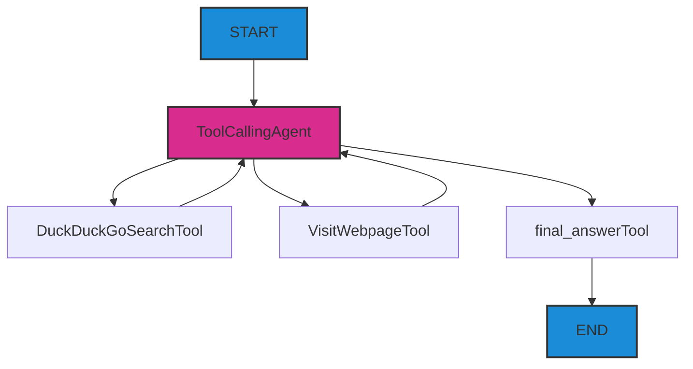

# Creando tu Primer Agente

Quiero que crees tu primer Agente de IA incluso antes de entender los conceptos básicos. Por lo tanto, vamos a empezar directamente con la práctica de crear un agente sencillo que realice investigaciones de varios pasos en Internet.

## Preguntas

- ¿Cómo crear un Agente de IA que pueda buscar información en Internet?
- ¿Cómo escribir un prompt del sistema para un agente?
- ¿Qué componentes básicos (4) son necesarios para crear un agente de búsqueda?

## Pasos

### 1. Obteniendo claves API

#### Opción 1: (recomendada)

:::tip llm-keygen.merkulov.ai

Estoy distribuyendo claves API para el 98% de los modelos del mundo en [llm-keygen.merkulov.ai](https://llm-keygen.merkulov.ai) **(para obtener una clave, ¡solo necesitas 1 clic)**. Proveedores soportados:

- openai, anthropic
- google, deepseek, Xai

- a lot of other model providers via openrouter, openrouter, replicate, etc.

Además de la clave, tendrás una consola web donde podrás gestionar las claves, realizar un seguimiento del consumo y ver los registros.

Los usuarios gratuitos reciben una cuota de 10 millones de tokens al mes para modelos pequeños (pero puedes usar cualquiera, aunque puedes agotar rápidamente la cuota). *Los estudiantes de merkulov.courses no están limitados por esta cuota.*

:::

Solo necesitas autenticarte a través de GitHub y copiar la clave. **Guárdala en un lugar seguro**, la reutilizarás en el futuro.

No se recomienda utilizar modelos más caros que gemini-2.0-flash o gpt-4o-mini, ya que es posible que no tengas suficiente cuota para completar todo el curso.

<details>
<summary>Otras opciones</summary>

#### Huggingface $0.1

Puedes utilizar muchos modelos de código abierto utilizando los endpoints de inferencia de Hugging Face.

Secuencia de acciones:

1. Regístrate en [huggingface.com](https://huggingface.com)
2. Crea una clave API en [huggingface.com/settings/tokens](https://huggingface.com/settings/tokens)
    - selecciona una clave Fine-grained
    - especifica un nombre y da acceso como en la captura de pantalla
        
3. **Guárdala en un lugar seguro**, la reutilizarás en el futuro.

#### Opción 3. langdock

Puedes obtener 110$ durante 7 días en [langdock.com](https://langdock.com) para las APIs de los principales proveedores propietarios.

Se recomienda utilizarlo para desarrollar futuros proyectos enormes con un gran consumo. Puedes registrar tantas cuentas como quieras.

#### Opciones de pago

Elige, regístrate y recarga el saldo de la API en cualquiera de los proveedores:

- [openai.com](https://openai.com)
- [anthropic.com](https://anthropic.com)
- [groq.com](https://groq.com)
- [cohere.com](https://cohere.com)
- [gemini.google.com](https://gemini.google.com)

O recarga el saldo del proxy [openrouter.ai](https://openrouter.ai) para tener acceso a todas las APIs a la vez.

</details>

### 2. Creando tu propio análogo de perplexity (agente de búsqueda en Internet)

#### 1. Regístrate en [replit.com](https://replit.com)

#### 2. Crea un proyecto

1. Choose a template
2. Selecciona Python.
3. Create app

#### 3. Configura el entorno

:::danger no uses replit agent - no podrás practicar con él
Usando un **asistente** (no un agente), edita tu proyecto en replit - **lee,** copia y pega mis prompts, no olvides modificarlos donde sea necesario.
:::

**Necesitas editar el prompt de abajo.**
```
Eres un asistente de profesor - no escribas nada extra y no te adelantes.
Crea un proyecto de aprendizaje vacío en Python:
- en .env añade OPENAI_API_KEY=________ y OPENAI_BASE_URL=https://proxy.merkulov.ai
- instala las bibliotecas smolagents==1.12.0, smolagents[openai]==1.12.0
- crea un archivo main.py vacío e importa desde smolagents DuckDuckGoSearchTool, HfApiModel, ToolCallingAgent, VisitWebpageTool, OpenAIServerModel, PromptTemplates

No hagas nada más.
```

Pulsa apply changes, comprueba el archivo main.py, que todo está bien.

:::warning

1. Ignora las advertencias sobre la falta de la biblioteca smolagents.
2. Si buscas y no puedes encontrar el archivo .env en el directorio -> pulsa los tres puntos -> show hidden files -> .env
3. **¿No olvidaste especificar OPENAI_API_KEY en el prompt?**

Si aparecen errores imprevistos, comprueba primero si estás utilizando un asistente, no un agente.
:::

#### 4. Configura el modelo

Un agente es una combinación de 4 componentes:
- LLM
- prompt
- herramientas

En el curso del trabajo, acumula un historial de mensajes - se puede llamar "contexto".

```
Ahora debemos crear la entidad LLM y configurarla. Crea la clase OpenAIServerModel con los parámetros model_id="openai/gpt-4o-mini".

También crea la variable tools:
tools = [
    DuckDuckGoSearchTool(max_results=5), # búsqueda en Internet a través de un buscador gratuito
    VisitWebpageTool() # lectura de texto de una página web
]
```

Pulsa apply changes.

#### 5. Configura el agente

**La arquitectura cognitiva del agente se ve así:**

Imagina que recibes una query del usuario en el nodo START, y luego corres infinitamente en la dirección de las flechas hasta llegar a END.


**Necesitas editar el prompt de abajo.**

Imagina que le estás explicando a un subordinado muy estúpido lo que tiene que hacer (y solo sabe escribir texto y usar herramientas):
- explica su rol (por ejemplo, "tú eres ...")
- explica lo que tiene que hacer (por ejemplo, "tú debes buscar ...")
- explica lo que hace cada una de las herramientas
- Al final añade "Cuando encuentres la respuesta, llama a la herramienta final_answer, y escríbela en la respuesta."
```
Ahora crea la clase PromptTemplates con el parámetro system_prompt="""
Estás desempeñando el rol de ...
Debes ...
Tienes la herramienta DuckDuckGoSearchTool, que ...
Tienes la herramienta VisitWebpageTool, que ...
Cuando encuentres la respuesta, ...
"""
```

Pulsa apply changes.

#### 6. Toque final

```
Ahora escribe el código restante:
agent = ToolCallingAgent(
    tools=tools,
    model=model,
    prompt_templates=prompt_template,
    max_steps=6 # limitación para evitar bucles
)

# ------

query = "¿En qué año Cassius Clay cambió su nombre?"
output = agent.run(query)

print("Executor result:", output)
```

Pulsa apply changes.

Abre la "consola" a la derecha y ejecuta main.py con el botón grande de arriba. **¡Revisa los resultados!** No te apresures a estudiar el framework smolagents ahora, volveremos a él.

Puedes probar otras preguntas:
- `¿Cuánto cuestan 1000 tokens de YandexGPT Pro en Yandex Cloud para dos modos?`
- `Encuentra el nombre del equipo que quedó en 3er lugar en el TI10. ¿En qué torneo debutó este equipo?`
    Este es un ejemplo de investigación de varios pasos. Para responder a esta pregunta, primero debes averiguar el medallista de bronce y luego averiguar la composición del equipo en ese año.
- **Cualquier otra pregunta que se te ocurra**

<details>
<summary>Respuestas</summary>

1. Cassius Clay cambió su nombre en 1964.
2. 0,60 rublos y 1,20 rublos
3. Star Ladder Star Series Season 10.

Lo más probable es que hayas obtenido una respuesta incorrecta a la última pregunta. Piensa, ¿cómo necesitas complementar el prompt del sistema del agente para que revise la información encontrada o haga una "solicitud adicional"?

<details>
<summary>Sugerencia para mejorar el prompt del sistema</summary>

Para que el agente pueda verificar la información y hacer solicitudes adicionales, puedes añadir las siguientes instrucciones al prompt del sistema:

```
system_prompt="""
Eres un investigador profesional de Internet.
    Tu tarea es encontrar la información que necesita el usuario. Si encuentras parte de alguna información, no la muestres inmediatamente en la respuesta, sino que haz una solicitud para verificarla.
    Utiliza las herramientas DuckDuckGoSearchTool para buscar información en Internet y VisitWebpageTool para visitar páginas web.
    Cuando encuentres la respuesta, llama a la herramienta final_answer, y escríbela en la respuesta.
"""
```


</details>
</details>

¡Felicidades! Has creado tu primer agente que puede realizar investigaciones en Internet. Ejemplos de agentes industriales similares, pero más complejos, son [perplexity](https://www.perplexity.ai), [you.com](https://you.com). Ellos también navegan por la red hasta que encuentran una respuesta.


## Pasos Extra

1. Regístrate en [e2b.dev](https://e2b.dev)
2. Crea una clave API
3. Añade a .env E2B_API_KEY=...

Puedes intentar reemplazar todo el código `main.py` con este, para tocar un agente con planificación, búsqueda y la capacidad de escribir programas + obtener su salida.
```
from smolagents import CodeAgent, DuckDuckGoSearchTool, OpenAIServerModel

model = OpenAIServerModel(model_id="openai/gpt-4o-mini")

agent = CodeAgent(tools=[DuckDuckGoSearchTool()], model=model, executor_type="e2b")
#output = agent.run("How many seconds would it take for a leopard at full speed to run through Pont des Arts?")
print("E2B executor result:", output)
```

**Podemos utilizar un agente similar para resolver tareas que requieran cálculos precisos.**

---

Aquí tienes un ejemplo de un agente que, utilizando e2b, Python y la biblioteca matplotlib, genera una imagen de un gráfico y la envía al chat con el usuario: [ai-analyst](https://ai-analyst.e2b.dev/)
    
Prueba en [ai-analyst](https://ai-analyst.e2b.dev/) el prompt: `Construye un hermoso histograma de Price-Costs-Value con tres columnas para el iPhone como ilustración. Producir un iPhone cuesta 200$, su precio es de 1000$, los usuarios evalúan su utilidad en 1200$.`


## Ahora sabemos...

Hemos estudiado:
- Cómo crear una arquitectura cognitiva básica de un Agente de IA
- Cómo configurar herramientas de búsqueda y visualización de páginas web
- Cómo crear un prompt del sistema eficaz para un agente
- Cómo utilizar el framework smolagents para la creación rápida de prototipos de agentes
- Cómo limitar a un agente para evitar bucles

## Ejercicios

1. ¿De qué componentes básicos consta un agente?
2. Piensa, ¿dónde se puede utilizar un agente de este tipo en tu vida y en tu negocio?
3. ¿Qué problemas pueden surgirle al agente actual al trabajar?
4. Intenta modificar el prompt del sistema del agente para mejorar la calidad de sus respuestas o añadir una nueva funcionalidad.

