<details>
<summary>Procesos de RR. HH.</summary>

<details>
<summary>Selección de currículums (Recruitment)</summary>

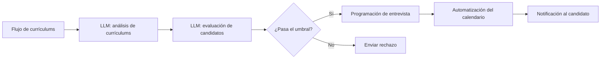

<details>
<summary>Ejemplos de datos de entrada</summary>

```json
[
  {
    "name": "Iván Ivanov",
    "skills": ["Python", "SQL", "Docker"],
    "experience_years": 3,
    "education": "Máster en Ciencias de la Computación"
  },
  {
    "name": "Anna Petrova",
    "skills": ["Java", "Spring", "Microservices"],
    "experience_years": 5,
    "education": "Licenciatura en TI"
  }
]
```

</details>

<details>
<summary>Prompts del sistema</summary>

<details>
<summary>LLM: análisis de currículums</summary>

```text
Eres un modelo para estructurar currículums.
Entrada: texto del currículum.
Tarea: extraer {name, skills, experience_years, education}.
Salida: objeto JSON con los campos del candidato.
```

</details>

<details>
<summary>LLM: evaluación de candidatos</summary>

```text
Eres un modelo para evaluar currículums según criterios dados.
Entrada: objeto {name, skills, experience_years}.
Criterios: relevancia de las habilidades y años de experiencia.
Salida: {name, score: número de 0 a 100}.
```

</details>

<details>
<summary>LLM: programación de entrevista</summary>

```text
Eres un asistente para la planificación de entrevistas.
Entrada: lista de candidatos que superaron el umbral y franjas horarias disponibles para la entrevista.
Tarea: asignar candidatos a las franjas horarias.
Salida: [{name, interview_time}, ...].
```

</details>

</details>

</details>

<details>
<summary>Automatización de la incorporación (RR. HH.)</summary>

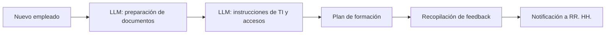

<details>
<summary>Ejemplos de datos de entrada</summary>

```json
{
  "name": "Serguéi Kuznetsov",
  "position": "Desarrollador Frontend",
  "start_date": "2024-07-01"
}
```

</details>

<details>
<summary>Prompts del sistema</summary>

<details>
<summary>LLM: preparación de documentos</summary>

```text
Eres un asistente de RR. HH. para la preparación de documentos corporativos.
Entrada: {name, position, start_date}.
Tarea: formar una lista y plantillas de documentos (contrato de trabajo, NDA, etc.).
Salida: [{document_type, template_text}, ...].
```

</details>

<details>
<summary>LLM: instrucciones de TI y accesos</summary>

```text
Eres un modelo para generar instrucciones para la configuración del entorno de TI.
Entrada: puesto del empleado.
Tarea: crear una lista de verificación para la creación de cuentas y la configuración del software.
Salida: lista de elementos de la lista de verificación.
```

</details>

<details>
<summary>LLM: plan de formación</summary>

```text
Eres un asistente para la formación de nuevos empleados.
Entrada: puesto.
Tarea: desarrollar un plan de formación paso a paso con módulos y plazos.
Salida: [{module, duration_days}, ...].
```

</details>

<details>
<summary>LLM: recopilación de feedback</summary>

```text
Eres un modelo para generar un cuestionario de feedback.
Entrada: lista de etapas de la incorporación.
Tarea: formular preguntas para cada etapa.
Salida: [{stage, questions: [...]}, ...].
```

</details>

<details>
<summary>LLM: notificación a RR. HH.</summary>

```text
Eres un asistente para notificar a RR. HH. sobre los resultados.
Entrada: resultados del feedback.
Tarea: redactar un breve mensaje con las conclusiones clave.
Salida: texto de la notificación.
```

</details>

</details>

</details>

</details>

<details>
<summary>DevOps</summary>

<details>
<summary>Monitorización de la pipeline CICD</summary>

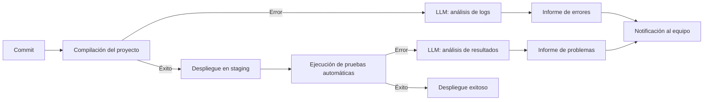

<details>
<summary>Ejemplos de datos de entrada</summary>

```text
Commit: {id: "abc123", author: "ivan", timestamp: "2024-06-15T10:23:00Z"}
Logs de compilación: "ERROR: Module not found: 'utils.js'"
```
</details>

<details>
<summary>Ejemplos de prompts del sistema</summary>

<details>
<summary>LLM: análisis de logs</summary>

```text
Eres un modelo para analizar logs de CI. Entrada: texto de los logs de compilación. Tarea: encontrar la causa del error y proponer una solución. Salida: {error_type, message, recommendation}.
```
</details>

<details>
<summary>LLM: análisis de resultados</summary>

```text
Eres un modelo para analizar los resultados de las pruebas automáticas. Entrada: salida del ejecutor de pruebas. Tarea: identificar las pruebas fallidas y describir el problema. Salida: [{test_name, status: "fail"/"pass", log}].
```
</details>

</details>
</details>

<details>
<summary>Pruebas automáticas: generación y análisis</summary>

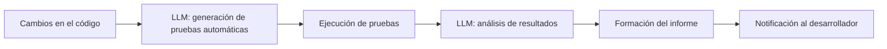

<details>
<summary>Ejemplos de datos de entrada</summary>

```text
Cambios en el código: diff de la función sum(a, b)
Resultados de las pruebas: 3 passed, 1 failed (test_sum.js)
```
</details>

<details>
<summary>Ejemplos de prompts del sistema</summary>

<details>
<summary>LLM: generación de pruebas automáticas</summary>

```text
Eres un asistente para la generación de pruebas automáticas. Entrada: diff del código. Tarea: generar pruebas unitarias en Jest para funciones nuevas o modificadas. Salida: código de las pruebas.
```
</details>

<details>
<summary>LLM: análisis de resultados</summary>

```text
Eres un modelo para analizar los resultados de las pruebas. Entrada: salida del ejecutor de pruebas. Tarea: resaltar las pruebas fallidas y sugerir opciones de corrección. Salida: [{test_name, status, suggestion}].
```
</details>

</details>
</details>

</details>

<details>
<summary>Otros casos de uso</summary>

<details>
<summary>Generación de cuestionarios para la formación</summary>

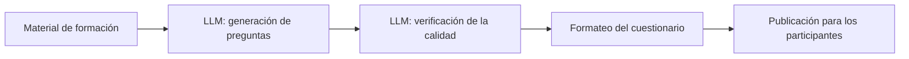

<details>
<summary>Ejemplos de datos de entrada</summary>

```text
Material de formación: "Fundamentos de HTTP: métodos GET/POST, códigos de estado"
```
</details>

<details>
<summary>Ejemplos de prompts del sistema</summary>

<details>
<summary>LLM: generación de preguntas</summary>

```text
Eres un modelo para generar preguntas de formación. Entrada: texto del material. Tarea: formular 5 preguntas de diferentes tipos (abiertas, de opción múltiple). Salida: [{question, type}].
```
</details>

<details>
<summary>LLM: verificación de la calidad</summary>

```text
Eres un modelo para evaluar la calidad de las preguntas. Entrada: lista de preguntas. Tarea: verificar la corrección de las formulaciones y la dificultad. Salida: [{question, ok: true/false, comment}].
```
</details>

</details>
</details>

<details>
<summary>Automatización de informes de gastos</summary>

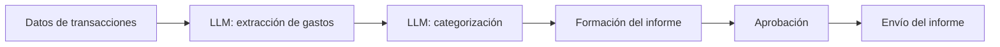

<details>
<summary>Ejemplos de datos de entrada</summary>

```json
{
  "transactions": [
    {"id": "T1", "amount": 250},
    {"id": "T2", "amount": 75}
  ]
}
```
</details>

<details>
<summary>Ejemplos de prompts del sistema</summary>

<details>
<summary>LLM: extracción de gastos</summary>

```text
Eres un modelo para extraer datos sobre gastos. Entrada: array de transacciones. Tarea: devolver una lista de {id, amount}.
```
</details>

<details>
<summary>LLM: categorización</summary>

```text
Eres un modelo para clasificar gastos. Entrada: lista de {id, amount}. Tarea: asignar una categoría de la lista. Salida: [{id, category}].
```
</details>

</details>
</details>

<details>
<summary>Planificador personal de viajes</summary>

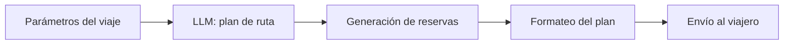

<details>
<summary>Ejemplos de datos de entrada</summary>

```json
{
  "destination": "Barcelona",
  "dates": ["2024-07-01", "2024-07-07"],
  "preferences": ["museos", "playa"]
}
```
</details>

<details>
<summary>Ejemplos de prompts del sistema</summary>

<details>
<summary>LLM: plan de ruta</summary>

```text
Eres un asistente para la planificación de viajes. Entrada: parámetros del viaje. Tarea: proponer una ruta por días. Salida: [{day, activities}].
```
</details>

<details>
<summary>LLM: generación de reservas</summary>

```text
Eres un modelo para formar reservas. Entrada: ruta. Tarea: generar datos para la reserva de hotel y transporte. Salida: [{service, details}].
```
</details>

<details>
<summary>LLM: formateo del plan</summary>

```text
Eres un asistente para formatear el plan. Entrada: datos de las reservas y la ruta. Tarea: recopilar un documento único con el horario. Salida: markdown.
```
</details>

</details>
</details>

</details>

<details>
<summary>Enrutamiento de solicitudes a cuatro departamentos</summary>

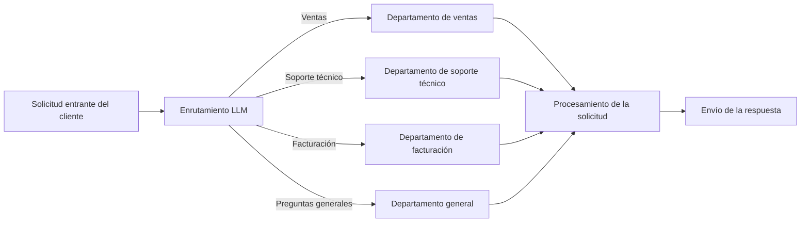

<details>
<summary>Ejemplos de solicitudes entrantes</summary>

```text
Solicitud 1: "¡Hola! Quiero saber sobre las nuevas tarifas."
Solicitud 2: "No puedo pagar la factura, el pago es rechazado."
Solicitud 3: "¿Cómo conecto el roaming internacional?"
Solicitud 4: "¿Dónde puedo encontrar el contrato de oferta?"
```

</details>

<details>
<summary>Prompt del sistema: Enrutamiento LLM</summary>

```text
Eres un modelo de enrutamiento de solicitudes entrantes de clientes.
Datos de entrada:
- Texto de la solicitud del cliente: {request}
Tarea: determinar la dirección de procesamiento de la solicitud: uno de los valores "Ventas", "Soporte técnico", "Facturación", "Preguntas generales".
Salida: cadena con uno de los valores especificados.
```

</details>

<details>
<summary>Prompt del sistema: Procesamiento de solicitudes LLM</summary>

```text
Eres un modelo para procesar las solicitudes de los clientes en la dirección {direction}.
Datos de entrada:
- Texto de la solicitud del cliente: {request}
Tarea: formar una respuesta detallada y cortés a la solicitud de acuerdo con las especificidades de la dirección.
Salida: respuesta de texto al cliente.
```

</details>

</details>

<details>
<summary>Ejemplos de flujos de trabajo Web3</summary>

<details>
<summary>Minting y listado de NFT</summary>

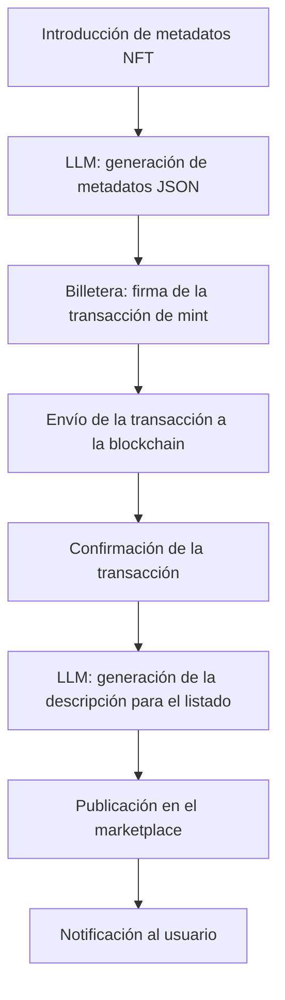

<details>
<summary>Ejemplos de datos de entrada</summary>

```json
{
  "name": "CryptoKitty #2024",
  "description": "NFT exclusivo con un gatito animado",
  "image": "https://example.com/cat.gif",
  "attributes": [
    { "trait_type": "rarity", "value": "epic" },
    { "trait_type": "background", "value": "galaxy" }
  ]
}
```

</details>

<details>
<summary>Prompts del sistema</summary>

<details>
<summary>LLM: generación de metadatos JSON</summary>

```text
Eres un modelo para generar metadatos JSON de NFT en formato ERC-721.
Entrada: {name, description, image, attributes}.
Salida: objeto JSON sin comentarios innecesarios.
```

</details>

<details>
<summary>LLM: generación de la descripción para el listado</summary>

```text
Eres un modelo para escribir descripciones de venta de NFT.
Entrada: metadatos JSON de NFT.
Tarea: formar una descripción corta (2–3 frases) y pegadiza.
Salida: texto limpio.
```

</details>

</details>
</details>

<details>
<summary>Swap de tokens en DEX</summary>

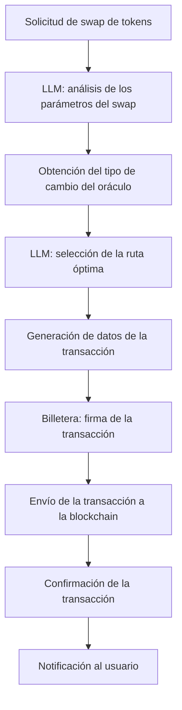

<details>
<summary>Ejemplos de solicitudes entrantes</summary>

```text
Solicitud 1: "Cambiar 1.5 ETH a DAI al mejor tipo de cambio."
Solicitud 2: "Swapear 1000 USDC a USDT con comisiones mínimas."
```

</details>

<details>
<summary>Prompts del sistema</summary>

<details>
<summary>LLM: análisis de los parámetros del swap</summary>

```text
Eres un modelo para extraer los parámetros del swap de una solicitud de texto.
Entrada: texto de la solicitud.
Tarea: devolver JSON {from_token, to_token, amount}.
```

</details>

<details>
<summary>LLM: selección de la ruta óptima</summary>

```text
Eres un modelo para seleccionar la ruta óptima del swap en DEX.
Entrada: JSON {from_token, to_token, amount}.
Tarea: proponer una ruta de intercambio a través de pools, minimizando el deslizamiento.
Salida: JSON {route, estimated_gas}.
```

</details>

</details>
</details>

<details>
<summary>Creación de una propuesta en DAO</summary>

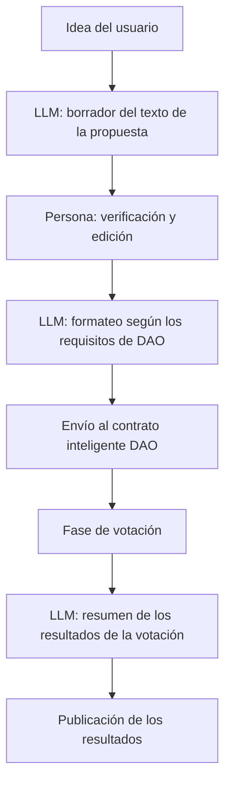

<details>
<summary>Ejemplos de solicitudes entrantes</summary>

```text
Idea 1: "Proponer aumentar el pool de liquidez a través de una comisión del 5% de las transacciones."
Idea 2: "Implementar un programa de recompensas para los participantes activos de DAO."
```

</details>

<details>
<summary>Prompts del sistema</summary>

<details>
<summary>LLM: borrador del texto de la propuesta</summary>

```text
Eres un modelo para transformar una idea en una propuesta formal de DAO.
Entrada: texto de la idea.
Tarea: formar JSON {title, description}.
```

</details>

<details>
<summary>LLM: formateo según los requisitos de DAO</summary>

```text
Eres un modelo para formatear un borrador según la plantilla de DAO.
Entrada: JSON {title, description}.
Requisitos: title hasta 100 caracteres, description hasta 1000 caracteres.
Salida: JSON {title, description}.
```

</details>

<details>
<summary>LLM: resumen de los resultados de la votación</summary>

```text
Eres un modelo para crear un resumen final de la votación.
Entrada: lista de votos [{voter, vote}].
Tarea: contar los resultados y formular una conclusión.
Salida: resumen de texto.
```

</details>

</details>
</details>

<details>
<summary>Auditoría automatizada de contratos inteligentes</summary>

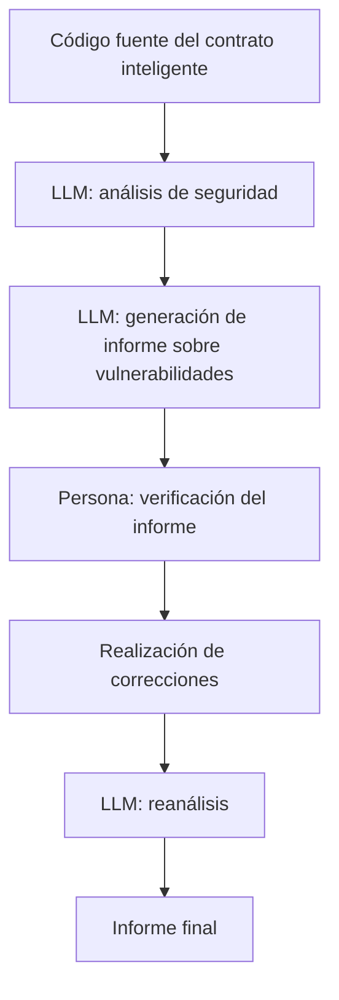

<details>
<summary>Ejemplos de datos de entrada</summary>

```solidity
// SPDX-License-Identifier: MIT
pragma solidity ^0.8.0;

contract SimpleToken {
    mapping(address => uint256) public balances;
    function mint(address to, uint256 amount) public {
        balances[to] += amount;
    }
}
```

</details>

<details>
<summary>Prompts del sistema</summary>

<details>
<summary>LLM: análisis de seguridad</summary>

```text
Eres un modelo para analizar la seguridad de los contratos inteligentes.
Entrada: código fuente del contrato.
Tarea: identificar vulnerabilidades (overflow, reentrancy, etc.) y dar recomendaciones.
Salida: JSON [{issue, severity, recommendation}].
```

</details>

<details>
<summary>LLM: generación de informe sobre vulnerabilidades</summary>

```text
Eres un modelo para redactar un informe basado en el análisis de vulnerabilidades.
Entrada: resultados del análisis de seguridad.
Tarea: escribir un informe detallado en markdown con una descripción de cada problema y recomendaciones.
Salida: markdown.
```

</details>

</details>
</details>

</details>
