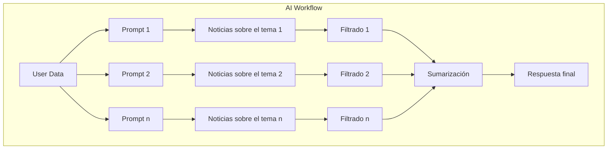
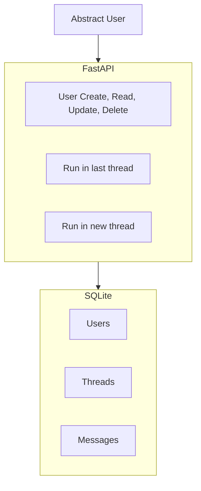
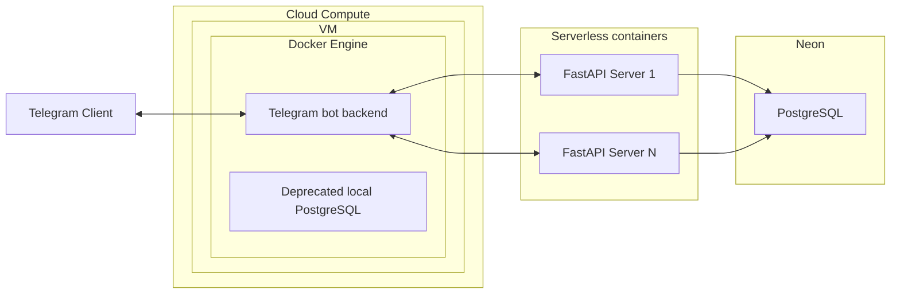

# Sobre el bloque "Desarrollo de Backend Ligero"

## ¿Por qué es necesario?

En la mayoría de las ofertas de empleo y proyectos de AI Agents, más allá de todo lo relacionado con la IA, se requerirá que sepas:
- desplegar tu servicio de IA
- integrar el servicio de IA en un backend existente
- escribir integraciones de API para tu servicio de IA (herramientas para el agente)

Al completar este bloque, no te convertirás en un desarrollador de backend completo, sin embargo:
- dominarás el desarrollo serverless rápido (necesario para startups, MVP, PoC)
- Comprenderás los conceptos básicos de SWE (microservicios, bases de datos, API, etc.) necesarios para superar las entrevistas para puestos junior y middle de Applied AI
- Aprenderás a trabajar con bases de datos y ORM

## Contenido: Práctica

Como puedes ver en la hoja de ruta, el bloque se divide en módulos teóricos y prácticos. Se recomienda estudiar los módulos de arriba a abajo, omitiendo los temas que te sean familiares.

Al final de los módulos prácticos, implementarás un backend listo para producción que:
- no se despliega en una máquina local
- consta de varios microservicios
- utiliza tecnologías serverless
- tiene pruebas, registro y monitorización, etc.
- funciona parcialmente en una VM en la nube, contenedorizado

Paso 1: Al principio, desarrollarás un workflow de IA para agregar y filtrar noticias

Paso 2: Luego, desarrollarás un backend para este workflow

Paso 3: Luego, escribirás un bot de Telegram que utilizará tu backend mejorado con un Agente de IA

Al final, obtendrás un bot de Telegram con la siguiente funcionalidad:

(aquí habrá una imagen)

## Contenido: Teoría

:::info instrucción
Antes de pasar a los siguientes módulos prácticos, completa los módulos teóricos precedentes según sea necesario.
:::

:::danger про Lite backend development блок
IMFO: Un ingeniero de Applied AI no tiene que ser un especialista en desarrollo de backend, pero debes profundizar por tu cuenta con el nivel de inmersión + omitir los temas familiares.
- **¿Quieres pasar más rápido al desarrollo de Agentes?** - estudia estos temas superficialmente - volviendo a la inmersión en SWE durante el desarrollo industrial.
    - Para estudiantes a tiempo completo: dedica 0.5-1 días por módulo
    - Para estudiantes a tiempo parcial: dedica 1-2 días por módulo
- **¿Quieres conocimientos profundos?** - será útil para futuros arquitectos
    - Para estudiantes a tiempo completo: dedica 1-2 días por módulo, estudia superficialmente las secciones Extra/Silver
    - Para estudiantes a tiempo parcial: dedica 2-4 días por módulo, estudia superficialmente las secciones Extra/Silver
:::

### Mapa del bloque

- Esa base de IT
- Practice 1 - workflow
- FastAPI
- Bases de datos
- Practice 2 - backend
- Nubes y VM
- Docker
- Microservicios
- Desarrollo rápido
- Practice 3 - app
- Extra ✦
