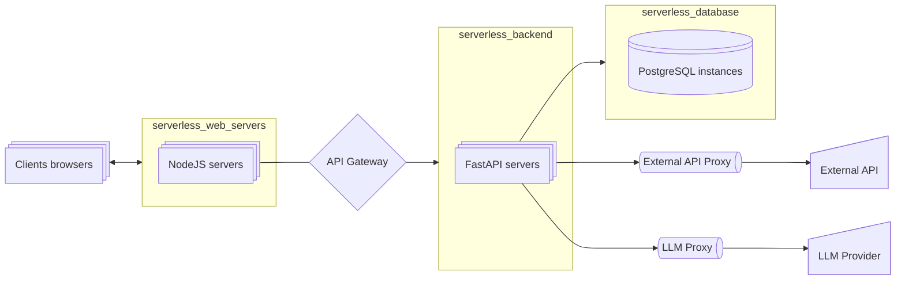

# Microservicios y arquitectura de sistemas para IA Aplicada

Imagina que los microservicios son naves espaciales modulares y Docker es tu cosmódromo personal para ensamblarlas. Aquí aprenderás a diseñar "estaciones orbitales" para Agentes de IA: dividir sistemas monolíticos en servicios-satélite autónomos, configurar su interacción a través de protocolos interestelares (REST/gRPC) y automatizar el despliegue con cohetes portadores CI/CD. Estas habilidades permitirán que tus redes neuronales se escalen como un imperio galáctico, se actualicen sin tiempo de inactividad y sobrevivan a fallos de componentes individuales sin el colapso de todo el sistema.

Instrucciones para Ask AI

:::tip instrucción
Dado que estos temas no cambian con el tiempo, lo mejor es estudiarlos con un profesor personal: ChatGPT.

El proceso de estudio debe ser el siguiente:
- Creas un prompt de sistema para ChatGPT ([plantillas](../metalearning#chatgpt-prompts)), donde describes tus antecedentes, preferencias, nivel de detalle de las explicaciones, etc.
- Copias el tema de la lista (triple clic) y le pides a ChatGPT que te explique ese tema.
- Si deseas profundizar, haz preguntas aclaratorias.

Actualmente, esta es la forma más conveniente de aprender los conceptos básicos. **Además de los conceptos, puedes estudiar materiales adicionales en las secciones Gold, Silver, Extra.**
1. Gold: es imprescindible estudiar antes de interactuar con ChatGPT.
2. Ask AI: haz preguntas sobre cada tema desconocido.
3. Silver: materiales secundarios.
4. Extra: temas avanzados.
:::

## Golden

### 1. Videos

sys des: docker

<iframe width="560" height="315" src="https://www.youtube.com/embed/QEzbZKtLi-g?si=-AWdHrv8kphS7k4F" title="YouTube video player" frameborder="0" allow="accelerometer; autoplay; clipboard-write; encrypted-media; gyroscope; picture-in-picture; web-share" referrerpolicy="strict-origin-when-cross-origin" allowfullscreen></iframe>

### 2. Arquitecturas para GenAI

#### Arquitectura estándar para un Agente de IA

- Necesitamos un proxy para LLM para cumplir con el rate-limiting.
- Necesitamos un proxy para la API externa para cumplir con el rate-limiting y el almacenamiento en caché de los resultados.
- Necesitamos una puerta de enlace (gateway) frente al backend para clasificar las solicitudes, determinar los roles del usuario (nivel de pago, nivel gratuito), establecer límites en el tamaño del contexto, etc., establecer el rate-limiting, etc.

## Ask AI

45. **Conceptos básicos de la arquitectura de microservicios (Guía de inicio)**
46. Microservicios vs Monolito: comparación completa de arquitecturas
47. Domain-Driven Design: principios básicos para microservicios
48. API Gateway: patrones para principiantes (Resumen)
49. Docker para servicios de IA: prácticas mínimas necesarias
50. Kubernetes: fundamentos de la orquestación para desarrolladores de IA
51. Balanceo de carga de tareas de GPU: enfoques básicos
52. Versionado de modelos de IA: versionado semántico
53. Pruebas A/B de modelos: casos de producción (Breve resumen)
54. Seguridad de los servicios de IA: OAuth2/JWT en la práctica
55. Rate limiting para operaciones de IA: fundamentos para principiantes
56. CI/CD para IA: pipeline de trabajo mínimo
57. GRPC vs REST: comparación para API de IA (Concepto)
58. Almacenamiento en caché de resultados de modelos ML: estrategias básicas
59. Circuit Breaker: principio de funcionamiento e implementación
60. Monitorización de servicios de redes neuronales: métricas clave
61. **Almacenamiento en caché: TTL vs invalidación (Análisis comparativo)**
    

    
Almacenamiento en caché: estrategias e invalidación de la caché

    <iframe width="560" height="315" src="https://www.youtube.com/embed/a4yX7RUgTxI?si=fZJZ2tg9YYM_Gmvz" title="YouTube video player" frameborder="0" allow="accelerometer; autoplay; clipboard-write; encrypted-media; gyroscope; picture-in-picture; web-share" referrerpolicy="strict-origin-when-cross-origin" allowfullscreen></iframe>

    

62. Message Queue: conceptos básicos y casos de uso (Resumen)

## Silver

System Design Tutorial, 53 min, fully with animations

<iframe width="560" height="315" src="https://www.youtube.com/embed/F2FmTdLtb_4?si=YBQFjHAGU4-tImWM" title="YouTube video player" frameborder="0" allow="accelerometer; autoplay; clipboard-write; encrypted-media; gyroscope; picture-in-picture; web-share" referrerpolicy="strict-origin-when-cross-origin" allowfullscreen></iframe>

## Extra
