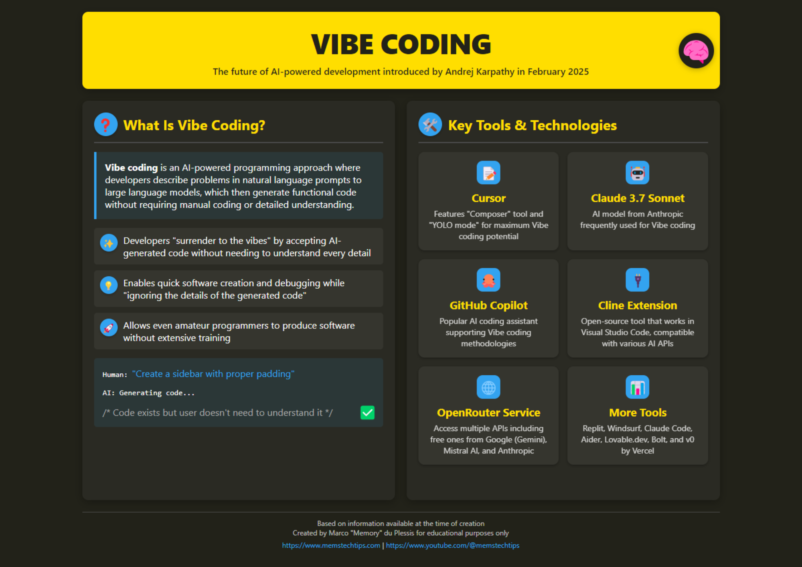

# Vibe-Coding y Cursor AI

En esta etapa, exploraremos un enfoque revolucionario para la programación: el vibe-coding, y conoceremos la herramienta Cursor AI, que utiliza inteligencia artificial para generar código. Aprenderá a aplicar estas tecnologías para acelerar significativamente el proceso de desarrollo y crear aplicaciones sin un conocimiento profundo de los lenguajes de programación.

<iframe width="560" height="315" src="https://www.youtube.com/embed/Tw18-4U7mts?si=2mFmUAZyvE_S622K" title="YouTube video player" frameborder="0" allow="accelerometer; autoplay; clipboard-write; encrypted-media; gyroscope; picture-in-picture; web-share" referrerpolicy="strict-origin-when-cross-origin" allowfullscreen></iframe>

## Preguntas

Preguntas que discutiremos:

- ¿Qué es el vibe-coding y cómo este enfoque cambia el desarrollo tradicional?
- ¿Cómo implementa Cursor AI el concepto de vibe-coding en la práctica?
- ¿Cómo empezar a trabajar con Cursor AI y generar código con IA?
- ¿Cuáles son las ventajas y limitaciones de la programación con IA?
- ¿Cómo integrar el vibe-coding en los flujos de trabajo de los desarrolladores profesionales?

## Pasos

### 1.1. Comprender el concepto de vibe-coding

Vibe-coding es un enfoque innovador para el desarrollo de software propuesto por el investigador Andrei Karpathy. Este método redefine por completo el proceso de programación: los desarrolladores formulan sus intenciones en lenguaje natural y permiten que la inteligencia artificial genere la mayor parte del código real[^1].

:::warning

**El vibe-coding no es una habilidad simple**, como piensa la mayoría. Puede ser razonable dedicar tanto tiempo a dominarlo como a aprender un nuevo lenguaje de programación. **Sin embargo, el tiempo invertido en aprenderlo se amortizará decenas de veces.**

:::

Características clave del vibe-coding:

- Los programadores "confían en la vibra" y permiten que la IA realice la mayor parte del proceso de escritura de código
- Los desarrolladores describen las tareas y los requisitos en lenguaje humano
- Las redes neuronales crean automáticamente código, corrigen errores e implementan las funciones necesarias
- Los desarrolladores a menudo aceptan el código sin comprender completamente todos los detalles de su funcionamiento[^1]

El investigador de IA Simon Willison explica un matiz importante: "Si la red neuronal escribió cada línea de su código, pero usted lo verificó, probó y entendió completamente, entonces no es vibe-coding, sino simplemente usar la red neuronal como una máquina de escribir"[^1].

### 1.2. Voice-to-Code: ampliando las capacidades del vibe-coding

La propagación del vibe-coding ha acelerado la transición a la programación mediante interfaces de voz. La tecnología Voice-to-Code permite a los desarrolladores formular verbalmente ideas, y la IA convierte el habla en código listo y funcional[^1].

Este enfoque es especialmente útil para:

- Desarrolladores con neurodiversidad, ya que tiene en cuenta diferentes estilos cognitivos
- Reducir las barreras de entrada a la industria de TI
- Acelerar los procesos de creación de prototipos y MVP

Como muestran los ejemplos prácticos, con la ayuda de la programación por voz y la IA, se puede crear una aplicación completa en 15 minutos sin escribir una sola línea de código manualmente[^2].

### 1.3. Introducción a Cursor AI como herramienta de vibe-coding

Cursor AI es un editor de código con inteligencia artificial integrada, que es una de las principales herramientas para implementar el vibe-coding en la práctica. Ofrece un enfoque único para la programación, haciendo que el proceso de creación de aplicaciones sea más accesible y eficiente[^3].

Funciones principales de [Cursor AI](https://www.cursor.com/):

- **Generación de código**: creación instantánea de código de programa basado en una descripción de la tarea en lenguaje natural
- **Automatización de tareas rutinarias**: escritura de plantillas, adición de comentarios y estructuración de proyectos
- **Corrección de errores**: identificación y eliminación de errores sintácticos y lógicos
- **Explicación de partes complejas del código**: ayuda para comprender la funcionalidad de diferentes secciones del programa[^3]

### 1.4. Aplicación práctica de Cursor AI

Para empezar a trabajar con [Cursor AI](https://www.cursor.com/):

1. Descargue e instale el programa desde el [sitio web oficial](https://www.cursor.com/)
2. Después de la instalación, verá una interfaz similar a Visual Studio Code, pero con funciones adicionales de IA
3. Para interactuar con la IA, abra la sección de chat con la combinación de teclas CMD+L
4. Seleccione un modelo de lenguaje (para obtener los mejores resultados, se recomiendan GPT-4 o Claude 3.7 Sonnet)
5. Formule una solicitud para generar código[^3]

Ejemplo de solicitud: "Cree una estructura de proyecto para una aplicación web en Flask que permita agregar, eliminar y ver tareas"[^3].

### 2. Aprenda los fundamentos del vibe-coding

<iframe width="560" height="315" src="https://www.youtube.com/embed/v7UcVPO4y3c?si=DEaVMhRwFbvj1wiF" title="YouTube video player" frameborder="0" allow="accelerometer; autoplay; clipboard-write; encrypted-media; gyroscope; picture-in-picture; web-share" referrerpolicy="strict-origin-when-cross-origin" allowfullscreen></iframe>

Infografía sobre vibe-coding

### 3. [Buenos consejos atómicos](https://www.reddit.com/r/ChatGPTCoding/comments/1j5l4xw/vibe_coding_manual/)

## Pasos adicionales

### E1. Vibe-Coding profesional

[Vibecoding Guides](https://github.com/cpjet64/vibecoding) - estas guías están escritas por una persona con mucha experiencia. Según la experiencia de [@llm_notes](https://t.me/llm_notes), utilizando los consejos de estas guías, podrá crear servicios industriales y arquitectónicamente complejos zero-shot.

### E2. ¿Cómo vibe-codificar teniendo en cuenta los cambios de AYER en su framework?

El problema de los asistentes basados en llm es que su preentrenamiento se realizó en un corte de Internet realizado en un momento determinado; generalmente, este corte está 10+ meses por detrás del día actual.
Durante estos meses, aparecen nuevos frameworks, los antiguos se actualizan y los asistentes escriben código sin conocer estos cambios.

Entonces, ¿cómo transmitir este conocimiento al asistente? Para ello, necesitaremos llm.txt y MCP:

<iframe width="560" height="315" src="https://www.youtube.com/embed/fk2WEVZfheI?si=3kpd-35HROIbbCRB" title="YouTube video player" frameborder="0" allow="accelerometer; autoplay; clipboard-write; encrypted-media; gyroscope; picture-in-picture; web-share" referrerpolicy="strict-origin-when-cross-origin" allowfullscreen></iframe>

- https://mirror-feeling-d80.notion.site/MCP-Server-for-llms-txt-1ba808527b1780b38388ee8126933592
- https://github.com/langchain-ai/mcpdoc

### E3. Enlaces adicionales

- https://github.com/roboco-io/awesome-vibecoding?tab=readme-ov-file - lista de todo sobre vibe-coding
- https://simonwillison.net/2025/Mar/11/using-llms-for-code/ - guía para desarrolladores experimentados

## Ahora sabemos...

Hemos explorado el concepto de vibe-coding como un enfoque revolucionario para la programación utilizando inteligencia artificial. Conocimos Cursor AI, un editor de código con IA integrada que le permite generar código basado en descripciones en lenguaje natural. Ahora entendemos cómo instalar y configurar Cursor AI, cómo interactuar con él y cómo formular solicitudes para generar código.

## Ejercicios

1. **Análisis y reflexión**: ¿Cómo cree que cambiará el papel del programador en un mundo donde la mayor parte del código está escrito por IA? ¿Qué habilidades se volverán más valiosas y cuáles menos demandadas?

Respuesta

https://youtu.be/psLjf6xeaj0?si=VTnLEcGEcff98jHb
aproximadamente desde las 6:30 hasta las 26:00 - pensamientos profundos

P.D. Valera e Igor son buenos amigos

3. Instale Cursor AI e intente crear un proyecto simple (por ejemplo, una página de destino, una calculadora o una lista de tareas pendientes) utilizando solo descripciones en lenguaje natural.
4. Intente escribir un PRD para su idea, luego mejórelo con ChatGPT caro, luego lea su PRD y edítelo
5. Útil para la vida: pídale al Agente que "haga un gráfico para usted usando Python y la biblioteca Seaborn"

⁂

[^1]: https://vc.ru/ai/1868358-vaib-koding-kak-novyi-sposob-razrabotki-programmnogo-obespecheniya

[^2]: https://www.youtube.com/watch?v=FXYPc-L-pnk

[^3]: https://dzen.ru/a/Z9VP64QnBwBkY7cE

[^4]: https://coursehunter.net/course/cursor-programmirovanie-s-ai

[^5]: https://www.youtube.com/watch?v=OZaxtm3RyCw

[^6]: https://www.itrn.ru/expertise/detail.php?id=204078

[^7]: https://habr.com/ru/news/895504/

[^8]: https://itinai.ru/cursor-инновационный-редактор-кода-ide-испол?query-24-page=3

[^9]: https://www.youtube.com/watch?v=XpPrOgVyI98

[^10]: https://techcrunch.com/2025/03/14/ai-coding-assistant-cursor-reportedly-tells-a-vibe-coder-to-write-his-own-damn-code/

[^11]: https://habr.com/ru/news/895918/

[^12]: https://www.youtube.com/watch?v=dan3QfN3CDU

[^13]: https://dzen.ru/a/Z39of6JA-1YoFUi-

[^14]: https://coursehunter.net/course/cursor-ai-polnoe-rukovodstvo-dlya-razrabotchikov

[^15]: https://www.youtube.com/watch?v=oFAPQv5UikM

[^16]: https://ru.wikipedia.org/wiki/Вайб-кодинг

[^17]: https://www.youtube.com/watch?v=CW1aPily6-Q

[^18]: https://productuniversity.ru/cursor

[^19]: https://www.youtube.com/watch?v=pHNOhptPKQI

[^20]: https://dev.to/charlene_/vibe-coding-with-ai-agents-lol-4bkd
