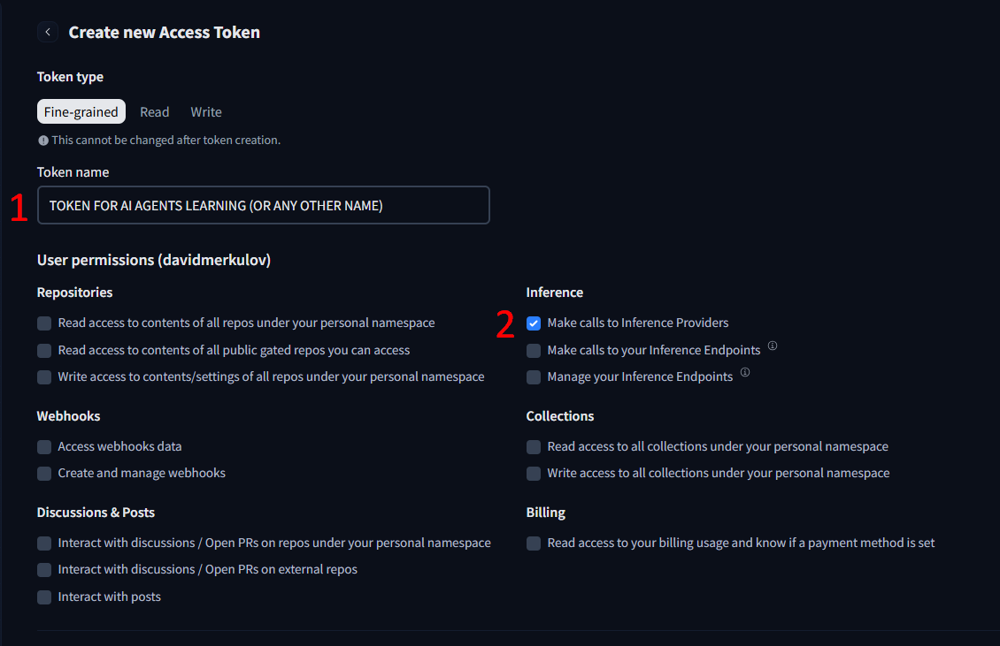

# Создаем первого Агента

Я хочу, чтобы вы создали своего первого AI Агента еще до понимания основных концепций. ПОэтому мы сразу приступим к практике по  созданию простенького агента, который проводит многошаговые исследования в интернете.

## Questions

- Как создать AI Агента, который может искать информацию в интернете?
- Как написать системный промпт для агента?
- Какие базовые компоненты (3) необходимы для создания поискового агента?

## Steps

### 1. Добываем API ключи

#### Вариант 1: (рекомендуемый)

:::tip llm-keygen.merkulov.ai

Я раздаю API ключи на 98% моделей мира в [llm-keygen.merkulov.ai](https://llm-keygen.merkulov.ai) **(чтобы получить ключ, нужен всего 1 клик)**. Поддерживаемые провайдеры:

- openai, anthropic
- google, deepseek, Xai
- yandex, sber
- a lot of other model providers via openrouter, openrouter, replicate, etc.

Кроме ключа у вас будет веб-консоль, где вы сможете управлять ключами, отслеживать потребление, просматривать логи.

Бесплатные пользователи получают квоту на 10М токенов в месяц к небольшим моделям (но использовать можно любые, правда вы можете быстро выжечь квоту). *Студенты merkulov.courses не ограничены данной квотой.*

:::

Вам нужно только аутентифицироваться через гитхаб и скопировать ключ. **Сохраните его в надежное место** - вы будете переиспользовать его в будущем.

Использовать модели дороже gemini-2.0-flash или gpt-4o-mini не рекомендуется, так как вам может не хватить ковты на прохождение всего курса.

<details>
<summary>Другие варианты</summary>

#### Huggingface $0.1

Многие опенсорсные модели вы можете использовать с помощью huggingface inference endpoints.

Последовательность действий:

1. Зарегистрируйтесь на [huggingface.com](https://huggingface.com)
2. Создайте API ключ в [huggingface.com/settings/tokens](https://huggingface.com/settings/tokens)
    - выберите Fine-grained ключ
    - укажите имя и дайте доступ как на скриншоте
        
3. **Сохраните его в надежное место** - вы будете переиспользовать его в будущем.

#### Вариант 3. langdock

Вы можете получить 110$ на 7 дней на [langdock.com](https://langdock.com) на APIшки крупных проприетарных провайдеров.

Рекомендуется использовать для разработки будущих огромных проектов с большим потреблением. Регистрировать можно сколько угодно аккаунтов.

#### Платные варианты

Выберите, зарегистрируйтесь и пополните баланс API на любом из провайдеров:

- [openai.com](https://openai.com)
- [anthropic.com](https://anthropic.com)
- [groq.com](https://groq.com)
- [cohere.com](https://cohere.com)
- [gemini.google.com](https://gemini.google.com)

Или пополните баланс прокси [openrouter.ai](https://openrouter.ai), чтобы иметь доступ сразу ко всем API.

</details>

### 2. Создаем свой аналог perplexity (агент поиска в интернете)

#### 1. Регистрируемся на [replit.com](https://replit.com)

#### 2. Создаем проект

1. Choose a template
2. Выберите Python.
3. Create app

#### 3. Настраиваем окружение

Используя **ассистента** (не агента), редактируйте свой проект на replit - **читайте,** копируйте и вставляйте мои промпты, не забывая их изменить, там где нужно.

**Вам нужно отредактировать промпт ниже.**
```
Ты ассистент преподавателя - не пиши лишнего и не забегай вперед.
Создай пустой учебный проект на питоне:
- в .env добавь OPENAI_API_KEY=________ и OPENAI_BASE_URL=https://proxy.merkulov.ai
- установи библиотеки smolagents, smolagents[openai]
- создай пустой файл main.py и импортируй из smolagents DuckDuckGoSearchTool, HfApiModel, ToolCallingAgent, VisitWebpageTool, OpenAIServerModel, PromptTemplates

Больше ничего не делай.
```

Жмем apply changes, проверяем файл main.py, что всё ок.

#### 4. Настраиваем модель

```
Теперь мы должны создать сущность LLM и настроить её. Создай класс OpenAIServerModel с параметрами model_id="openai/gpt-4o-mini".

Также создайте переменную tools:
tools = [
    DuckDuckGoSearchTool(max_results=5), # поиск в интернете через бесплатный поисковик
    VisitWebpageTool() # чтение текста с веб-страницы
]
```

Жмем apply changes.

#### 5. Настраиваем агента

**Когнитивная архитектура агента выглядит так:**

Представьте себе, что вы получаете query от пользователя на ноде START, а дальше бесконечно бегаете в направлении стрелочек пока не дойдете до END.


**Вам нужно отредактировать промпт ниже.**

Представьте, что вы объясняете очень глупому подчиненному, что он должен делать:
- объясните его роль (например, "ты - ...")
- объясните, что он должен делать (например, "ты должен искать ...")
- объясните, что делает каждый из инструментов
- В конце добавьте "Когда находишь ответ, вызывай инструмент final_answer, и пиши его в ответе."
```
Теперь создай класс класс PromptTemplates с параметром system_prompt="""
Ты ипольняешь роль ...
Ты должен ...
У тебя есть инструмент DuckDuckGoSearchTool, который ...
У тебя есть инструмент VisitWebpageTool, который ...
Когда находишь ответ, ...
"""
```

Жмем apply changes.

#### 6. Финальный штрих

```
Теперь напиши оставшийся код:
agent = ToolCallingAgent(
    tools=tools,
    model=model,
    prompt_templates=prompt_template,
    max_steps=6 # ограничение от зацикливания
)

# ------

query = "В каком году Кассиус Клей сменил имя?"
output = agent.run(query)

print("Executor result:", output)
```

Жмем apply changes.

Откройте справа "консоль" и запустите main.py большой кнопкой сверху. **Просматривайте результаты!** Не спешите изучать фреймворк smolagents сейчас, мы к нему еще вернемся.

Можете попробовать другие вопросы:
- Сколько стоит 1000 токенов YandexGPT Pro в Yandex Cloud для двух режимов?
- Сейчас 2025 год. Покажи мне текущий состав команды, которая заняла 3 место в TI10
    Это - пример многошагового исследования. Для ответа на данный вопрос нужно сначала узнать бронзового призера, а потому узнать состав команды в том году.

<details>
<summary>Ответы</summary>

1. Кассиус Клей сменил имя в 1964 году.
2. 0,60руб и 1,20руб
3. Состав Team Secret на The International 2021:
    **Matumbaman** (Lasse Urpalainen)
    **Nisha** (Michal Jankowski)
    **Zyori** (Ainul Hasan)
    **Puppey** (Kuro Salehi Takhasomi)
    **YapzOr** (Yazied Jaradat) 

</details>

Поздравляем! Вы создали своего первого агента, который может проводить исследования в интернете. Примеры подобных, но более сложных промышленных агентов - [perplexity](https://www.perplexity.ai), [you.com](https://you.com). Они тоже ходят по сети, пока не наткнутся на ответ.


## Extra Steps

1. Регистрация на [e2b.dev](https://e2b.dev)
2. Создайте API ключ
3. Добавьте в .env E2B_API_KEY=...

Вы можете попробовать заменить весь код `main.py` на этот, чтобы потрогать агента с планированием, поиском и возможностью писать программы + получать их вывод.
```
from smolagents import CodeAgent, DuckDuckGoSearchTool, OpenAIServerModel

model = OpenAIServerModel(model_id="openai/gpt-4o-mini")

agent = CodeAgent(tools=[DuckDuckGoSearchTool()], model=model, executor_type="e2b")
#output = agent.run("How many seconds would it take for a leopard at full speed to run through Pont des Arts?")
print("E2B executor result:", output)
```

Мы можем использовать этого агента для решения задач, которые требуют точных расчетов.

## Now we know...

Мы изучили:
- Как создать базовую когнитивную архитектуру AI Агента
- Как настроить инструменты поиска и просмотра веб-страниц
- Как создать эффективный системный промпт для агента
- Как использовать фреймворк smolagents для быстрого прототипирования агентов
- Как ограничить агента, чтобы предотвратить зацикливание

## Exercises

1. Подумайте, где можно использовать такого агента в вашей жизни и бизнесе? 
2. Какие проблемы могут возникнуть у текущего агента при работе? 
3. Попробуйте модифицировать системный промпт агента, чтобы улучшить качество его ответов или добавить новую функциональность.

