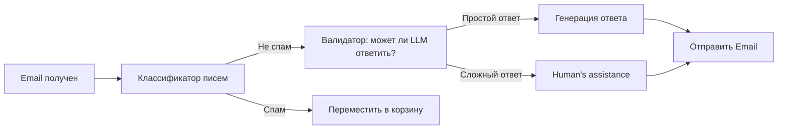
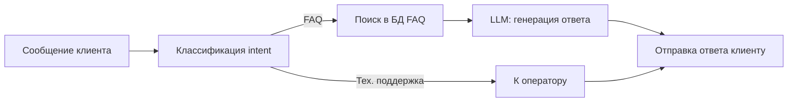
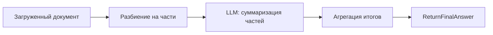
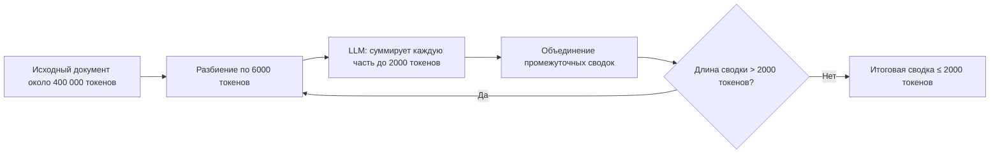
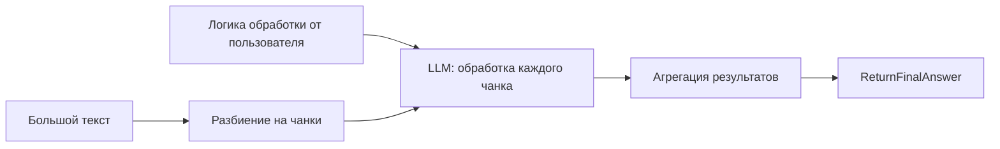
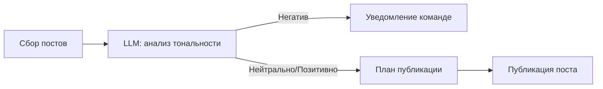
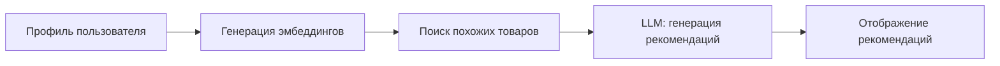
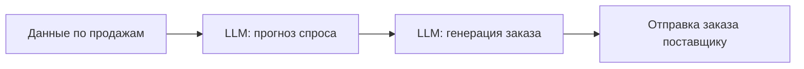
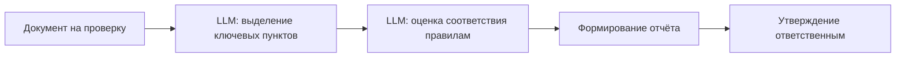

<details>
<summary>Коммуникация и поддержка</summary>

<details>
<summary>Email классификатор</summary>



<details>
<summary>Примеры входных запросов</summary>

```text
Email 1:
От: client@example.com
Тема: Проблема с оплатой
Сообщение: "Здравствуйте, я оплатил заказ несколько дней назад, но статус не изменился. Помогите, пожалуйста."

Email 2:
От: user2@example.com
Тема: Вопрос о продукте
Сообщение: "Добрый день, расскажите, пожалуйста, о возможностях вашего приложения."
```
</details>

<details>
<summary>Системный промпт: Классификатор писем</summary>

```text
Вы — модель, которая классифицирует входящие письма как 'spam' или 'not_spam'.
Получаете на вход заголовок и тело письма.
Выход — одно слово: 'spam' или 'not_spam'.
```
</details>

<details>
<summary>Системный промпт: Валидатор (может ли LLM ответить?)</summary>

```text
Вы — модель, проверяющая, может ли LLM автономно ответить на запрос.
Получаете тело письма.
Если ответ прост — выведите 'simple_answer', иначе 'complex_answer'.
```
</details>

<details>
<summary>Системный промпт: Генерация ответа</summary>

```text
Вы — помощник службы поддержки. Составьте вежливый и лаконичный ответ клиенту на основе текста письма:
\"\"\"{email_body}\"\"\"
```
</details>

</details>

<details>
<summary>Триаж запросов в службу поддержки</summary>



<details>
<summary>Примеры входных запросов</summary>

```text
Запрос 1: "Как сбросить пароль к аккаунту?"
Запрос 2: "У меня ошибка при оплате подписки, номер заказа #12345."
```
</details>

<details>
<summary>Системный промпт: Классификация intent</summary>

```text
Вы — модель, которая на основе сообщения клиента определяет intent: 'FAQ' или 'technical_support'.
Выход — 'FAQ' или 'technical_support'.
```
</details>

<details>
<summary>Системный промпт: LLM генерация ответа по FAQ</summary>

```text
Вы — помощник, генерирующий ответ на основе найденного FAQ.
Вход: запрос клиента и контент FAQ:
\"\"\"Вопрос: {faq_question}
Ответ: {faq_answer}\"\"\"
Выход — полный ответ клиенту.
```
</details>

</details>

</details>
<details>
<summary>Суммаризация документов</summary>

<details>
<summary>Пайплайн суммаризации документов</summary>



<details>
<summary>Примеры входных документов</summary>

```text
Документ 1: Статья о JavaScript (≈ 5 000 токенов)
Документ 2: Отчет по продажам за квартал (≈ 8 000 токенов)
```

</details>

<details>
<summary>Системный промпт: LLM — суммаризация частей</summary>

```text
Вы — модель для суммаризации текстовых фрагментов.
Ваша задача — на основе входного фрагмента (≤ 6000 токенов) сформировать краткую и информативную сводку (≤ 500 токенов).
Вход: текстовый фрагмент документа.
Выход: сводка фрагмента.
```

</details>

</details>

<details>
<summary>Суммаризация бесконечного текста</summary>

Допустим, вы можете использовать только LLM, которая максимально вмещает 8000 токенов в свои Attention-слои. Максимально LLM может генерировать до 2000 токенов. (Итого: 6000 токенов input, 2000 output)



Например, для текста в 18 мегатокенов, алгоритм отработает в 2 цикла суммаризации:
    1. 1 цикл: 18 000 токенов -> 6 000 токенов
        1.1. 18 000 токенов -> 3 чанка по 6 000 токенов
        1.2. 3 чанка по 6 000 токенов -> 3 саммари по 2 000 токенов
        1.3. 3 саммари по 2 000 токенов -> конкатенация в 1 сводку в 6 000 токенов
    2. 2 цикл: 6 000 токенов -> 2 000 токенов
        2.1. 6 000 токенов -> 1 чанк по 6 000 токенов
        2.2. 1 чанк по 6 000 токенов -> 1 саммари по 2 000 токенов
        2.3. 1 саммари по 2 000 токенов -> финальная сводка

<details>
<summary>Примеры входного документа</summary>

```text
Документ: Техническая спецификация продукта (≈ 400 000 токенов)
```

</details>

<details>
<summary>Системный промпт: LLM — суммирует каждую часть до 2000 токенов</summary>

```text
Суммаризируй текст в 2000 токенов.
```

</details>

</details>

<details>
<summary>Анализ и обработка большого текста с логикой менеджера</summary>



<details>
<summary>Примеры входных данных</summary>

```text
Логика обработки: "Найдите все упоминания слов 'ошибка' и 'исключение', подсчитайте их частоту."
Текст: Логи приложения (≈ 100 000 токенов)
```

</details>

<details>
<summary>Системный промпт: LLM — обработка текстового чанка</summary>

```text
Вы — аналитическая модель. Ваша задача — на основе заданной логики пользователя и входного текстового чанка сформировать частичный отчёт.
Вход:
- Логика обработки: {логика}
- Текст чанка: {текст}
Выход:
- Частичный отчёт.
```

</details>

</details>

</details>

<details>
<summary>Социальный мониторинг и рекомендации</summary>

<details>
<summary>Мониторинг социальных сетей</summary>



<details>
<summary>Примеры входных запросов</summary>

```text
Запрос 1: "Собрать последние 100 твитов с хэштегом #нашПродукт"
Запрос 2: "Получить посты из Instagram за последние 24 часа с упоминанием бренда"
```
</details>

<details>
<summary>Пример системного промпта для шага "анализ тональности"</summary>

```text
Вы — модель анализа тональности социальных медиа. Ваша задача — классифицировать каждый пост как «Негативный», «Нейтральный» или «Позитивный».
Входные данные:
- Текст поста: {текст}
Выходные данные:
- Тональность: {Негативный|Нейтральный|Позитивный}
- Краткое обоснование классификации.
```
</details>

</details>

<details>
<summary>Рекомендательная система</summary>



<details>
<summary>Примеры входных данных</summary>

```text
Профиль пользователя:
- ID: 12345
- История просмотров: ["Телефон", "Наушники", "Чехлы"]
- Возраст: 29
- Интересы: технологии, музыка
```

</details>

<details>
<summary>Пример системного промпта для шага "генерация рекомендаций"</summary>

```text
Вы — система рекомендаций на основе LLM. Ваша задача — на основе эмбеддингов пользователя и списка похожих товаров сформировать пять релевантных рекомендаций.
Входные данные:
- Эмбеддинги пользователя: {vector}
- Список похожих товаров: [{id, название, эмбеддинг}, ...]
Выходные данные:
- JSON-массив с рекомендациями:
[
  {id: ..., название: ..., причина: ...},
  ...
]
```

</details>

</details>

</details>


<details>
<summary>Код-ревью и публикация</summary>

  <details>
  <summary>Автоматизированный код-ревью</summary>

  ```mermaid
  flowchart LR
      PR[Pull Request] --> Lint[Автоматические тесты]
      Lint -->|Ошибки| Report[Формирование отчёта]
      Lint -->|ОК| Comments[LLM: генерация комментариев]
      Comments --> Post[Добавить комментарии в PR]
  ```

  <details>
  <summary>Примеры входных запросов</summary>

  ```text
  Запрос 1: Pull Request с изменениями в файле app.js:
  ```diff
  - function add(a, b) { return a + b; }
  + function add(a, b) { return Number(a) + Number(b); }
  ```
  Запрос 2: Pull Request, удаляющий неиспользуемые переменные в utils.js:
  ```diff
  - const unused = 42;
  + // удалено
  ```
  ```
  </details>

  <details>
  <summary>Системный промпт: LLM — генерация комментариев</summary>

  ```text
  Вы — ассистент по автоматизированному code review. 
  Ваша задача — на основе diff Pull Request:
  - обнаружить синтаксические или логические ошибки,
  - отметить нарушения стайлгайда,
  - предложить рекомендации по улучшению кода.
  Входные данные:
  - diff Pull Request: {diff}
  Выходной формат (structured output):
  [
    {file: "app.js", line: 1, comment: "Рекомендуется явно приводить параметры к Number для безопасного сложения строк."},
    {file: "utils.js", line: 3, comment: "Переменная 'unused' не используется — стоит её удалить."}
  ]
  ```
  </details>

  </details>

  <details>
  <summary>Публикация блога</summary>

  ```mermaid
  flowchart LR
      Draft[Черновик статьи] --> SpellCheck[LLM: проверка орфографии]
      SpellCheck --> StyleEdit[LLM: улучшение стиля]
      StyleEdit --> Publish[Публикация в соц. сетях]
  ```

  <details>
  <summary>Примеры входных запросов</summary>

  ```text
  Черновик статьи:
  "OpenAI представила новую модель GPT-4. Она предлагает улучшенные возможности для генерации текста, поддержки кода и аналитики данных. Некоторые участки текста можно сделать более плавными и выразительными..."
  ```
  </details>

  <details>
  <summary>Системный промпт: LLM — проверка орфографии</summary>

  ```text
  Вы — модель для орфографической проверки текстов. 
  Ваша задача — найти и исправить опечатки и типографические ошибки.
  Вход:
  - текст черновика: {draft_text}
  Выход:
  - исправленный текст без ошибок.
  ```
  </details>

  <details>
  <summary>Системный промпт: LLM — улучшение стиля</summary>

  ```text
  Вы — модель для стилистического редактирования текстов. 
  Ваша задача — сделать текст более плавным, ясным и привлекательным, сохранив исходный смысл.
  Вход:
  - текст после орфографической правки: {corrected_text}
  Выход — отредактированный текст.
  ```
  </details>

  </details>

</details>

<details>
<summary>Маркетинг и продажи</summary>

  <details>
  <summary>Персонализация маркетинговой кампании</summary>

  ```mermaid
  flowchart LR
      CRM[Данные клиентов] --> Segment[LLM: сегментация аудитории]
      Segment --> Message[LLM: генерация сообщений]
      Message --> Launch[Запуск e‑mail кампании]
  ```

  <details>
  <summary>Примеры входных запросов</summary>

  ```text
  CRM данные 1: {id: 101, имя: "Анна", возраст: 28, последние_покупки: ["кроссовки","футболка"], интересы: ["спорт","путешествия"]}
  CRM данные 2: {id: 102, имя: "Борис", возраст: 35, последние_покупки: ["смарт‑часы"], интересы: ["технологии","фитнес"]}
  ```
  </details>

  <details>
  <summary>Системные промпты</summary>

    <details>
    <summary>LLM: сегментация аудитории</summary>

    ```text
    Вы — модель, которая на основе списка CRM-данных сегментирует клиентов по категориям (возраст, интересы, история покупок).
    Вход: список клиентов [{id, имя, возраст, последние_покупки, интересы}, ...]
    Выход — JSON-массив сегментов:
    [
      {segment_id: 1, критерии: "спортсмены 25-35", клиенты: [101, ...]},
      ...
    ]
    ```
    </details>

    <details>
    <summary>LLM: генерация сообщений</summary>

    ```text
    Вы — копирайтер-помощник, создающий персонализированные e-mail для каждого сегмента.
    Вход: сегмент {segment_id, критерии, клиенты} и шаблон сообщения.
    Выход — JSON-массив сообщений:
    [
      {segment_id: 1, subject: "Специальное предложение для спортсменов", body: "..."},
      ...
    ]
    ```
    </details>

  </details>

  </details>

  <details>
  <summary>Квалификация лидов и upsale (Sales)</summary>

  ```mermaid
  flowchart LR
      Lead[Новый лид] --> Qualify[LLM: квалификация]
      Qualify -->|Готов к продаже| Propose[LLM: коммерческое предложение]
      Propose --> Send[Отправка предложения]
      Send --> Follow[LLM: анализ ответов]
      Follow -->|Положительный| Upsell[LLM: генерация upsale]
      Upsell --> SendUpsell[Отправка доп. предложения]
  ```

  <details>
  <summary>Примеры входных запросов</summary>

  ```text
  Лид 1: {id: "LID123", компания: "Acme Corp", бюджет: 50000, потребность: "CRM-система"}
  Лид 2: {id: "LID124", компания: "Beta LLC", бюджет: 150000, потребность: "аналитика продаж"}
  ```
  </details>

  <details>
  <summary>Системные промпты</summary>

    <details>
    <summary>LLM: квалификация</summary>

    ```text
    Вы — модель, оценивающая лиды по готовности к покупке.
    Вход: лид {id, компания, бюджет, потребность}
    Выход — {lead_id, status: "готов"/"не готов", score: число}
    ```
    </details>

    <details>
    <summary>LLM: коммерческое предложение</summary>

    ```text
    Вы — помощник по продажам, генерирующий коммерческие предложения.
    Вход: лид {lead_id, компания, потребность, бюджет} и шаблон КП.
    Выход — {lead_id, proposal: "текст коммерческого предложения"}
    ```
    </details>

    <details>
    <summary>LLM: анализ ответов</summary>

    ```text
    Вы — модель для анализа отзывов клиентов.
    Вход: переписка {lead_id, сообщения: [...]}
    Выход — {lead_id, sentiment: "положительный"/"отрицательный"/"нейтральный"}
    ```
    </details>

    <details>
    <summary>LLM: генерация upsale</summary>

    ```text
    Вы — ассистент по upsell, формирующий дополнительное предложение.
    Вход: лид {lead_id} и история взаимодействий.
    Выход — {lead_id, upsell_offer: "текст дополнительного предложения"}
    ```
    </details>

  </details>

  </details>

</details>

<details>
<summary>Операционные процессы</summary>

<details>
<summary>Автоматическая дозакупка товаров</summary>



<details>
<summary>Примеры входных данных</summary>

```json
{
  "sales_data": [
    {"product_id": "A1", "date": "2024-06-01", "quantity": 120},
    {"product_id": "B2", "date": "2024-06-01", "quantity": 75}
  ],
  "safety_stock": 50
}
```

</details>

<details>
<summary>Системные промпты</summary>

<details>
<summary>LLM: прогноз спроса</summary>

```text
Вы — модель прогнозирования спроса.
Вход: массив записей о продажах с полями {product_id, date, quantity}.
Задача: на основе исторических данных предсказать спрос на каждый товар на следующий период.
Выход: массив объектов [{product_id, forecast_quantity}, ...].
```

</details>

<details>
<summary>LLM: генерация заказа</summary>

```text
Вы — ассистент по формированию заказов поставщику.
Вход: прогноз спроса [{product_id, forecast_quantity}, ...] и параметр безопасности (safety_stock).
Задача: рассчитать количество заказа, чтобы покрыть прогнозный спрос плюс запас.
Выход: массив объектов [{product_id, order_quantity}, ...].
```

</details>

</details>

</details>

<details>
<summary>Проверка соответствия документов</summary>



<details>
<summary>Примеры входных данных</summary>

```text
Тип документа: договор аренды  
Текст документа:  
"Настоящий договор заключён между Арендодателем и Арендатором...
Статья 1. Предмет договора...
Статья 2. Срок действия..."
```

</details>

<details>
<summary>Системные промпты</summary>

<details>
<summary>LLM: выделение ключевых пунктов</summary>

```text
Вы — модель для извлечения ключевых пунктов из юридического текста.
Вход: полный текст документа.
Задача: выделить номера статей и их краткое содержание.
Выход: массив объектов [{article: номер, summary: текст}, ...].
```

</details>

<details>
<summary>LLM: оценка соответствия правилам</summary>

```text
Вы — модель проверки соответствия документа заданным нормативам.
Вход: массив ключевых пунктов и список правил.
Задача: для каждого пункта определить, соответствует ли он правилам.
Выход: [{article, compliance: "соответствует"/"не соответствует", comments}, ...].
```

</details>

<details>
<summary>LLM: формирование отчёта</summary>

```text
Вы — помощник по подготовке отчётов.
Вход: результаты оценки соответствия.
Задача: сгенерировать структурированный отчёт в markdown с разделами «Соответствующие пункты» и «Нарушения».
Выход: markdown-текст отчёта.
```

</details>

</details>

</details>

</details>
