<details>
<summary>HR-процессы</summary>

<details>
<summary>Скрининг резюме (Recruitment)</summary>

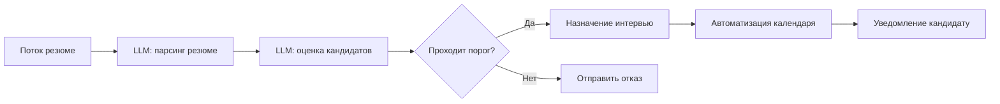

<details>
<summary>Примеры входных данных</summary>

```json
[
  {
    "name": "Иван Иванов",
    "skills": ["Python", "SQL", "Docker"],
    "experience_years": 3,
    "education": "Магистр компьютерных наук"
  },
  {
    "name": "Анна Петрова",
    "skills": ["Java", "Spring", "Microservices"],
    "experience_years": 5,
    "education": "Бакалавр ИТ"
  }
]
```

</details>

<details>
<summary>Системные промпты</summary>

<details>
<summary>LLM: парсинг резюме</summary>

```text
Вы — модель для структурирования резюме.
Вход: текст резюме.
Задача: извлечь {name, skills, experience_years, education}.
Выход: JSON-объект с полями кандидата.
```

</details>

<details>
<summary>LLM: оценка кандидатов</summary>

```text
Вы — модель для оценки резюме по заданным критериям.
Вход: объект {name, skills, experience_years}.
Критерии: релевантность навыков и стаж работы.
Выход: {name, score: число от 0 до 100}.
```

</details>

<details>
<summary>LLM: назначение интервью</summary>

```text
Вы — ассистент по планированию интервью.
Вход: список кандидатов, прошедших порог, и доступные слоты интервью.
Задача: распределить кандидатов по слотам.
Выход: [{name, interview_time}, ...].
```

</details>

</details>

</details>

<details>
<summary>Автоматизация онбординга (HR)</summary>

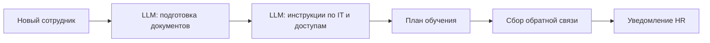

<details>
<summary>Примеры входных данных</summary>

```json
{
  "name": "Сергей Кузнецов",
  "position": "Frontend-разработчик",
  "start_date": "2024-07-01"
}
```

</details>

<details>
<summary>Системные промпты</summary>

<details>
<summary>LLM: подготовка документов</summary>

```text
Вы — помощник HR для подготовки корпоративных документов.
Вход: {name, position, start_date}.
Задача: сформировать список и шаблоны документов (трудовой договор, NDA и т.д.).
Выход: [{document_type, template_text}, ...].
```

</details>

<details>
<summary>LLM: инструкции по IT и доступам</summary>

```text
Вы — модель по генерации инструкций для настройки IT-среды.
Вход: должность сотрудника.
Задача: создать чек-лист по созданию учетных записей и настройке ПО.
Выход: список пунктов чек-листа.
```

</details>

<details>
<summary>LLM: план обучения</summary>

```text
Вы — ассистент по обучению новых сотрудников.
Вход: должность.
Задача: разработать пошаговый план обучения с модулями и сроками.
Выход: [{module, duration_days}, ...].
```

</details>

<details>
<summary>LLM: сбор обратной связи</summary>

```text
Вы — модель для генерации анкеты обратной связи.
Вход: список этапов онбординга.
Задача: сформулировать вопросы для каждого этапа.
Выход: [{stage, questions: [...]}, ...].
```

</details>

<details>
<summary>LLM: уведомление HR</summary>

```text
Вы — помощник для уведомления HR об итогах.
Вход: результаты обратной связи.
Задача: составить краткое сообщение с ключевыми выводами.
Выход: текст уведомления.
```

</details>

</details>

</details>

</details>

<details>
<summary>DevOps</summary>

<details>
<summary>CICD pipeline мониторинг</summary>

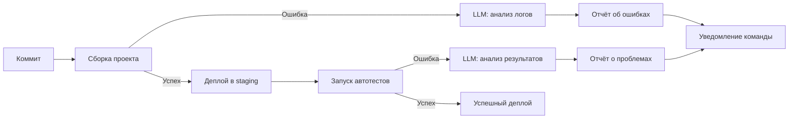

<details>
<summary>Примеры входных данных</summary>

```text
Коммит: {id: "abc123", author: "ivan", timestamp: "2024-06-15T10:23:00Z"}
Логи сборки: "ERROR: Module not found: 'utils.js'"
```
</details>

<details>
<summary>Примеры системных промптов</summary>

<details>
<summary>LLM: анализ логов</summary>

```text
Вы — модель для анализа логов CI. Вход: текст логов сборки. Задача: найти причину ошибки и предложить решение. Выход: {error_type, message, recommendation}.
```
</details>

<details>
<summary>LLM: анализ результатов</summary>

```text
Вы — модель для анализа результатов автотестов. Вход: вывод тестового раннера. Задача: выявить упавшие тесты и описать проблему. Выход: [{test_name, status: "fail"/"pass", log}].
```
</details>

</details>
</details>

<details>
<summary>Автотесты: генерация и анализ</summary>

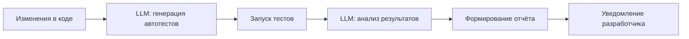

<details>
<summary>Примеры входных данных</summary>

```text
Изменения в коде: diff функции sum(a, b)
Результаты тестов: 3 passed, 1 failed (test_sum.js)
```
</details>

<details>
<summary>Примеры системных промптов</summary>

<details>
<summary>LLM: генерация автотестов</summary>

```text
Вы — ассистент по генерации автотестов. Вход: diff кода. Задача: сгенерировать unit-тесты на Jest для новых или изменённых функций. Выход: код тестов.
```
</details>

<details>
<summary>LLM: анализ результатов</summary>

```text
Вы — модель для анализа результатов тестов. Вход: вывод тест-раннера. Задача: выделить упавшие тесты и предложить варианты фиксации. Выход: [{test_name, status, suggestion}].
```
</details>

</details>
</details>

</details>

<details>
<summary>Прочие кейсы</summary>

<details>
<summary>Генерация квизов для обучения</summary>

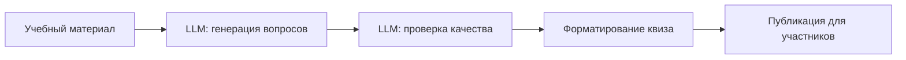

<details>
<summary>Примеры входных данных</summary>

```text
Учебный материал: "Основы HTTP: методы GET/POST, статус-коды"
```
</details>

<details>
<summary>Примеры системных промптов</summary>

<details>
<summary>LLM: генерация вопросов</summary>

```text
Вы — модель для генерации учебных вопросов. Вход: текст материала. Задача: сформулировать 5 вопросов разных типов (открытые, с выбором). Выход: [{question, type}].
```
</details>

<details>
<summary>LLM: проверка качества</summary>

```text
Вы — модель для оценки качества вопросов. Вход: список вопросов. Задача: проверить корректность формулировок и сложность. Выход: [{question, ok: true/false, comment}].
```
</details>

</details>
</details>

<details>
<summary>Автоматизация отчётов по расходам</summary>

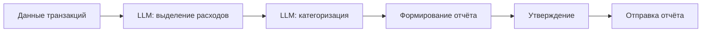

<details>
<summary>Примеры входных данных</summary>

```json
{
  "transactions": [
    {"id": "T1", "amount": 250},
    {"id": "T2", "amount": 75}
  ]
}
```
</details>

<details>
<summary>Примеры системных промптов</summary>

<details>
<summary>LLM: выделение расходов</summary>

```text
Вы — модель для извлечения данных о расходах. Вход: массив транзакций. Задача: вернуть список {id, amount}.
```
</details>

<details>
<summary>LLM: категоризация</summary>

```text
Вы — модель для классификации расходов. Вход: список {id, amount}. Задача: присвоить категорию из списка. Выход: [{id, category}].
```
</details>

</details>
</details>

<details>
<summary>Персональный планировщик путешествий</summary>

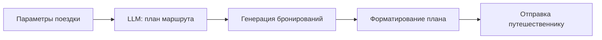

<details>
<summary>Примеры входных данных</summary>

```json
{
  "destination": "Барселона",
  "dates": ["2024-07-01", "2024-07-07"],
  "preferences": ["музеи", "пляж"]
}
```
</details>

<details>
<summary>Примеры системных промптов</summary>

<details>
<summary>LLM: план маршрута</summary>

```text
Вы — ассистент по планированию путешествий. Вход: параметры поездки. Задача: предложить маршрут по дням. Выход: [{day, activities}].
```
</details>

<details>
<summary>LLM: генерация бронирований</summary>

```text
Вы — модель для формирования бронирований. Вход: маршрут. Задача: сгенерировать данные для брони отеля и транспорта. Выход: [{service, details}].
```
</details>

<details>
<summary>LLM: форматирование плана</summary>

```text
Вы — помощник по форматированию плана. Вход: данные бронирований и маршрут. Задача: собрать единый документ с расписанием. Выход: markdown.
```
</details>

</details>
</details>

</details>

<details>
<summary>Маршрутизация запросов на четыре направления</summary>

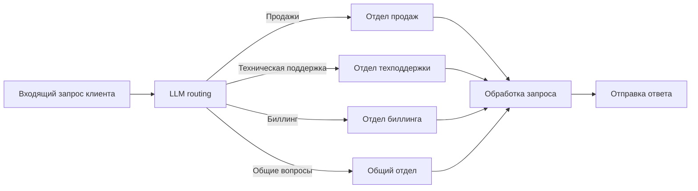

<details>
<summary>Примеры входных запросов</summary>

```text
Запрос 1: "Здравствуйте! Хочу узнать про новые тарифы."
Запрос 2: "Не могу оплатить счёт, платеж отклоняется."
Запрос 3: "Как подключить международный роуминг?"
Запрос 4: "Где найти договор оферты?"
```

</details>

<details>
<summary>Системный промпт: LLM routing</summary>

```text
Вы — модель маршрутизации входящих запросов клиентов.
Входные данные:
- Текст запроса клиента: {request}
Задача: определить направление обработки запроса: одно из значений "Продажи", "Техническая поддержка", "Биллинг", "Общие вопросы".
Выход: строка с одним из указанных значений.
```

</details>

<details>
<summary>Системный промпт: LLM обработка запроса</summary>

```text
Вы — модель для обработки клиентских запросов в направлении {direction}.
Входные данные:
- Текст запроса клиента: {request}
Задача: сформировать развернутый и вежливый ответ на запрос в соответствии со спецификой направления.
Выход: текстовый ответ клиенту.
```

</details>

</details>

<details>
<summary>Примеры Web3 workflows</summary>

<details>
<summary>Minting и листинг NFT</summary>

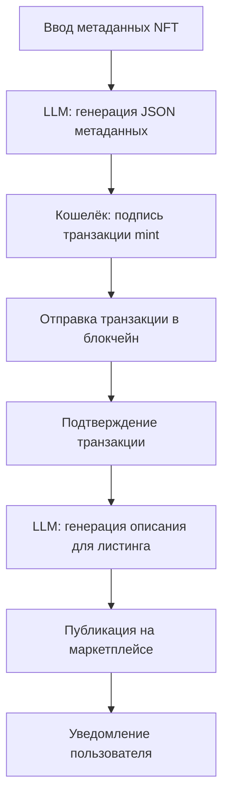

<details>
<summary>Примеры входных данных</summary>

```json
{
  "name": "CryptoKitty #2024",
  "description": "Эксклюзивный NFT с анимированным котиком",
  "image": "https://example.com/cat.gif",
  "attributes": [
    { "trait_type": "rarity", "value": "epic" },
    { "trait_type": "background", "value": "galaxy" }
  ]
}
```

</details>

<details>
<summary>Системные промпты</summary>

<details>
<summary>LLM: генерация JSON метаданных</summary>

```text
Вы — модель для генерации JSON-метаданных NFT в формате ERC-721.
Вход: {name, description, image, attributes}.
Выход: JSON-объект без лишних комментариев.
```

</details>

<details>
<summary>LLM: генерация описания для листинга</summary>

```text
Вы — модель для написания продающих описаний NFT.
Вход: JSON-метаданные NFT.
Задача: сформировать короткое (2–3 предложения), цепляющее описание.
Выход: чистый текст.
```

</details>

</details>
</details>

<details>
<summary>Своп токенов на DEX</summary>

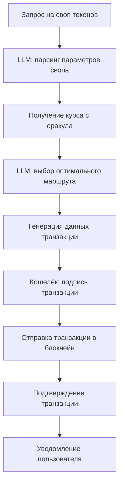

<details>
<summary>Примеры входных запросов</summary>

```text
Запрос 1: "Обменять 1.5 ETH на DAI по лучшему курсу."
Запрос 2: "Свопнуть 1000 USDC на USDT при минимальных комиссиях."
```

</details>

<details>
<summary>Системные промпты</summary>

<details>
<summary>LLM: парсинг параметров свопа</summary>

```text
Вы — модель для извлечения параметров свопа из текстового запроса.
Вход: текст запроса.
Задача: вернуть JSON {from_token, to_token, amount}.
```

</details>

<details>
<summary>LLM: выбор оптимального маршрута</summary>

```text
Вы — модель для выбора оптимального маршрута свопа на DEX.
Вход: JSON {from_token, to_token, amount}.
Задача: предложить путь обмена через пулы, минимизируя проскальзывание.
Выход: JSON {route, estimated_gas}.
```

</details>

</details>
</details>

<details>
<summary>Создание предложения в DAO</summary>

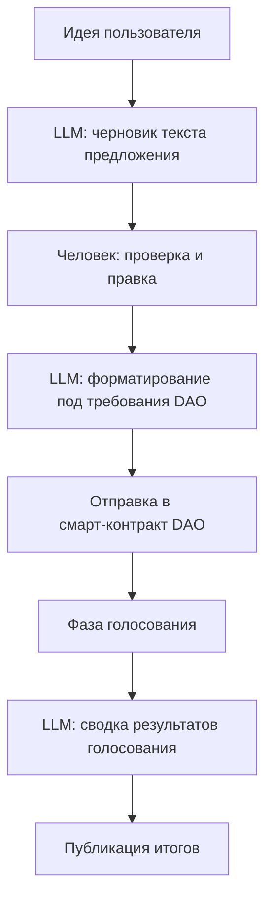

<details>
<summary>Примеры входных запросов</summary>

```text
Идея 1: "Предложить увеличить пул ликвидности за счёт 5% комиссии транзакций."
Идея 2: "Внедрить программу вознаграждения активных участников DAO."
```

</details>

<details>
<summary>Системные промпты</summary>

<details>
<summary>LLM: черновик текста предложения</summary>

```text
Вы — модель для преобразования идеи в формальное предложение DAO.
Вход: текст идеи.
Задача: сформировать JSON {title, description}.
```

</details>

<details>
<summary>LLM: форматирование под требования DAO</summary>

```text
Вы — модель для форматирования черновика согласно шаблону DAO.
Вход: JSON {title, description}.
Требования: title до 100 символов, description до 1000 символов.
Выход: JSON {title, description}.
```

</details>

<details>
<summary>LLM: сводка результатов голосования</summary>

```text
Вы — модель для создания итоговой сводки голосования.
Вход: список голосов [{voter, vote}].
Задача: подсчитать результаты и сформулировать вывод.
Выход: текстовая сводка.
```

</details>

</details>
</details>

<details>
<summary>Автоматизированный аудит смарт‑контрактов</summary>

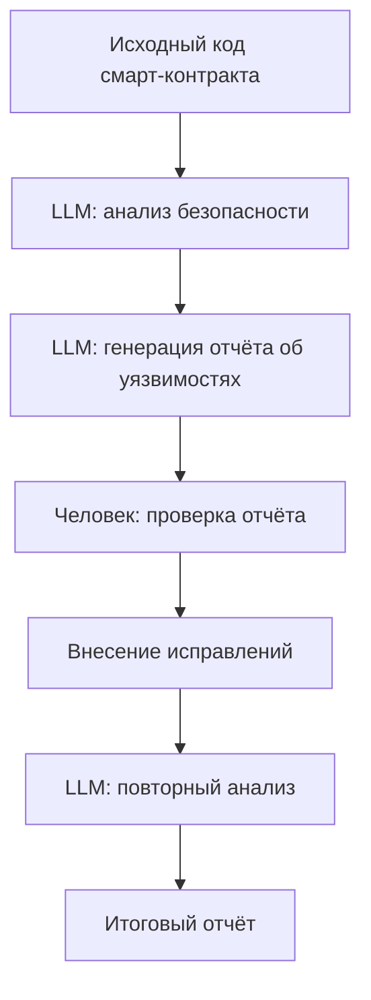

<details>
<summary>Примеры входных данных</summary>

```solidity
// SPDX-License-Identifier: MIT
pragma solidity ^0.8.0;

contract SimpleToken {
    mapping(address => uint256) public balances;
    function mint(address to, uint256 amount) public {
        balances[to] += amount;
    }
}
```

</details>

<details>
<summary>Системные промпты</summary>

<details>
<summary>LLM: анализ безопасности</summary>

```text
Вы — модель для анализа безопасности смарт‑контрактов.
Вход: исходный код контракта.
Задача: выявить уязвимости (overflow, reentrancy и т.д.) и дать рекомендации.
Выход: JSON [{issue, severity, recommendation}].
```

</details>

<details>
<summary>LLM: генерация отчёта об уязвимостях</summary>

```text
Вы — модель для составления отчёта на основе анализа уязвимостей.
Вход: результаты анализа безопасности.
Задача: написать детальный markdown-отчёт с описанием каждой проблемы и рекомендациями.
Выход: markdown.
```

</details>

</details>
</details>

</details>

