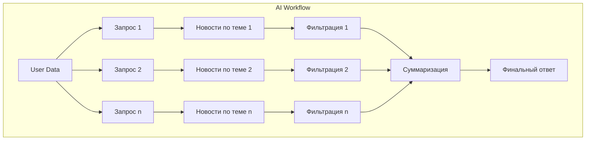
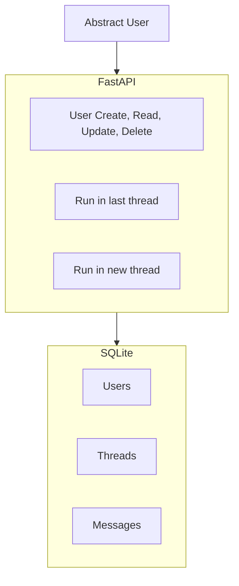
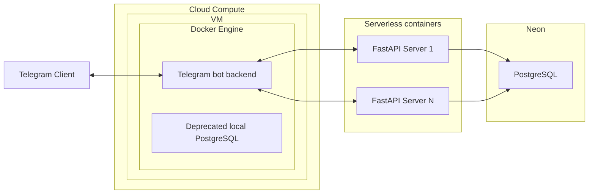

# О блоке "Легкая бэкенд-разработка"

## Зачем это нужно?

В большинстве AI Agents вакансий и проектов, за пределами всего что связано с AI, от вас потребуется уметь:
- делать деплой вашего AI сервиса
- интегрировать AI сервис в существующий бекенд
- писать API-интеграции вашего AI сервиса (инструменты для агента)

Пройдя этот блок вы не станете полноценным бекенд-разработчиком, однако:
- освоете быструю serverless-разработку (нужно для стартапов, MVP, PoC)
- Разберетесь в основных SWE концепциях (микросервисы, базы данных, API, и т.д.), необходимых для прохождения собеседований на junior и middle Applied AI позиции
- Научитесь работать с базами данных и ORM

## Содержание: Практика

Как вы можете видеть на roadmap, блок разделен на теоретические и практические модули. Рекомендуется идти в изучении модулей сверху вниз, пропуская хорошо знакомые вам темы.

К концу практических модулей вы реализуете production-ready бэкенд, который:
- развернут не на локальной машине
- состоит из нескольких микросервисов
- использует serverless технологии
- имеет тесты, логирование и мониторинг и т.д.
- частично работает на VM в облаке, контейнеризован

Шаг 1: В начале вы разработаете AI workflow для агрегации и фильтрации новостей

Шаг 2: Затем вы разработаете бэкенд для этого workflow

Шаг 3: Затем вы напишете телеграм-бота, который будет пользоваться вашим улучшенным бэкендом с AI Агентом

В конце вы получите телеграм бота со следующим функционалом:

(тут будет картинка)

## Содержание: Теория

:::info инструкция
Перед тем как приступать к следущим практическим модулям, по надобности проходите предшествующие теоретические модули.
:::

:::danger про Lite backend development блок
IMFO: Applied AI engineer не должен быть специалистом по бэкенд разработке, но вы сами должны углубиться с уровнем погружения + пропускайте знакомые темы.
- **Хотите быстрее перейти к разработке Агентов?** - изучите данные темы поверхностно - возвращаясь к погружению в SWE по ходу промышленной разработки.
    - Для Full-time learners: тратьте 0.5-1 дня на модуль
    - Для Part-time learners: тратьте 1-2 дня на модуль
- **Хотите углубленные знания?** - будет полезно будущим архитекторам
    - Для Full-time learners: тратьте 1-2 дня на модуль, поверхностно проходите Extra/Silver секции
    - Для Part-time learners: тратьте 2-4 дня на модуль, поверхностно проходите Extra/Silver секции
:::

### Карта блока

- Та самая IT-база
- Practice 1 - workflow
- FastAPI
- Базы данных
- Practice 2 - backend
- Облака и VM
- Docker
- Микросервисы
- Rapid development
- Practice 3 - app
- Extra ✦

