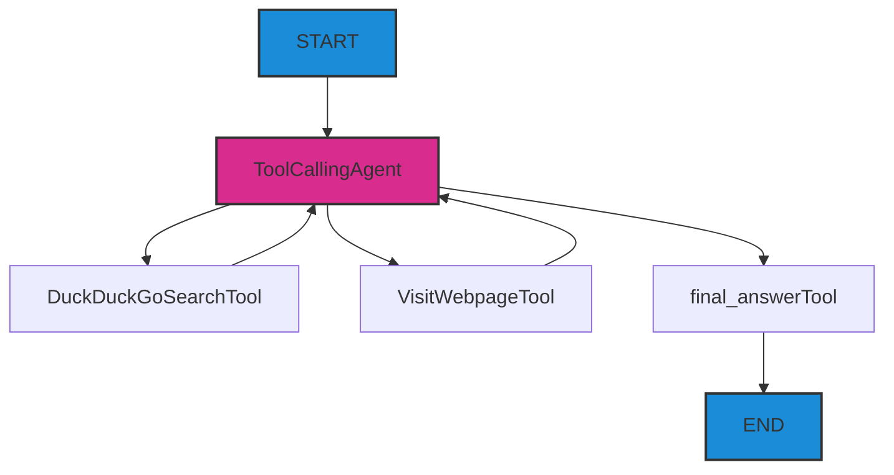

# 创建你的第一个智能体

我想让你在理解基本概念之前就创建你的第一个AI智能体。因此，我们将立即开始实践，创建一个简单的智能体，它可以进行多步骤的互联网研究。

## 问题

- 如何创建一个可以在互联网上搜索信息的AI智能体？
- 如何为智能体编写系统提示词？
- 创建搜索智能体需要哪些基本组件（4个）？

## 步骤

### 1. 获取API密钥

#### 方案 1：（推荐）

:::tip llm-keygen.merkulov.ai

我在 [llm-keygen.merkulov.ai](https://llm-keygen.merkulov.ai) 上分发了世界上 98% 模型的 API 密钥 **（只需单击一下即可获得密钥）**。支持的提供商：

- openai, anthropic
- google, deepseek, Xai

- 通过 openrouter, openrouter, replicate 等提供的大量其他模型提供商。

除了密钥，你还将拥有一个Web控制台，你可以在其中管理密钥、跟踪消耗、查看日志。

免费用户每月可获得 10M 令牌的小模型配额（但可以使用任何模型，只是你可能会很快耗尽配额）。*merkulov.courses 的学生不受此配额限制。*

:::

你只需要通过 GitHub 进行身份验证并复制密钥。**将其保存在安全的地方** - 你将在未来重复使用它。

不建议使用比 gemini-2.0-flash 或 gpt-4o-mini 更昂贵的模型，因为你可能没有足够的配额来完成整个课程。

<details>
<summary>其他方案</summary>

#### Huggingface $0.1

你可以使用 huggingface inference endpoints 使用许多开源模型。

操作步骤：

1. 在 [huggingface.com](https://huggingface.com) 上注册
2. 在 [huggingface.com/settings/tokens](https://huggingface.com/settings/tokens) 中创建一个 API 密钥
    - 选择 Fine-grained 密钥
    - 指定名称并授予访问权限，如屏幕截图所示
        
3. **将其保存在安全的地方** - 你将在未来重复使用它。

#### 方案 3. langdock

你可以在 [langdock.com](https://langdock.com) 上获得 110 美元，为期 7 天，用于大型专有提供商的 API。

建议用于开发未来具有大量消耗的巨型项目。可以注册任意数量的帐户。

#### 付费方案

选择、注册并在以下任何一个提供商处充值 API 余额：

- [openai.com](https://openai.com)
- [anthropic.com](https://anthropic.com)
- [groq.com](https://groq.com)
- [cohere.com](https://cohere.com)
- [gemini.google.com](https://gemini.google.com)

或者充值代理 [openrouter.ai](https://openrouter.ai) 的余额，以便立即访问所有 API。

</details>

### 2. 创建你自己的 perplexity（互联网搜索智能体）

#### 1. 在 [replit.com](https://replit.com) 上注册

#### 2. 创建项目

1. 选择一个模板
2. 选择 Python。
3. 创建应用

#### 3. 配置环境

:::danger 不要使用 replit agent - 实践不会成功
使用**助手**（不是智能体）在 replit 上编辑你的项目 - **阅读、**复制并粘贴我的提示词，不要忘记在需要的地方修改它们。
:::

**你需要编辑下面的提示词。**
```
你是一位教师的助手 - 不要写多余的内容，也不要超前。
创建一个空的 Python 学习项目：
- 在 .env 中添加 OPENAI_API_KEY=________ 和 OPENAI_BASE_URL=https://proxy.merkulov.ai
- 安装库 smolagents==1.12.0, smolagents[openai]==1.12.0
- 创建一个空的 main.py 文件，并从 smolagents 导入 DuckDuckGoSearchTool, HfApiModel, ToolCallingAgent, VisitWebpageTool, OpenAIServerModel, PromptTemplates

不要做任何其他事情。
```

点击 apply changes，检查 main.py 文件，确保一切正常。

:::warning

1. 忽略关于缺少 smolagents 库的警告。
2. 如果你正在寻找但无法在目录中找到 .env 文件 -> 点击三个点 -> show hidden files -> .env
3. **你没有忘记在提示词中指定 OPENAI_API_KEY 吗？**

如果出现意外错误，首先要检查你是否使用的是助手，而不是智能体。
:::

#### 4. 配置模型

智能体是 4 个组件的组合：
- LLM
- 提示词
- 工具

在工作过程中，它会积累消息历史记录 - 可以将其称为“上下文”。

```
现在我们必须创建 LLM 实体并对其进行配置。创建一个带有参数 model_id="openai/gpt-4o-mini" 的 OpenAIServerModel 类。

还要创建一个变量 tools：
tools = [
    DuckDuckGoSearchTool(max_results=5), # 通过免费搜索引擎在互联网上搜索
    VisitWebpageTool() # 从网页上读取文本
]
```

点击 apply changes。

#### 5. 配置智能体

**智能体的认知架构如下所示：**

想象一下，你从 START 节点收到用户的 query，然后沿着箭头方向无限循环，直到到达 END。


**你需要编辑下面的提示词。**

想象一下，你正在向一个非常愚蠢的下属解释他应该做什么（他只会写文本和使用工具）：
- 解释他的角色（例如，“你 - ...”）
- 解释他应该做什么（例如，“你应该搜索 ...”）
- 解释每个工具的作用
- 最后添加“当你找到答案时，调用工具 final_answer，并将其写在答案中。”
```
现在创建一个带有参数 system_prompt=""" 的 PromptTemplates 类
你扮演的角色是 ...
你应该 ...
你有一个 DuckDuckGoSearchTool 工具，它可以 ...
你有一个 VisitWebpageTool 工具，它可以 ...
当你找到答案时，...
"""
```

点击 apply changes。

#### 6. 最后的润色

```
现在编写剩余的代码：
agent = ToolCallingAgent(
    tools=tools,
    model=model,
    prompt_templates=prompt_template,
    max_steps=6 # 防止无限循环的限制
)

# ------

query = "卡修斯·克莱在哪一年改名？"
output = agent.run(query)

print("Executor result:", output)
```

点击 apply changes。

打开右侧的“控制台”，然后点击顶部的大按钮运行 main.py。**查看结果！** 现在不要急于学习 smolagents 框架，我们稍后会回到它。

你可以尝试其他问题：
- `在 Yandex Cloud 中，YandexGPT Pro 的 1000 个令牌对于两种模式的成本是多少？`
- `找到在 TI10 中获得第三名的队伍的名称。这支队伍在哪场比赛中首次亮相？`
    这是一个多步骤研究的示例。要回答这个问题，你需要先找出铜牌得主，然后找出当年队伍的阵容。
- **你自己想到的任何其他问题**

<details>
<summary>答案</summary>

1. 卡修斯·克莱于 1964 年改名。
2. 0.60 卢布和 1.20 卢布
3. Star Ladder Star Series Season 10。

你很可能在最后一个问题上得到了错误的答案。想想应该如何补充智能体的系统提示词，以便它能够验证找到的信息或进行“额外查询”？

<details>
<summary>改进系统提示词的提示</summary>

为了让智能体能够验证信息并进行额外查询，你可以在系统提示词中添加以下说明：

```
system_prompt="""
你是一位专业的互联网研究员。
    你的任务是找到用户需要的信息。如果你找到了一些信息的一部分，不要立即将其输出到答案中 - 而是发出请求进行验证。
    使用 DuckDuckGoSearchTool 工具在互联网上搜索信息，并使用 VisitWebpageTool 工具访问网页。
    当你找到答案时，调用工具 final_answer，并将其写在答案中。
"""
```


</details>
</details>

恭喜！你创建了你的第一个智能体，它可以进行互联网研究。类似但更复杂的工业智能体的示例 - [perplexity](https://www.perplexity.ai), [you.com](https://you.com)。它们也会在网络上漫游，直到找到答案。


## 额外步骤

1. 在 [e2b.dev](https://e2b.dev) 上注册
2. 创建 API 密钥
3. 在 .env 中添加 E2B_API_KEY=...

你可以尝试将所有 `main.py` 代码替换为以下代码，以体验具有计划、搜索和编写程序 + 获取其输出能力的智能体。
```
from smolagents import CodeAgent, DuckDuckGoSearchTool, OpenAIServerModel

model = OpenAIServerModel(model_id="openai/gpt-4o-mini")

agent = CodeAgent(tools=[DuckDuckGoSearchTool()], model=model, executor_type="e2b")
#output = agent.run("How many seconds would it take for a leopard at full speed to run through Pont des Arts?")
print("E2B executor result:", output)
```

**我们可以使用类似的智能体来解决需要精确计算的任务。**

---

这是一个使用 e2b、python 和 matplotlib 库生成图形图像并将其发送到与用户的聊天的智能体示例：[ai-analyst](https://ai-analyst.e2b.dev/)
    
在 [ai-analyst](https://ai-analyst.e2b.dev/) 中尝试提示词：`构建一个漂亮的 Price-Costs-Value 直方图，其中包含三个用于说明 iPhone 的列。生产 iPhone 的成本为 200 美元，其价格为 1000 美元，用户估计其价值为 1200 美元。`


## 现在我们知道了...

我们学习了：
- 如何创建 AI 智能体的基本认知架构
- 如何配置搜索和浏览网页的工具
- 如何为智能体创建有效的系统提示词
- 如何使用 smolagents 框架快速原型化智能体
- 如何限制智能体以防止无限循环

## 练习

1. 智能体由哪些基本组件组成？
2. 想想在你的生活和业务中可以在哪里使用这样的智能体？
3. 当前智能体在工作时可能会出现哪些问题？
4. 尝试修改智能体的系统提示词，以提高其答案的质量或添加新功能。

