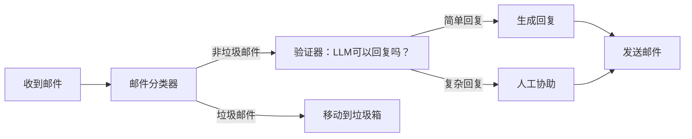
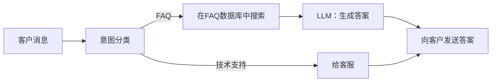
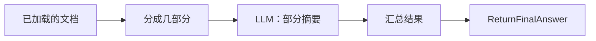
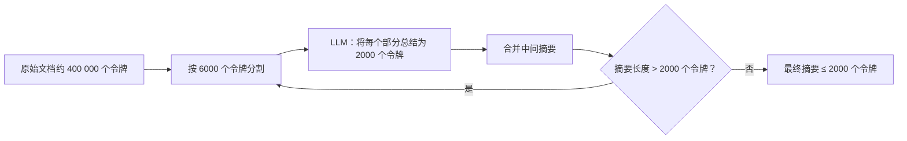
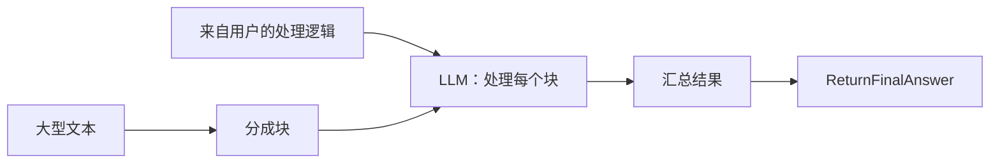
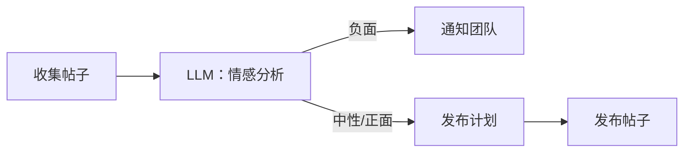
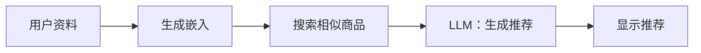
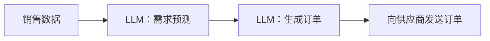
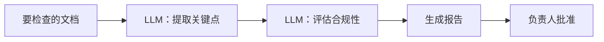

<details>
<summary>沟通与支持</summary>

<details>
<summary>邮件分类器</summary>



<details>
<summary>输入请求示例</summary>

```text
邮件 1:
发件人: client@example.com
主题: 付款问题
消息: "您好，我几天前支付了订单，但状态没有改变。请帮忙。"

邮件 2:
发件人: user2@example.com
主题: 产品问题
消息: "您好，请告诉我你们应用程序的功能。"
```
</details>

<details>
<summary>系统提示词：邮件分类器</summary>

```text
你是一个将收到的邮件分类为“spam”或“not_spam”的模型。
输入是邮件的标题和正文。
输出是一个词：“spam”或“not_spam”。
```
</details>

<details>
<summary>系统提示词：验证器（LLM可以回复吗？）</summary>

```text
你是一个检查 LLM 是否可以自主回复请求的模型。
输入是邮件正文。
如果答案很简单 - 输出“simple_answer”，否则输出“complex_answer”。
```
</details>

<details>
<summary>系统提示词：生成回复</summary>

```text
你是一名支持服务助理。根据邮件内容为客户撰写礼貌而简洁的回复：
\"\"\"{email_body}\"\"\"
```
</details>

</details>

<details>
<summary>支持服务请求分诊</summary>



<details>
<summary>输入请求示例</summary>

```text
请求 1: "如何重置我的帐户密码？"
请求 2: "我在支付订阅费用时遇到错误，订单号 #12345。"
```
</details>

<details>
<summary>系统提示词：意图分类</summary>

```text
你是一个根据客户消息确定意图的模型：“FAQ”或“technical_support”。
输出是“FAQ”或“technical_support”。
```
</details>

<details>
<summary>系统提示词：LLM根据FAQ生成答案</summary>

```text
你是一个根据找到的FAQ生成答案的助手。
输入：客户请求和FAQ内容：
\"\"\"问题：{faq_question}
答案：{faq_answer}\"\"\"
输出 - 给客户的完整答案。
```
</details>

</details>

</details>
<details>
<summary>文档摘要</summary>

<details>
<summary>文档摘要流程</summary>



<details>
<summary>输入文档示例</summary>

```text
文档 1：关于 JavaScript 的文章（≈ 5 000 个令牌）
文档 2：季度销售报告（≈ 8 000 个令牌）
```

</details>

<details>
<summary>系统提示词：LLM - 部分摘要</summary>

```text
你是一个用于总结文本片段的模型。
你的任务是根据输入片段（≤ 6000 个令牌）形成一个简短而内容丰富的摘要（≤ 500 个令牌）。
输入：文档的文本片段。
输出：片段摘要。
```

</details>

</details>

<details>
<summary>无限文本摘要</summary>

假设你只能使用 LLM，它最多可以在其 Attention 层中容纳 8000 个令牌。LLM 最多可以生成 2000 个令牌。（总计：6000 个令牌输入，2000 个输出）



例如，对于 18 兆令牌的文本，该算法将在 2 个摘要周期中运行：
    1. 1 周期：18 000 个令牌 -> 6 000 个令牌
        1.1. 18 000 个令牌 -> 3 个块，每个块 6 000 个令牌
        1.2. 3 个块，每个块 6 000 个令牌 -> 3 个摘要，每个摘要 2 000 个令牌
        1.3. 3 个摘要，每个摘要 2 000 个令牌 -> 连接成 1 个摘要，共 6 000 个令牌
    2. 2 周期：6 000 个令牌 -> 2 000 个令牌
        2.1. 6 000 个令牌 -> 1 个块，共 6 000 个令牌
        2.2. 1 个块，共 6 000 个令牌 -> 1 个摘要，共 2 000 个令牌
        2.3. 1 个摘要，共 2 000 个令牌 -> 最终摘要

<details>
<summary>输入文档示例</summary>

```text
文档：产品技术规范（≈ 400 000 个令牌）
```

</details>

<details>
<summary>系统提示词：LLM - 将每个部分总结为 2000 个令牌</summary>

```text
将文本总结为 2000 个令牌。
```

</details>

</details>

<details>
<summary>使用管理器逻辑分析和处理大型文本</summary>



<details>
<summary>输入数据示例</summary>

```text
处理逻辑：“查找所有提及单词‘错误’和‘异常’的地方，计算它们的频率。”
文本：应用程序日志（≈ 100 000 个令牌）
```

</details>

<details>
<summary>系统提示词：LLM - 处理文本块</summary>

```text
你是一个分析模型。你的任务是根据给定的用户逻辑和输入的文本块形成一个部分报告。
输入：
- 处理逻辑：{逻辑}
- 文本块：{文本}
输出：
- 部分报告。
```

</details>

</details>

</details>

<details>
<summary>社交监控和推荐</summary>

<details>
<summary>社交媒体监控</summary>



<details>
<summary>输入请求示例</summary>

```text
请求 1：“收集带有标签 #我们的产品 的最近 100 条推文”
请求 2：“获取过去 24 小时内 Instagram 上提及该品牌的帖子”
```
</details>

<details>
<summary>“情感分析”步骤的系统提示词示例</summary>

```text
你是一个社交媒体情感分析模型。你的任务是将每个帖子分类为“负面”、“中性”或“正面”。
输入数据：
- 帖子文本：{文本}
输出数据：
- 情感：{负面|中性|正面}
- 分类的简要理由。
```
</details>

</details>

<details>
<summary>推荐系统</summary>



<details>
<summary>输入数据示例</summary>

```text
用户资料：
- ID：12345
- 浏览历史：["电话", "耳机", "手机壳"]
- 年龄：29
- 兴趣：技术、音乐
```

</details>

<details>
<summary>“生成推荐”步骤的系统提示词示例</summary>

```text
你是一个基于 LLM 的推荐系统。你的任务是根据用户嵌入和相似商品列表生成五个相关的推荐。
输入数据：
- 用户嵌入：{vector}
- 相似商品列表：[{id, 名称, 嵌入}, ...]
输出数据：
- 带有推荐的 JSON 数组：
[
  {id: ..., 名称: ..., 原因: ...},
  ...
]
```

</details>

</details>

</details>

<details>
<summary>代码审查和发布</summary>

  <details>
  <summary>自动化代码审查</summary>

  ```mermaid
  flowchart LR
      PR[Pull Request] --> Lint[自动测试]
      Lint -->|错误| Report[生成报告]
      Lint -->|OK| Comments[LLM：生成评论]
      Comments --> Post[将评论添加到 PR]
  ```

  <details>
  <summary>输入请求示例</summary>

  ```text
  请求 1：Pull Request，其中包含 app.js 文件中的更改：
  ```diff
  - function add(a, b) { return a + b; }
  + function add(a, b) { return Number(a) + Number(b); }
  ```
  请求 2：Pull Request，删除 utils.js 中未使用的变量：
  ```diff
  - const unused = 42;
  + // 已删除
  ```
  ```
  </details>

  <details>
  <summary>系统提示词：LLM - 生成评论</summary>

  ```text
  你是一个自动化代码审查助手。
  你的任务是基于 Pull Request 的 diff：
  - 检测语法或逻辑错误，
  - 标记样式指南违规行为，
  - 提供改进代码的建议。
  输入数据：
  - diff Pull Request：{diff}
  输出格式（结构化输出）：
  [
    {file: "app.js", line: 1, comment: "建议显式地将参数转换为 Number，以确保字符串相加的安全。"},
    {file: "utils.js", line: 3, comment: "变量 'unused' 未使用 - 应该删除它。"}
  ]
  ```
  </details>

  </details>

  <details>
  <summary>博客发布</summary>

  ```mermaid
  flowchart LR
      Draft[文章草稿] --> SpellCheck[LLM：拼写检查]
      SpellCheck --> StyleEdit[LLM：改进风格]
      StyleEdit --> Publish[在社交网络上发布]
  ```

  <details>
  <summary>输入请求示例</summary>

  ```text
  文章草稿：
  "OpenAI 推出了新的 GPT-4 模型。它为文本生成、代码支持和数据分析提供了改进的功能。可以使文本的某些部分更流畅和更具表现力..."
  ```
  </details>

  <details>
  <summary>系统提示词：LLM - 拼写检查</summary>

  ```text
  你是一个用于文本拼写检查的模型。
  你的任务是查找并更正拼写错误和印刷错误。
  输入：
  - 草稿文本：{draft_text}
  输出：
  - 没有错误的更正文本。
  ```
  </details>

  <details>
  <summary>系统提示词：LLM - 改进风格</summary>

  ```text
  你是一个用于文本风格编辑的模型。
  你的任务是使文本更流畅、更清晰和更具吸引力，同时保留原始含义。
  输入：
  - 拼写检查后的文本：{corrected_text}
  输出 - 编辑后的文本。
  ```
  </details>

  </details>

</details>

<details>
<summary>营销和销售</summary>

  <details>
  <summary>营销活动个性化</summary>

  ```mermaid
  flowchart LR
      CRM[客户数据] --> Segment[LLM：受众细分]
      Segment --> Message[LLM：生成消息]
      Message --> Launch[启动电子邮件活动]
  ```

  <details>
  <summary>输入请求示例</summary>

  ```text
  CRM 数据 1：{id: 101, 姓名: "安娜", 年龄: 28, 最近_购买: ["运动鞋","T恤"], 兴趣: ["运动","旅行"]}
  CRM 数据 2：{id: 102, 姓名: "鲍里斯", 年龄: 35, 最近_购买: ["智能手表"], 兴趣: ["技术","健身"]}
  ```
  </details>

  <details>
  <summary>系统提示词</summary>

    <details>
    <summary>LLM：受众细分</summary>

    ```text
    你是一个根据 CRM 数据列表按类别（年龄、兴趣、购买历史）细分客户的模型。
    输入：客户列表 [{id, 姓名, 年龄, 最近_购买, 兴趣}, ...]
    输出 - JSON 细分数组：
    [
      {segment_id: 1, 标准: "25-35 岁的运动员", 客户: [101, ...]},
      ...
    ]
    ```
    </details>

    <details>
    <summary>LLM：生成消息</summary>

    ```text
    你是一个文案助手，为每个细分市场创建个性化的电子邮件。
    输入：细分市场 {segment_id, 标准, 客户} 和消息模板。
    输出 - JSON 消息数组：
    [
      {segment_id: 1, 主题: "运动员特别优惠", 正文: "..."},
      ...
    ]
    ```
    </details>

  </details>

  </details>

  <details>
  <summary>潜在客户资格认证和追加销售（销售）</summary>

  ```mermaid
  flowchart LR
      Lead[新潜在客户] --> Qualify[LLM：资格认证]
      Qualify -->|准备好销售| Propose[LLM：商业提案]
      Propose --> Send[发送提案]
      Send --> Follow[LLM：分析回复]
      Follow -->|积极| Upsell[LLM：生成追加销售]
      Upsell --> SendUpsell[发送其他提案]
  ```

  <details>
  <summary>输入请求示例</summary>

  ```text
  潜在客户 1：{id: "LID123", 公司: "Acme Corp", 预算: 50000, 需求: "CRM 系统"}
  潜在客户 2：{id: "LID124", 公司: "Beta LLC", 预算: 150000, 需求: "销售分析"}
  ```
  </details>

  <details>
  <summary>系统提示词</summary>

    <details>
    <summary>LLM：资格认证</summary>

    ```text
    你是一个评估潜在客户购买准备情况的模型。
    输入：潜在客户 {id, 公司, 预算, 需求}
    输出 - {lead_id, status: "准备好"/"未准备好", score: 数字}
    ```
    </details>

    <details>
    <summary>LLM：商业提案</summary>

    ```text
    你是一个销售助手，生成商业提案。
    输入：潜在客户 {lead_id, 公司, 需求, 预算} 和商业提案模板。
    输出 - {lead_id, proposal: "商业提案文本"}
    ```
    </details>

    <details>
    <summary>LLM：分析回复</summary>

    ```text
    你是一个用于分析客户反馈的模型。
    输入：通信 {lead_id, 消息: [...]}
    输出 - {lead_id, sentiment: "积极"/"消极"/"中性"}
    ```
    </details>

    <details>
    <summary>LLM：生成追加销售</summary>

    ```text
    你是一个追加销售助手，形成其他提案。
    输入：潜在客户 {lead_id} 和交互历史记录。
    输出 - {lead_id, upsell_offer: "其他提案文本"}
    ```
    </details>

  </details>

  </details>

</details>

<details>
<summary>运营流程</summary>

<details>
<summary>自动补货</summary>



<details>
<summary>输入数据示例</summary>

```json
{
  "sales_data": [
    {"product_id": "A1", "date": "2024-06-01", "quantity": 120},
    {"product_id": "B2", "date": "2024-06-01", "quantity": 75}
  ],
  "safety_stock": 50
}
```

</details>

<details>
<summary>系统提示词</summary>

<details>
<summary>LLM：需求预测</summary>

```text
你是一个需求预测模型。
输入：带有字段 {product_id, date, quantity} 的销售记录数组。
任务：根据历史数据预测下一时期每种产品的需求。
输出：对象数组 [{product_id, forecast_quantity}, ...]。
```

</details>

<details>
<summary>LLM：生成订单</summary>

```text
你是一个向供应商生成订单的助手。
输入：需求预测 [{product_id, forecast_quantity}, ...] 和安全参数 (safety_stock)。
任务：计算订单数量以满足预测需求加上库存。
输出：对象数组 [{product_id, order_quantity}, ...]。
```

</details>

</details>

</details>

<details>
<summary>文档合规性检查</summary>



<details>
<summary>输入数据示例</summary>

```text
文档类型：租赁协议
文档文本：
“本协议由出租人和承租人签订...
第 1 条。协议的主题...
第 2 条。有效期...”
```

</details>

<details>
<summary>系统提示词</summary>

<details>
<summary>LLM：提取关键点</summary>

```text
你是一个从法律文本中提取关键点的模型。
输入：文档的全文。
任务：突出显示条款编号及其摘要。
输出：对象数组 [{article: 编号, summary: 文本}, ...]。
```

</details>

<details>
<summary>LLM：评估合规性</summary>

```text
你是一个检查文档是否符合给定标准的模型。
输入：关键点数组和规则列表。
任务：确定每个点是否符合规则。
输出：[{article, compliance: "符合"/"不符合", comments}, ...]。
```

</details>

<details>
<summary>LLM：生成报告</summary>

```text
你是一个报告准备助手。
输入：合规性评估结果。
任务：生成一个结构化的 markdown 报告，其中包含“符合的点”和“违规行为”部分。
输出：markdown 报告文本。
```

</details>

</details>

</details>

</details>
