<details>
<summary>HR流程</summary>

<details>
<summary>简历筛选 (招聘)</summary>

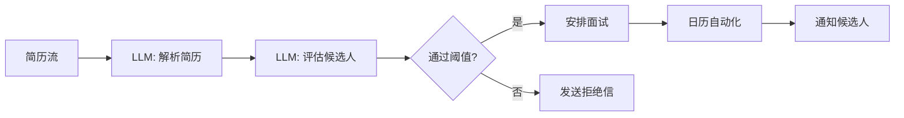

<details>
<summary>输入数据示例</summary>

```json
[
  {
    "name": "伊万·伊万诺夫",
    "skills": ["Python", "SQL", "Docker容器"],
    "experience_years": 3,
    "education": "计算机科学硕士"
  },
  {
    "name": "安娜·彼得罗娃",
    "skills": ["Java", "Spring", "Microservices"],
    "experience_years": 5,
    "education": "IT学士"
  }
]
```

</details>

<details>
<summary>系统提示词</summary>

<details>
<summary>LLM: 解析简历</summary>

```text
你是一个用于结构化简历的模型。
输入：简历文本。
任务：提取 {name, skills, experience_years, education}。
输出：包含候选人字段的 JSON 对象。
```

</details>

<details>
<summary>LLM: 评估候选人</summary>

```text
你是一个用于根据给定标准评估简历的模型。
输入：对象 {name, skills, experience_years}。
标准：技能的相关性和工作经验。
输出：{name, score: 0 到 100 之间的数字}。
```

</details>

<details>
<summary>LLM: 安排面试</summary>

```text
你是一个面试安排助手。
输入：通过阈值的候选人列表和可用的面试时间段。
任务：将候选人分配到时间段。
输出：[{name, interview_time}, ...]。
```

</details>

</details>

</details>

<details>
<summary>入职自动化 (HR)</summary>

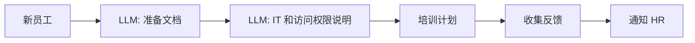

<details>
<summary>输入数据示例</summary>

```json
{
  "name": "谢尔盖·库兹涅佐夫",
  "position": "前端开发工程师",
  "start_date": "2024-07-01"
}
```

</details>

<details>
<summary>系统提示词</summary>

<details>
<summary>LLM: 准备文档</summary>

```text
你是一个 HR 助手，用于准备公司文档。
输入：{name, position, start_date}。
任务：形成文档列表和模板（劳动合同、保密协议等）。
输出：[{document_type, template_text}, ...]。
```

</details>

<details>
<summary>LLM: IT 和访问权限说明</summary>

```text
你是一个用于生成 IT 环境设置说明的模型。
输入：员工职位。
任务：创建用于创建帐户和设置软件的清单。
输出：清单项目列表。
```

</details>

<details>
<summary>LLM: 培训计划</summary>

```text
你是一个新员工培训助手。
输入：职位。
任务：制定包含模块和期限的分步培训计划。
输出：[{module, duration_days}, ...]。
```

</details>

<details>
<summary>LLM: 收集反馈</summary>

```text
你是一个用于生成反馈问卷的模型。
输入：入职阶段列表。
任务：为每个阶段制定问题。
输出：[{stage, questions: [...]}, ...]。
```

</details>

<details>
<summary>LLM: 通知 HR</summary>

```text
你是一个用于通知 HR 结果的助手。
输入：反馈结果。
任务：撰写包含关键结论的简短消息。
输出：通知文本。
```

</details>

</details>

</details>

</details>

<details>
<summary>DevOps</summary>

<details>
<summary>CICD 流水线监控</summary>

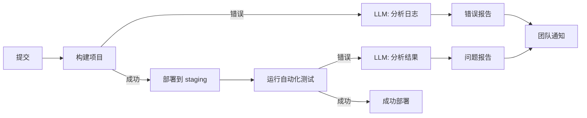

<details>
<summary>输入数据示例</summary>

```text
提交: {id: "abc123", author: "ivan", timestamp: "2024-06-15T10:23:00Z"}
构建日志: "ERROR: Module not found: 'utils.js'"
```
</details>

<details>
<summary>系统提示词示例</summary>

<details>
<summary>LLM: 分析日志</summary>

```text
你是一个用于分析 CI 日志的模型。输入：构建日志文本。任务：找到错误原因并提出解决方案。输出：{error_type, message, recommendation}。
```
</details>

<details>
<summary>LLM: 分析结果</summary>

```text
你是一个用于分析自动化测试结果的模型。输入：测试运行器的输出。任务：识别失败的测试并描述问题。输出：[{test_name, status: "fail"/"pass", log}]。
```
</details>

</details>
</details>

<details>
<summary>自动化测试：生成和分析</summary>

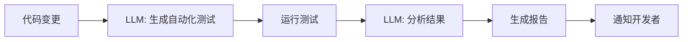

<details>
<summary>输入数据示例</summary>

```text
代码变更: sum(a, b) 函数的 diff
测试结果: 3 passed, 1 failed (test_sum.js)
```
</details>

<details>
<summary>系统提示词示例</summary>

<details>
<summary>LLM: 生成自动化测试</summary>

```text
你是一个自动化测试生成助手。输入：代码 diff。任务：为新的或修改的函数生成 Jest 单元测试。输出：测试代码。
```
</details>

<details>
<summary>LLM: 分析结果</summary>

```text
你是一个用于分析测试结果的模型。输入：测试运行器的输出。任务：突出显示失败的测试并提出修复方案。输出：[{test_name, status, suggestion}]。
```
</details>

</details>
</details>

</details>

<details>
<summary>其他用例</summary>

<details>
<summary>生成用于培训的测验</summary>

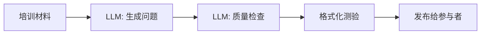

<details>
<summary>输入数据示例</summary>

```text
培训材料: "HTTP 基础知识：GET/POST 方法，状态码"
```
</details>

<details>
<summary>系统提示词示例</summary>

<details>
<summary>LLM: 生成问题</summary>

```text
你是一个用于生成培训问题的模型。输入：材料文本。任务：制定 5 个不同类型的问题（开放式、选择题）。输出：[{question, type}]。
```
</details>

<details>
<summary>LLM: 质量检查</summary>

```text
你是一个用于评估问题质量的模型。输入：问题列表。任务：检查措辞和难度是否正确。输出：[{question, ok: true/false, comment}]。
```
</details>

</details>
</details>

<details>
<summary>自动化费用报告</summary>

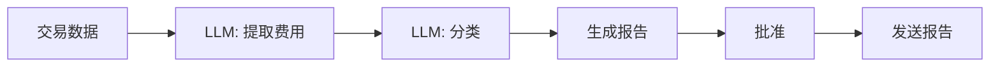

<details>
<summary>输入数据示例</summary>

```json
{
  "transactions": [
    {"id": "T1", "amount": 250},
    {"id": "T2", "amount": 75}
  ]
}
```
</details>

<details>
<summary>系统提示词示例</summary>

<details>
<summary>LLM: 提取费用</summary>

```text
你是一个用于提取费用数据的模型。输入：交易数组。任务：返回 {id, amount} 列表。
```
</details>

<details>
<summary>LLM: 分类</summary>

```text
你是一个用于对费用进行分类的模型。输入：{id, amount} 列表。任务：从列表中分配类别。输出：[{id, category}]。
```
</details>

</details>
</details>

<details>
<summary>个人旅行计划器</summary>

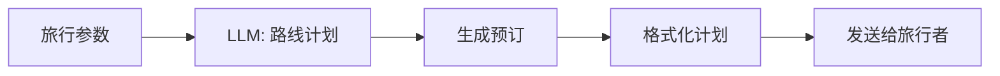

<details>
<summary>输入数据示例</summary>

```json
{
  "destination": "巴塞罗那",
  "dates": ["2024-07-01", "2024-07-07"],
  "preferences": ["博物馆", "海滩"]
}
```
</details>

<details>
<summary>系统提示词示例</summary>

<details>
<summary>LLM: 路线计划</summary>

```text
你是一个旅行计划助手。输入：旅行参数。任务：提出每日路线。输出：[{day, activities}]。
```
</details>

<details>
<summary>LLM: 生成预订</summary>

```text
你是一个用于生成预订的模型。输入：路线。任务：生成酒店和交通预订数据。输出：[{service, details}]。
```
</details>

<details>
<summary>LLM: 格式化计划</summary>

```text
你是一个用于格式化计划的助手。输入：预订数据和路线。任务：收集包含时间表的单个文档。输出：markdown。
```
</details>

</details>
</details>

</details>

<details>
<summary>将请求路由到四个方向</summary>

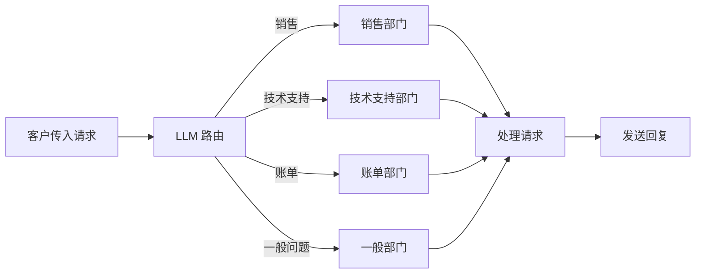

<details>
<summary>输入请求示例</summary>

```text
请求 1：“您好！我想了解新的资费。”
请求 2：“我无法支付账单，付款被拒绝。”
请求 3：“如何连接国际漫游？”
请求 4：“在哪里可以找到报价合同？”
```

</details>

<details>
<summary>系统提示词：LLM 路由</summary>

```text
你是一个路由客户传入请求的模型。
输入数据：
- 客户请求文本：{request}
任务：确定请求的处理方向：以下值之一“销售”、“技术支持”、“账单”、“一般问题”。
输出：包含指定值之一的字符串。
```

</details>

<details>
<summary>系统提示词：LLM 请求处理</summary>

```text
你是一个用于处理 {direction} 方向的客户请求的模型。
输入数据：
- 客户请求文本：{request}
任务：根据方向的特殊性，形成对请求的详细而礼貌的回复。
输出：给客户的文本回复。
```

</details>

</details>

<details>
<summary>Web3 工作流程示例</summary>

<details>
<summary>NFT 的铸造和列表</summary>

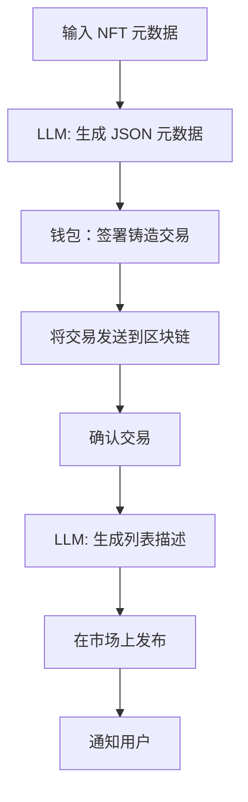

<details>
<summary>输入数据示例</summary>

```json
{
  "name": "CryptoKitty #2024",
  "description": "带有动画小猫的独家 NFT",
  "image": "https://example.com/cat.gif",
  "attributes": [
    { "trait_type": "rarity", "value": "epic" },
    { "trait_type": "background", "value": "galaxy" }
  ]
}
```

</details>

<details>
<summary>系统提示词</summary>

<details>
<summary>LLM: 生成 JSON 元数据</summary>

```text
你是一个用于生成 ERC-721 格式的 NFT JSON 元数据的模型。
输入：{name, description, image, attributes}。
输出：没有多余注释的 JSON 对象。
```

</details>

<details>
<summary>LLM: 生成列表描述</summary>

```text
你是一个用于编写 NFT 销售描述的模型。
输入：NFT JSON 元数据。
任务：形成一个简短（2-3 句话）的引人注目的描述。
输出：纯文本。
```

</details>

</details>
</details>

<details>
<summary>在 DEX 上交换令牌</summary>

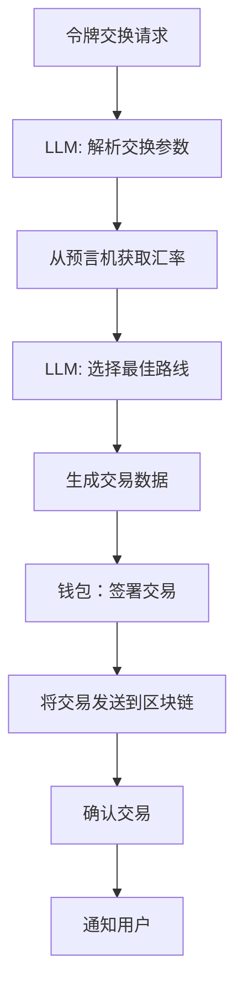

<details>
<summary>输入请求示例</summary>

```text
请求 1：“以最佳汇率将 1.5 ETH 兑换为 DAI。”
请求 2：“以最低费用将 1000 USDC 兑换为 USDT。”
```

</details>

<details>
<summary>系统提示词</summary>

<details>
<summary>LLM: 解析交换参数</summary>

```text
你是一个用于从文本请求中提取交换参数的模型。
输入：请求文本。
任务：返回 JSON {from_token, to_token, amount}。
```

</details>

<details>
<summary>LLM: 选择最佳路线</summary>

```text
你是一个用于在 DEX 上选择最佳交换路线的模型。
输入：JSON {from_token, to_token, amount}。
任务：提出通过池进行交换的路径，最大限度地减少滑点。
输出：JSON {route, estimated_gas}。
```

</details>

</details>
</details>

<details>
<summary>在 DAO 中创建提案</summary>

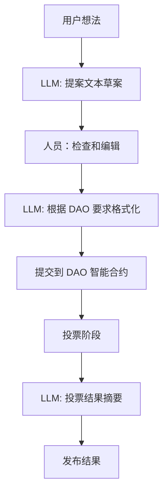

<details>
<summary>输入请求示例</summary>

```text
想法 1：“建议通过 5% 的交易费用来增加流动性池。”
想法 2：“实施 DAO 活跃参与者的奖励计划。”
```

</details>

<details>
<summary>系统提示词</summary>

<details>
<summary>LLM: 提案文本草案</summary>

```text
你是一个用于将想法转换为正式 DAO 提案的模型。
输入：想法文本。
任务：形成 JSON {title, description}。
```

</details>

<details>
<summary>LLM: 根据 DAO 要求格式化</summary>

```text
你是一个用于根据 DAO 模板格式化草案的模型。
输入：JSON {title, description}。
要求：标题最多 100 个字符，描述最多 1000 个字符。
输出：JSON {title, description}。
```

</details>

<details>
<summary>LLM: 投票结果摘要</summary>

```text
你是一个用于创建最终投票摘要的模型。
输入：投票列表 [{voter, vote}]。
任务：计算结果并形成结论。
输出：文本摘要。
```

</details>

</details>
</details>

<details>
<summary>智能合约的自动化审计</summary>

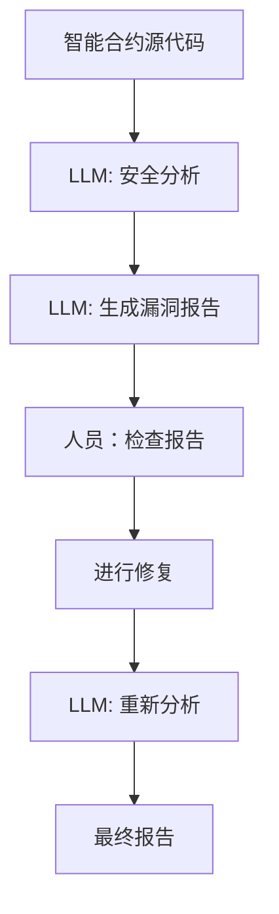

<details>
<summary>输入数据示例</summary>

```solidity
// SPDX-License-Identifier: MIT
pragma solidity ^0.8.0;

contract SimpleToken {
    mapping(address => uint256) public balances;
    function mint(address to, uint256 amount) public {
        balances[to] += amount;
    }
}
```

</details>

<details>
<summary>系统提示词</summary>

<details>
<summary>LLM: 安全分析</summary>

```text
你是一个用于分析智能合约安全性的模型。
输入：合约源代码。
任务：识别漏洞（溢出、重入等）并提供建议。
输出：JSON [{issue, severity, recommendation}]。
```

</details>

<details>
<summary>LLM: 生成漏洞报告</summary>

```text
你是一个用于根据漏洞分析结果编写报告的模型。
输入：安全分析结果。
任务：编写详细的 markdown 报告，其中包含每个问题的描述和建议。
输出：markdown。
```

</details>

</details>
</details>

</details>
