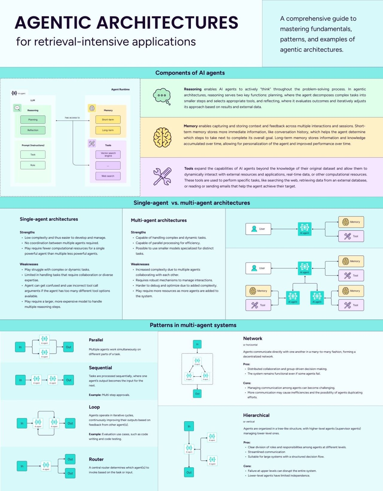

# AI Agents 101 认知架构

太棒了！从本模块开始，我们将学习智能体！之前您已经了解了如何创建没有循环的 AI 工作流，并且在 HF 课程中您了解了智能体的基本组成部分（LLM、工具、上下文）。现在我们将了解智能体架构 - 带有循环的架构。

[“认知架构”一词的历史](https://blog.langchain.dev/what-is-a-cognitive-architecture/)

## 问题

- 有哪些类型的认知架构？
- LLM 在没有工具的情况下评估自身答案的架构叫什么？
- 目前哪种认知架构最先进？

## 步骤

### 1. 学习基本循环架构

<iframe width="560" height="315" src="https://www.youtube.com/embed/ZJlfF1ESXVw?si=4cXLWZRlV8rW7Itl" title="YouTube video player" frameborder="0" allow="accelerometer; autoplay; clipboard-write; encrypted-media; gyroscope; picture-in-picture; web-share" referrerpolicy="strict-origin-when-cross-origin" allowfullscreen></iframe>
[miro pdf](https://drive.google.com/file/d/1ESnrIy4c5LPOhNHRnn87Cv7DU_i0-_J9/view)

:::tip
这里可以休息一下。
:::

### 2. [智能体介绍](https://www.getzep.com/ai-agents/introduction-to-ai-agents)

- 只阅读第一章
- 跳过熟悉的主题

## 额外步骤

### E1. 查看 Plan-and-Execute Agents 的 py/js 代码

https://blog.langchain.dev/planning-agents/

智能体架构备忘单

### E2. 智能体架构备忘单

智能体架构备忘单

## 现在我们知道了...

在本模块中，我们了解了 AI 智能体的认知架构的基础知识，并研究了它们的主要类型：
- 反思 (Reflection)
- 反射行动者 (Reflexion Actor)
- 计划与执行 (Plan-and-Execute)
- ReWoo
- LLMCompiler

接下来，我们将深入研究智能体开发的**实践方面**。您将在高级和前沿模块中了解更高级的架构。

## 练习

-
