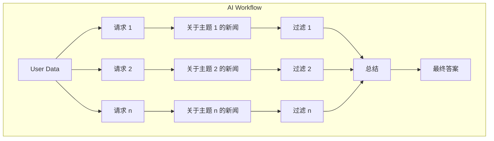
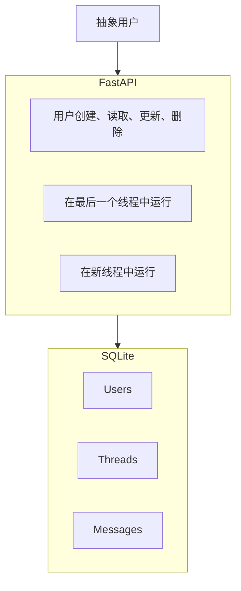
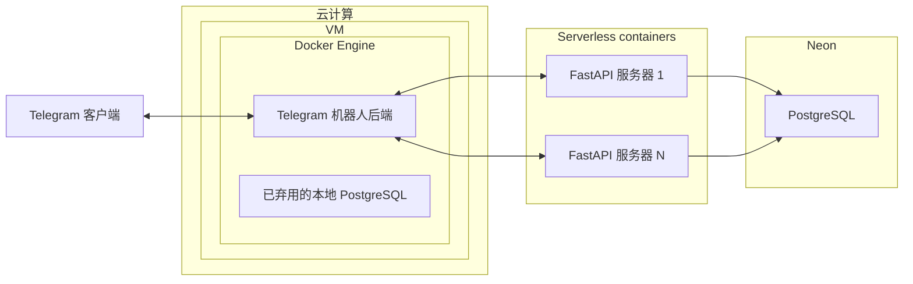

# 关于“轻量级后端开发”模块

## 为什么需要它？

在大多数 AI Agent 职位和项目中，除了与 AI 相关的所有内容之外，你还需要能够：
- 部署你的 AI 服务
- 将 AI 服务集成到现有的后端中
- 编写 AI 服务的 API 集成（代理的工具）

完成此模块后，你不会成为一名成熟的后端开发人员，但是：
- 你将掌握快速的 serverless 开发（初创公司、MVP、PoC 需要）
- 你将了解主要的 SWE 概念（微服务、数据库、API 等），这些概念对于通过初级和中级应用 AI 职位的面试至关重要
- 你将学习如何使用数据库和 ORM

## 内容：实践

正如你在路线图上看到的那样，该模块分为理论和实践模块。 建议从上到下学习模块，跳过你非常熟悉的主题。

在实践模块结束时，你将实现一个生产环境就绪的后端，该后端：
- 不部署在本地机器上
- 由多个微服务组成
- 使用 serverless 技术
- 具有测试、日志记录和监控等
- 部分在云中的 VM 上运行，并进行 Docker容器化

步骤 1：首先，你将开发一个用于聚合和过滤新闻的 AI 工作流

步骤 2：然后，你将为此工作流开发一个后端

步骤 3：然后，你将编写一个 Telegram 机器人，它将使用你改进的带有 AI 代理的后端

最后，你将获得一个具有以下功能的 Telegram 机器人：

(这里会有一张图片)

## 内容：理论

:::info 说明
在开始下一个实践模块之前，请根据需要完成之前的理论模块。
:::

:::danger 关于 Lite backend development 模块
IMFO：应用 AI 工程师不必是后端开发专家，但你必须自己深入研究，并跳过熟悉的主题。
- **想更快地开始开发代理？** - 表面上学习这些主题 - 在工业开发过程中再深入研究 SWE。
    - 对于全日制学习者：每个模块花费 0.5-1 天
    - 对于非全日制学习者：每个模块花费 1-2 天
- **想要更深入的知识？** - 对未来的架构师很有用
    - 对于全日制学习者：每个模块花费 1-2 天，表面上学习 Extra/Silver 部分
    - 对于非全日制学习者：每个模块花费 2-4 天，表面上学习 Extra/Silver 部分
:::

### 模块地图

- 那个 IT 基础
- 实践 1 - 工作流
- FastAPI
- 数据库
- 实践 2 - 后端
- 云和 VM
- Docker容器
- 微服务
- 快速开发
- 实践 3 - 应用程序
- 额外 ✦