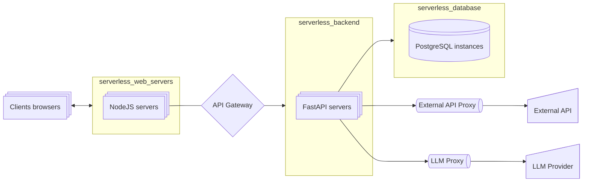

# 用于应用人工智能的微服务和系统架构

想象一下，微服务是模块化的宇宙飞船，而 Docker容器 是你组装它们的私人航天发射场。在这里，你将学习如何为 AI 代理设计“轨道空间站”：将单体系统分解为自主的卫星服务，通过星际协议（REST/gRPC）配置它们的交互，并使用 CI/CD 火箭助推器自动化部署。这些技能将使你的神经网络像银河帝国一样扩展，在不停机的情况下更新，并在整个系统崩溃的情况下承受单个组件的故障。

Ask AI 指令

:::tip 指令
由于这些主题不会随时间变化，因此最好与你的私人导师 - ChatGPT 一起学习它们。

学习过程应如下：
- 你为 ChatGPT 编写一个系统 提示词 ([模板](../metalearning#chatgpt-prompts))，在其中描述你的背景、偏好、解释的详细程度等。
- 从列表中复制主题（三击），并要求 ChatGPT 向你解释该主题
- 如果想深入研究，请提出澄清问题

目前，这是学习基础知识最方便的方法。**除了概念之外，你还可以在黄金、白银、额外部分学习其他材料。**
1. 黄金 - 在与 ChatGPT 交流之前一定要学习
2. Ask AI - 询问每个不熟悉的主题
3. 白银 - 次要材料
4. 额外 - 深入主题
:::

## 黄金

### 1. 视频

系统设计：Docker容器

<iframe width="560" height="315" src="https://www.youtube.com/embed/QEzbZKtLi-g?si=-AWdHrv8kphS7k4F" title="YouTube video player" frameborder="0" allow="accelerometer; autoplay; clipboard-write; encrypted-media; gyroscope; picture-in-picture; web-share" referrerpolicy="strict-origin-when-cross-origin" allowfullscreen></iframe>

### 2. GenAI 架构

#### AI 代理的标准架构

- 我们需要 LLM 的代理来遵守速率限制
- 我们需要外部 API 的代理来遵守速率限制和缓存结果
- 我们需要在后端之前的网关来对请求进行分类，确定用户角色（付费层、免费层），设置对上下文大小的限制等，设置速率限制等。

## Ask AI

45. **微服务架构的基本概念（入门指南）**
46. 微服务 vs 单体：架构的完整比较
47. 领域驱动设计：微服务的基本原则
48. API 网关：初学者模式（概述）
49. Docker容器 用于 AI 服务：最低限度的必要实践
50. Kubernetes：AI 开发人员的编排基础
51. GPU 任务的负载均衡：基本方法
52. AI 模型的版本控制：语义版本控制
53. 模型的 A/B 测试：生产环境用例（简要概述）
54. AI 服务的安全性：OAuth2/JWT 实践
55. AI 操作的速率限制：初学者基础
56. AI 的 CI/CD：最小工作管道
57. GRPC vs REST：AI API 的比较（概念）
58. ML 模型结果的缓存：基本策略
59. 断路器：工作原理和实现
60. 神经网络服务的监控：关键指标
61. **缓存：TTL vs 失效（比较分析）**
    

    
缓存：策略和缓存失效

    <iframe width="560" height="315" src="https://www.youtube.com/embed/a4yX7RUgTxI?si=fZJZ2tg9YYM_Gmvz" title="YouTube video player" frameborder="0" allow="accelerometer; autoplay; clipboard-write; encrypted-media; gyroscope; picture-in-picture; web-share" referrerpolicy="strict-origin-when-cross-origin" allowfullscreen></iframe>

    

62. 消息队列：基本概念和用例（概述）

## 白银

系统设计教程，53 分钟，完全动画

<iframe width="560" height="315" src="https://www.youtube.com/embed/F2FmTdLtb_4?si=YBQFjHAGU4-tImWM" title="YouTube video player" frameborder="0" allow="accelerometer; autoplay; clipboard-write; encrypted-media; gyroscope; picture-in-picture; web-share" referrerpolicy="strict-origin-when-cross-origin" allowfullscreen></iframe>

## 额外