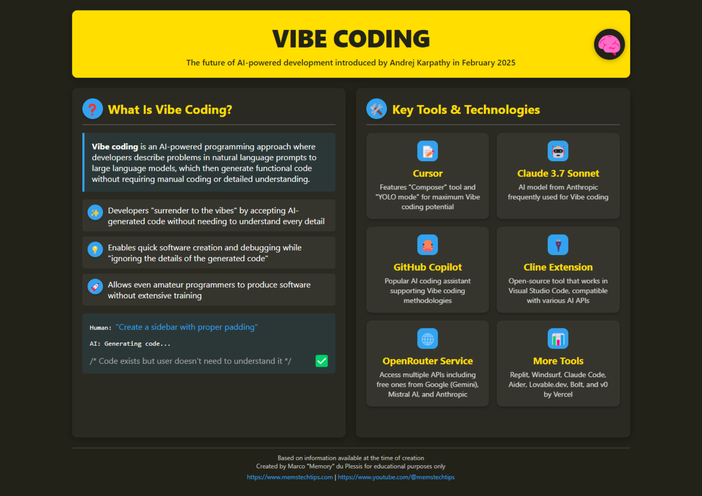
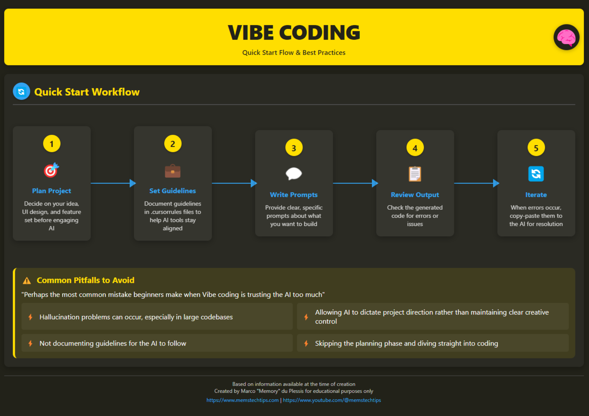

# Vibe-Coding 和 Cursor AI

在此阶段，我们将探索一种革命性的编程方法——vibe-coding（氛围编码），并了解 Cursor AI，它是一种使用人工智能生成代码的工具。您将学习如何应用这些技术来显著加速开发过程，并在没有深入编程语言知识的情况下创建应用程序。

<iframe width="560" height="315" src="https://www.youtube.com/embed/Tw18-4U7mts?si=2mFmUAZyvE_S622K" title="YouTube video player" frameborder="0" allow="accelerometer; autoplay; clipboard-write; encrypted-media; gyroscope; picture-in-picture; web-share" referrerpolicy="strict-origin-when-cross-origin" allowfullscreen></iframe>

## Questions

我们将讨论的问题：

- 什么是 vibe-coding，这种方法如何改变传统的开发？
- Cursor AI 如何在实践中实现 vibe-coding 的概念？
- 如何开始使用 Cursor AI 并使用 AI 生成代码？
- 使用 AI 编程的优势和局限性是什么？
- 如何将 vibe-coding 集成到专业开发人员的工作流程中？

## Steps

### 1.1. 理解 vibe-coding 的概念

Vibe-coding（氛围编码）是由研究员 Andrei Karpathy 提出的一种创新的软件开发方法。这种方法完全重新定义了编程过程：开发人员用自然语言表达他们的意图，并允许人工智能生成大部分实际代码[^1]。

:::warning

**Vibe-coding 不是一项简单的技能**，就像大多数人认为的那样。合理地分配与学习一门新编程语言相同的时间来掌握它。**然而，投入到学习中的时间将获得数十倍的回报。**

:::

Vibe-coding 的主要特点：

- 程序员“信任氛围”，并允许 AI 执行大部分代码编写过程
- 开发人员用人类语言描述任务和需求
- 神经网络自动创建代码、纠正错误并实现必要的功能
- 开发人员经常接受代码，而没有完全理解其工作的所有细节[^1]

AI 研究员 Simon Willison 解释了一个重要的细微差别：“如果神经网络编写了你的每一行代码，但你已经检查、测试并完全理解了它——这不再是 vibe-coding，而只是使用神经网络作为打字机”[^1]。

### 1.2. Voice-to-Code：扩展 vibe-coding 的能力

Vibe-coding 的普及加速了向使用语音界面进行编程的转变。Voice-to-Code 技术允许开发人员口头表达想法，而 AI 将语音转换为准备就绪且可运行的代码[^1]。

这种方法对于以下情况尤其有用：

- 具有神经多样性的开发人员，因为它考虑了不同的认知风格
- 降低进入 IT 行业的门槛
- 加速原型设计和 MVP 创建过程

正如实际例子所示，借助语音编程和 AI，可以在 15 分钟内创建一个完整的应用程序，而无需手动编写任何代码[^2]。

### 1.3. 了解 Cursor AI 作为 vibe-coding 工具

Cursor AI 是一款集成了人工智能的代码编辑器，它是实践中实现 vibe-coding 的领先工具之一。它提供了一种独特的编程方法，使应用程序的创建过程更加易于访问和高效[^3]。

[Cursor AI](https://www.cursor.com/) 的主要功能：

- **代码生成**：根据自然语言的任务描述立即创建软件代码
- **自动化例行任务**：编写模板、添加注释和构建项目
- **纠正错误**：识别和消除语法和逻辑错误
- **解释复杂代码部分**：帮助理解程序各个部分的函数[^3]

### 1.4. Cursor AI 的实际应用

要开始使用 [Cursor AI](https://www.cursor.com/)：

1. 从 [官方网站](https://www.cursor.com/) 下载并安装该程序
2. 安装后，您将看到一个类似于 Visual Studio Code 的界面，但具有额外的 AI 功能
3. 要与 AI 交互，请使用 CMD+L 组合键调用聊天部分
4. 选择语言模型（为了获得最佳效果，建议使用 GPT-4 或 Claude 3.7 Sonnet）
5. 制定代码生成请求[^3]

请求示例：“创建一个 Flask Web 应用程序的项目结构，该应用程序允许添加、删除和查看任务”[^3]。

### 2. 学习 vibe-coding 的基础知识

<iframe width="560" height="315" src="https://www.youtube.com/embed/v7UcVPO4y3c?si=DEaVMhRwFbvj1wiF" title="YouTube video player" frameborder="0" allow="accelerometer; autoplay; clipboard-write; encrypted-media; gyroscope; picture-in-picture; web-share" referrerpolicy="strict-origin-when-cross-origin" allowfullscreen></iframe>

关于 vibe-coding 的信息图

### 3. [好的原子建议](https://www.reddit.com/r/ChatGPTCoding/comments/1j5l4xw/vibe_coding_manual/)

### 4. How I reduced 90% errors for my Cursor by AI Jason (love him)

1. https://youtu.be/1L509JK8p1I?si=li1kcbXQtp5zOotC
2. https://youtu.be/dF4uCZAY1tk?si=oPu6Iknwxz4Foop3

## Extra Steps

### E1. 专业 Vibe-Coding

[Vibecoding Guides](https://github.com/cpjet64/vibecoding) - 这些指南是由一位经验丰富的人编写的。根据 [@llm_notes](https://t.me/llm_notes) 的经验 - 使用这些指南中的建议，您将能够 zero-shot 创建工业级的、架构复杂的服务。

### E2. 如何在考虑到昨天框架的更改的情况下进行 vibe-coding？

基于 llm 的助手的问题在于，它们的预训练是在特定时间制作的互联网切片上进行的 - 通常这个切片比当前日期落后 10 多个月。
在这几个月里，出现了新的框架，旧的框架得到了更新 - 助手编写代码时并不知道这些更改。

那么如何将这些知识传递给助手呢？为此，我们需要 llm.txt 和 MCP：

<iframe width="560" height="315" src="https://www.youtube.com/embed/fk2WEVZfheI?si=3kpd-35HROIbbCRB" title="YouTube video player" frameborder="0" allow="accelerometer; autoplay; clipboard-write; encrypted-media; gyroscope; picture-in-picture; web-share" referrerpolicy="strict-origin-when-cross-origin" allowfullscreen></iframe>

- https://mirror-feeling-d80.notion.site/MCP-Server-for-llms-txt-1ba808527b1780b38388ee8126933592
- https://github.com/langchain-ai/mcpdoc

### E3. 附加链接

- https://github.com/roboco-io/awesome-vibecoding?tab=readme-ov-file - 关于 vibe-coding 的所有内容列表
- https://simonwillison.net/2025/Mar/11/using-llms-for-code/ - 经验丰富的开发人员指南

## Now we know...

我们研究了 vibe-coding 的概念，这是一种使用人工智能的革命性编程方法。我们了解了 Cursor AI——一种集成了 AI 的代码编辑器，它允许根据自然语言描述生成代码。现在我们了解如何安装和配置 Cursor AI，如何与它交互以及如何制定代码生成请求。

## Exercises

1. **分析和反思**：思考一下，在人工智能编写大部分代码的世界中，程序员的角色将如何改变？哪些技能会变得更有价值，哪些技能会变得不那么受欢迎？

答案

https://youtu.be/psLjf6xeaj0?si=VTnLEcGEcff98jHb
大约从 6:30 到 26:00 - 深刻的想法

P.S. Валера 和 Игорь 是好朋友

3. 安装 Cursor AI 并尝试创建一个简单的项目（例如，登录页面、计算器或待办事项列表），仅使用自然语言描述。
4. 尝试为你的想法编写 PRD - 然后使用昂贵的 ChatGPT 改进它 - 然后阅读她的 PRD 并进行编辑
5. 对生活有益 - 要求 Agent “使用 python 和 seaborn 库为你制作一些图表”

⁂

[^1]: https://vc.ru/ai/1868358-vaib-koding-kak-novyi-sposob-razrabotki-programmnogo-obespecheniya

[^2]: https://www.youtube.com/watch?v=FXYPc-L-pnk

[^3]: https://dzen.ru/a/Z9VP64QnBwBkY7cE

[^4]: https://coursehunter.net/course/cursor-programmirovanie-s-ai

[^5]: https://www.youtube.com/watch?v=OZaxtm3RyCw

[^6]: https://www.itrn.ru/expertise/detail.php?id=204078

[^7]: https://habr.com/ru/news/895504/

[^8]: https://itinai.ru/cursor-инновационный-редактор-кода-ide-испол?query-24-page=3

[^9]: https://www.youtube.com/watch?v=XpPrOgVyI98

[^10]: https://techcrunch.com/2025/03/14/ai-coding-assistant-cursor-reportedly-tells-a-vibe-coder-to-write-his-own-damn-code/

[^11]: https://habr.com/ru/news/895918/

[^12]: https://www.youtube.com/watch?v=dan3QfN3CDU

[^13]: https://dzen.ru/a/Z39of6JA-1YoFUi-

[^14]: https://coursehunter.net/course/cursor-ai-polnoe-rukovodstvo-dlya-razrabotchikov

[^15]: https://www.youtube.com/watch?v=oFAPQv5UikM

[^16]: https://ru.wikipedia.org/wiki/Вайб-кодинг

[^17]: https://www.youtube.com/watch?v=CW1aPily6-Q

[^18]: https://productuniversity.ru/cursor

[^19]: https://www.youtube.com/watch?v=pHNOhptPKQI

[^20]: https://dev.to/charlene_/vibe-coding-with-ai-agents-lol-4bkd
